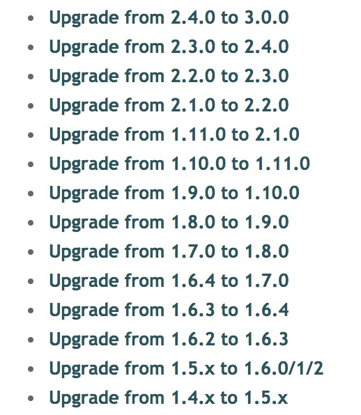

# 环境声明
- 系统 centos7
- 已经安装opensips 2.2
- 需要升级目标 opensips 2.4.6
- 要求：当前系统上没有部署mysql服务端程序


# 升级步骤
升级分为两步

1. opensips 应用升级，包括源码的下载，编译等等
2. opensips 数据库升级，使用opensipsdbctl工具迁移老的数据


## Edge: opensips应用升级

升级过程以Makefile交付，可以先新建一个空的目录，如 /root/opensips-update/

```bash
# file: /root/opensips-update/Makefile
VERSION=2.4.6

download:
	wget https://opensips.org/pub/opensips/$(VERSION)/opensips-$(VERSION).tar.gz;
  tar -zxvf opensips-$(VERSION).tar.gz;
  
build:
	cd opensips-$(VERSION);
  make all -j4 include_modules="db_mysql httpd db_http siprec"; # siprec是可选的
  make install include_modules="db_mysql httpd db_http siprec"; # siprec是可选的
```

1. 新建空目录/root/opensips-update/
2. 在新目录中创建名为 Makefile的文件, 内容如上面所示
3. 执行 make download
4. 执行 make build


## Core: opensips应用升级

```bash
make all -j4 include_modules="db_mysql httpd"
make install include_modules="db_mysql httpd"
```


# 可能遇到的报错以及解决方案
主要的问题可能是某些包冲突，或者某些库没有安装依赖。在解决问题后，需要重新编译。


## 1. linux2.6.x86_64 conflicts with file from package
> .linux2.6.x86_64 conflicts with file from package MySQL-server-5.1.7-0.i386
>     file /usr/share/mysql/italian/errmsg.sys from install of MySQL-server-5.5.28-1.linux2.6.x86_64 conflicts with file from package MySQL-server-5.1.7-0.i386
>     file /usr/share/mysql/japanese/errmsg.sys from install of MySQL-server-5.5.28-

解决方案：**rpm -qa | grep mysql | xargs rpm -e --nodeps**


## 2. my_con.h:29:19: fatal error: mysql.h: No such file or directory
> my_con.h:29:19: fatal error: mysql.h: No such file or directory

解决方案：**yum install mysql-devel -y**


## 3. siprec_uuid.h:29:23: fatal error: uuid/uuid.h: No such file or directory
ERROR3:
> siprec_uuid.h:29:23: fatal error: uuid/uuid.h: No such file or directory
> #include <uuid/uuid.h>

解决方案：**yum install libuuid-devel -y**


## 4. regex.so: undefined symbol: debug


## 数据库迁移
opensips不同的版本，所需要的模块对应的表可能都不同，所以需要迁移数据库。

迁移数据库需要opensipsdbctl命令，这个命令会根据opensipscrlrc文件链接opensips所使用的数据库。

opensips的升级有个特点新版本的opensipsdbctl只用用来升级之前版本的opensips。

从官方文档可以看出 2.2版本的opensips要升级到2.4，中间需要经过2.3。也就是说，你需要用opensips 2.3中的opensipsdbctl将 2.2升级到2.3，然后使用opensips 2.4中的opensipsdbctl将 2.3升级到2.4。




为了加快升级速度，避免在安装不必要的版本，我构建了两个docker镜像，这两个镜像分别是2.3版本的opensips和2.4版本的opensips。我们可以使用这两个镜像中的opensipsdbctl来升级数据库。

```bash
docker pull ccr.ccs.tencentyun.com/wangdd/opensips-base:2.3.1
docker pull ccr.ccs.tencentyun.com/wangdd/opensips-base:2.4.2
```

先从2.2升级到2.3

```bash
docker run -it --name opensips --rm ccr.ccs.tencentyun.com/wangdd/opensips-base:2.3.1 bash

vim /usr/local/etc/opensipsctlrc

opensipsdbctl migrate opensips_old_db opensips_new_db
# 下面会让你输入数据库密码，
# 下面可能让你输入y/n, 一律输入y
# 如果让你选择字符集，则输入 latin1
```

然后基于老的数据库，创建新的数据库。对于老的数据库，opensipsdbctl并不会改变它的任何字段。

首先需要配置/usr/local/etc/opensips/opensipsctlrc文件，把mysql相关的配置修改正确。

有可能升级过后<br />opensips -V 输出的还是老版本的opensips, 这是需要

- 排查PATH /usr/local/sbin/ 是不是在 /usr/sbin的前面
- 重新连接shell， 有可能环境变量还未更新


# 可执行文件的位置

```bash
# 2.x版本的
/usr/local/sbin/

# 1.x 版本的
/usr/sbin
```


# 报错

```bash
Jul 18 19:37:22 [28181] ERROR:core:sr_load_module: could not open module </usr/local/lib64/opensips/modules/regex.so>: /usr/local/lib64/opensips/modules/regex.so: undefined symbol: debug
Jul 18 19:37:22 [28181] ERROR:core:load_module: failed to load module
Jul 18 19:37:22 [28181] CRITICAL:core:yyerror: parse error in config file /usr/local//etc/opensips/opensips.cfg, line 26, column 13-14: failed to load module regex.so

Jul 18 19:37:22 [28181] ERROR:core:sr_load_module: could not open module </usr/local/lib64/opensips/modules/rest_client.so>: /usr/local/lib64/opensips/modules/rest_client.so: undefined symbol: debug
Jul 18 19:37:22 [28181] ERROR:core:load_module: failed to load module
Jul 18 19:37:22 [28181] CRITICAL:core:yyerror: parse error in config file /usr/local//etc/opensips/opensips.cfg, line 57, column 13-14: failed to load module rest_client.so

Jul 18 19:37:22 [28181] ERROR:core:set_mod_param_regex: parameter <failed_transaction_flag> not found in module <acc>
Jul 18 19:37:22 [28181] CRITICAL:core:yyerror: parse error in config file /usr/local//etc/opensips/opensips.cfg, line 99, column 20-21: Parameter <failed_transaction_flag> not found in module <acc> - can't set
Jul 18 19:37:22 [28181] ERROR:core:set_mod_param_regex: parameter <db_flag> not found in module <acc>
Jul 18 19:37:22 [28181] CRITICAL:core:yyerror: parse error in config file /usr/local//etc/opensips/opensips.cfg, line 101, column 20-21: Parameter <db_flag> not found in module <acc> - can't set
Jul 18 19:37:22 [28181] ERROR:core:set_mod_param_regex: parameter <db_missed_flag> not found in module <acc>
Jul 18 19:37:22 [28181] CRITICAL:core:yyerror: parse error in config file /usr/local//etc/opensips/opensips.cfg, line 102, column 20-21: Parameter <db_missed_flag> not found in module <acc> - can't set
Jul 18 19:37:22 [28181] ERROR:core:set_mod_param_regex: parameter <cdr_flag> not found in module <acc>
Jul 18 19:37:22 [28181] CRITICAL:core:yyerror: parse error in config file /usr/local//etc/opensips/opensips.cfg, line 103, column 20-21: Parameter <cdr_flag> not found in module <acc> - can't set
Jul 18 19:37:22 [28181] ERROR:core:set_mod_param_regex: parameter <db_extra> not found in module <acc>
Jul 18 19:37:22 [28181] CRITICAL:core:yyerror: parse error in config file /usr/local//etc/opensips/opensips.cfg, line 104, column 20-21: Parameter <db_extra> not found in module <acc> - can't set
Jul 18 19:37:22 [28181] ERROR:core:sr_load_module: could not open module </usr/local/lib64/opensips/modules/carrierroute.so>: /usr/local/lib64/opensips/modules/carrierroute.so: undefined symbol: debug
Jul 18 19:37:22 [28181] ERROR:core:load_module: failed to load module
Jul 18 19:37:22 [28181] CRITICAL:core:yyerror: parse error in config file /usr/local//etc/opensips/opensips.cfg, line 146, column 13-14: failed to load module carrierroute.so

Jul 18 19:37:22 [28181] ERROR:core:set_mod_param_regex: no module matching carrierroute found
Jul 18 19:37:22 [28181] CRITICAL:core:yyerror: parse error in config file /usr/local//etc/opensips/opensips.cfg, line 147, column 20-21: Parameter <db_url> not found in module <carrierroute> - can't set
Jul 18 19:37:22 [28181] ERROR:core:set_mod_param_regex: no module matching carrierroute found
Jul 18 19:37:22 [28181] CRITICAL:core:yyerror: parse error in config file /usr/local//etc/opensips/opensips.cfg, line 148, column 20-21: Parameter <config_source> not found in module <carrierroute> - can't set
Jul 18 19:37:22 [28181] ERROR:core:set_mod_param_regex: no module matching carrierroute found
Jul 18 19:37:22 [28181] CRITICAL:core:yyerror: parse error in config file /usr/local//etc/opensips/opensips.cfg, line 149, column 19-20: Parameter <use_domain> not found in module <carrierroute> - can't set
Jul 18 19:37:22 [28181] ERROR:core:set_mod_param_regex: no module matching carrierroute found
Jul 18 19:37:22 [28181] CRITICAL:core:yyerror: parse error in config file /usr/local//etc/opensips/opensips.cfg, line 150, column 20-21: Parameter <db_failure_table> not found in module <carrierroute> - can't set
Jul 18 19:37:23 [28181] ERROR:core:sr_load_module: could not open module </usr/local/lib64/opensips/modules/dialplan.so>: /usr/local/lib64/opensips/modules/dialplan.so: undefined symbol: debug
Jul 18 19:37:23 [28181] ERROR:core:load_module: failed to load module
Jul 18 19:37:23 [28181] CRITICAL:core:yyerror: parse error in config file /usr/local//etc/opensips/opensips.cfg, line 161, column 13-14: failed to load module dialplan.so

Jul 18 19:37:23 [28181] ERROR:core:set_mod_param_regex: no module matching dialplan found
Jul 18 19:37:23 [28181] CRITICAL:core:yyerror: parse error in config file /usr/local//etc/opensips/opensips.cfg, line 162, column 20-21: Parameter <db_url> not found in module <dialplan> - can't set
Jul 18 19:37:23 [28181] CRITICAL:core:yyerror: parse error in config file /usr/local//etc/opensips/opensips.cfg, line 244, column 26-28: syntax error
Jul 18 19:37:23 [28181] CRITICAL:core:yyerror: parse error in config file /usr/local//etc/opensips/opensips.cfg, line 244, column 26-28: bare word <uri> found, command calls need '()'
Jul 18 19:37:23 [28181] CRITICAL:core:yyerror: parse error in config file /usr/local//etc/opensips/opensips.cfg, line 244, column 26-28: bad command!)
Jul 18 19:37:23 [28181] CRITICAL:core:yyerror: parse error in config file /usr/local//etc/opensips/opensips.cfg, line 244, column 35-36: bare word <myself> found, command calls need '()'
Jul 18 19:37:23 [28181] CRITICAL:core:yyerror: parse error in config file /usr/local//etc/opensips/opensips.cfg, line 244, column 35-36: bad command: missing ';'?
Jul 18 19:37:23 [28181] CRITICAL:core:yyerror: parse error in config file /usr/local//etc/opensips/opensips.cfg, line 244, column 37-39: bad command!)
Jul 18 19:37:23 [28181] CRITICAL:core:yyerror: parse error in config file /usr/local//etc/opensips/opensips.cfg, line 244, column 53-54: syntax error
Jul 18 19:37:23 [28181] CRITICAL:core:yyerror: parse error in config file /usr/local//etc/opensips/opensips.cfg, line 244, column 53-54: bad command: missing ';'?
Jul 18 19:37:23 [28181] CRITICAL:core:yyerror: parse error in config file /usr/local//etc/opensips/opensips.cfg, line 244, column 53-54: bad command!)
Jul 18 19:37:23 [28181] CRITICAL:core:yyerror: parse error in config file /usr/local//etc/opensips/opensips.cfg, line 244, column 54-55: bad command!)
Jul 18 19:37:23 [28181] CRITICAL:core:yyerror: parse error in config file /usr/local//etc/opensips/opensips.cfg, line 255, column 2-4: syntax error
Jul 18 19:37:23 [28181] CRITICAL:core:yyerror: parse error in config file /usr/local//etc/opensips/opensips.cfg, line 255, column 2-4:
Jul 18 19:37:23 [28181] ERROR:core:main: bad config file (26 errors)
Jul 18 19:37:23 [28181] NOTICE:core:main: Exiting....
```


