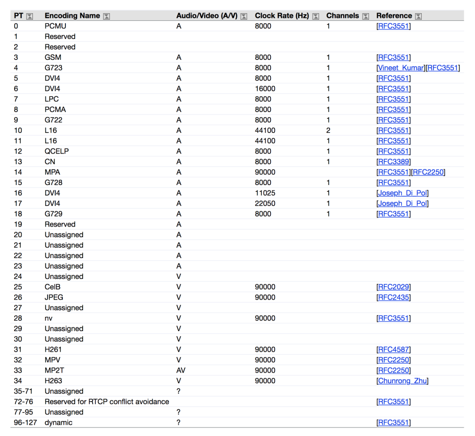

```bash
v=0
o=WMSWMS 1562204406 1562204407 IN IP4 192.168.40.79
s=WMSWMS
c=IN IP4 192.168.40.79
t=0 0
m=audio 31114 RTP/AVP 0 8 9 101
a=rtpmap:0 PCMU/8000
a=rtpmap:8 PCMA/8000
a=rtpmap:9 G722/8000
a=rtpmap:101 telephone-event/8000
a=fmtp:101 0-16
a=ptime:20
```

上面的SDP协议，我们只关注媒体编码部分，其中

```
m=audio 31114 RTP/AVP 0 8 9 101
a=rtpmap:0 PCMU/8000
a=rtpmap:8 PCMA/8000
a=rtpmap:9 G722/8000
```

- m字段audio说明是音频
- 31114是rtp的发送端口，一般rtp端口都是偶数，偶数后面的一个奇数端口是给rtcp端口的
- 0 8 9 101就是媒体编码，每个整数代表一个编码，其中96以下的是都是用IANA规定的，可以不用下面的rtpmap字段去指定，96以上的属于动态编码，需要用rtpmap去指定

上面是整个编码表，我们只需要记住几个就可以:



| 0 | PCMU/8000 |
| --- | --- |
| 3 | GSM/8000 |
| 8 | PCMA/8000 |
| 9 | G722/8000 |
| 18 | G729/8000 |
| 102 | DTMF/8000 |


**a=rtpmap:101 telephone-event/8000**<br />**a=fmtp:101 0-16**<br />上面的字段描述的是DTMP的支持。DTMF标准，所有SIP实体至少支持0-15的DTMF事件。

- 0-9是数字
- 10是*
- 11是#
- 12-15对应A,B,C,D


# 参考

- [https://www.iana.org/assignments/rtp-parameters/rtp-parameters.xhtml](https://www.iana.org/assignments/rtp-parameters/rtp-parameters.xhtml)
- [https://www.3cx.com/blog/voip-howto/sdp-voip2/](https://www.3cx.com/blog/voip-howto/sdp-voip2/)
- [https://www.3cx.com/blog/voip-howto/sdp-voip/](https://www.3cx.com/blog/voip-howto/sdp-voip/)

