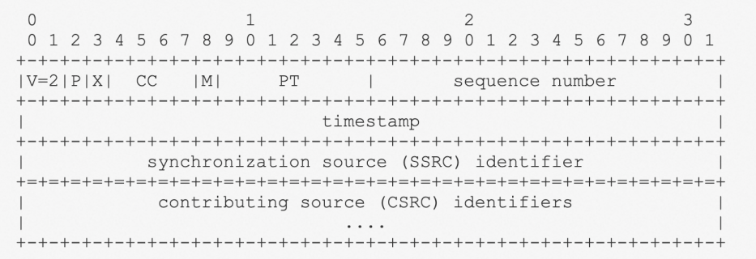
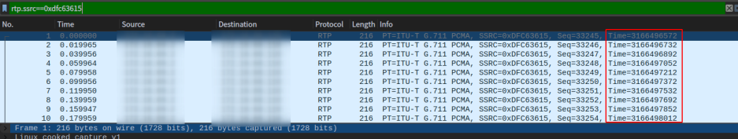
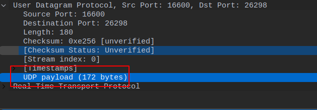
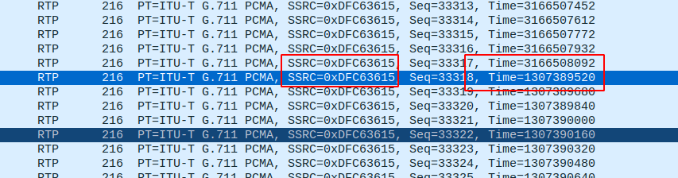
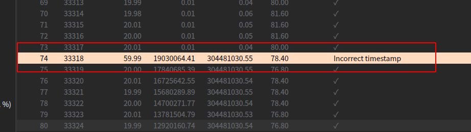

最近遇到一些和媒体流相关的问题，使用wireshark分析之后，总算有些眉目。然而我深感对RTP协议的理解，还是趋于表面。所以我决定，深入的学习一下RTP协议。

和rtp相关的协议有两个rfc, 分别是

- 1996的的 RFC 1889
- 2003年的 RFC 3550

RFC 3550是对RFC 1889的稍微改进，然而大体上是没什么改变的。所以我们可以直接看RFC 3550。

- RTP 底层用的是UDP协议
- RTP 的使用场景是传输实时数据，例如语音，视频，模拟数据等等
- RTP 并不保证QoS

# 
> **Synchronization source (SSRC):** The source of a stream of RTP packets, identified by a 32-bit numeric SSRC identifier carried in the RTP header so as not to be dependent upon the network address. All packets from a synchronization source form part of the same timing and sequence number space, so a receiver groups packets by synchronization source for playback. Examples of synchronization sources include the sender of a stream of packets derived from a signal source such as a microphone or a camera, or an RTP mixer (see below). A synchronization source may change its data format, e.g., audio encoding, over time. The SSRC identifier is a randomly chosen value meant to be globally unique within a particular RTP session (see Section 8). A participant need not use the same SSRC identifier for all the RTP sessions in a multimedia session; the binding of the SSRC identifiers is provided through RTCP (see Section 6.5.1). If a participant generates multiple streams in one RTP session, for example from separate video cameras, each MUST be identified as a different SSRC.

> The first twelve octets are present in every RTP packet, while the list of CSRC identifiers is present only when inserted by a mixer. The fields have the following meaning:

## version (V): 2 bits 
This field identifies the version of RTP. The version defined by this specification is two (2). (The value 1 is used by the first draft version of RTP and the value 0 is used by the protocol initially implemented in the "vat" audio tool.) 

## padding (P): 1 bit 
If the padding bit is set, the packet contains one or more additional padding octets at the end which are not part of the payload. The last octet of the padding contains a count of how many padding octets should be ignored, including itself. Padding may be needed by some encryption algorithms with fixed block sizes or for carrying several RTP packets in a lower-layer protocol data unit. 

## extension (X): 1 bit 
If the extension bit is set, the fixed header MUST be followed by exactly one header extension, with a format defined in Section 5.3.1. 

## CSRC count (CC): 4 bits 
The CSRC count contains the number of CSRC identifiers that follow the fixed header.

## marker (M): 1 bit 
The interpretation of the marker is defined by a profile. It is intended to allow significant events such as frame boundaries to be marked in the packet stream. A profile MAY define additional marker bits or specify that there is no marker bit by changing the number of bits in the payload type field (see Section 5.3). 

## payload type (PT): 7 bits 
This field identifies the format of the RTP payload and determines its interpretation by the application. A profile MAY specify a default static mapping of payload type codes to payload formats. Additional payload type codes MAY be defined dynamically through non-RTP means (see Section 3). A set of default mappings for audio and video is specified in the companion RFC 3551 [1]. An RTP source MAY change the payload type during a session, but this field SHOULD NOT be used for multiplexing separate media streams (see Section 5.2). A receiver MUST ignore packets with payload types that it does not understand. 

## sequence number: 16 bits 
The sequence number increments by one for each RTP data packet sent, and may be used by the receiver to detect packet loss and to restore packet sequence. The initial value of the sequence number SHOULD be random (unpredictable) to make known-plaintext attacks on encryption more difficult, even if the source itself does not encrypt according to the method in Section 9.1, because the packets may flow through a translator that does. Techniques for choosing unpredictable numbers are discussed in [17].

## timestamp: 32 bits 
最重要的就是这个字段，需要认证理解。

- timestamp的初始值是一个随机值，而不是linux时间戳
- timestamp反应的是rtp采样数据的一个字节的采样时刻
- 对于相同的rtp流来说，timestamp总是线性按照固定的长度增长，一般是160。采样频率一般是8000hz, 也就是说1秒会有8000个样本数据，每个样本占用1个字节。发送方一般每隔20毫秒发送一个20毫秒内的所有采样数据。那么一秒钟发送方会发送1000/20=50个RTP包，50个数据包发送8000个采样数据，平均每隔数据包携带8000/50=160个字节的数据。所以timestamp的增量一般是160， 在wireshark上抓包，可以看到rtc流的time字段是按照160的步长在增加。

- 然后我们分析单个的RTP流，从IP层可以看出UDP payload是172个字节，实际上就是rtp的采样数据160 + RTP的固定的12字节的头部

- 但是也有时候, timestamp也并不是总是按照固定的步长再增长，例如下图，3166508092的下一个包的Time字段突然变成1307389520了。这种情况比较特殊，一般是多个不同SSRC的语音流再经过同一个SBC时，SSRC被修改成相同的值，但是timestamp字段是原样保留的。导致发出的RTP流timestamp字段不再连续。在wireshark的流分析上，也能看出出现了不正常的timestamp。这种不正常的timestamp对于某些sipua来说，它可能会忽略不连续的所有后续的RTP包，进而导致无法放音的问题。我就层遇到过fs类似的问题，一个解决方案是升级fs, 另一个方案是试下 fs的rtp_rewrite_timestamps通道变量为true。[https://freeswitch.org/confluence/display/FREESWITCH/rtp_rewrite_timestamps](https://freeswitch.org/confluence/display/FREESWITCH/rtp_rewrite_timestamps)

> The timestamp reflects the sampling instant of the first octet in the RTP data packet. The sampling instant MUST be derived from a clock that increments monotonically and linearly in time to allow synchronization and jitter calculations (see Section 6.4.1). The resolution of the clock MUST be sufficient for the desired synchronization accuracy and for measuring packet arrival jitter (one tick per video frame is typically not sufficient). The clock frequency is dependent on the format of data carried as payload and is specified statically in the profile or payload format specification that defines the format, or MAY be specified dynamically for payload formats defined through non-RTP means. If RTP packets are generated periodically, the nominal sampling instant as determined from the sampling clock is to be used, not a reading of the system clock. As an example, for fixed-rate audio the timestamp clock would likely increment by one for each sampling period. If an audio application reads blocks covering 160 sampling periods from the input device, the timestamp would be increased by 160 for each such block, regardless of whether the block is transmitted in a packet or dropped as silent. The initial value of the timestamp SHOULD be random, as for the sequence number. Several consecutive RTP packets will have equal timestamps if they are (logically) generated at once, e.g., belong to the same video frame. Consecutive RTP packets MAY contain timestamps that are not monotonic if the data is not transmitted in the order it was sampled, as in the case of MPEG interpolated video frames. (The sequence numbers of the packets as transmitted will still be monotonic.) RTP timestamps from different media streams may advance at different rates and usually have independent, random offsets. Therefore, although these timestamps are sufficient to reconstruct the timing of a single stream, directly comparing RTP timestamps from different media is not effective for synchronization. Instead, for each medium the RTP timestamp is related to the sampling instant by pairing it with a timestamp from a reference clock (wallclock) that represents the time when the data corresponding to the RTP timestamp was sampled. The reference clock is shared by all media to be synchronized. The timestamp pairs are not transmitted in every data packet, but at a lower rate in RTCP SR packets as described in Section 6.4. The sampling instant is chosen as the point of reference for the RTP timestamp because it is known to the transmitting endpoint and has a common definition for all media, independent of encoding delays or other processing. The purpose is to allow synchronized presentation of all media sampled at the same time. Applications transmitting stored data rather than data sampled in real time typically use a virtual presentation timeline derived from wallclock time to determine when the next frame or other unit of each medium in the stored data should be presented. In this case, the RTP timestamp would reflect the presentation time for each unit. That is, the RTP timestamp for each unit would be related to the wallclock time at which the unit becomes current on the virtual presentation timeline. Actual presentation occurs some time later as determined by the receiver. An example describing live audio narration of prerecorded video illustrates the significance of choosing the sampling instant as the reference point. In this scenario, the video would be presented locally for the narrator to view and would be simultaneously transmitted using RTP. The "sampling instant" of a video frame transmitted in RTP would be established by referencing

 its timestamp to the wallclock time when that video frame was presented to the narrator. The sampling instant for the audio RTP packets containing the narrator's speech would be established by referencing the same wallclock time when the audio was sampled. The audio and video may even be transmitted by different hosts if the reference clocks on the two hosts are synchronized by some means such as NTP. A receiver can then synchronize presentation of the audio and video packets by relating their RTP timestamps using the timestamp pairs in RTCP SR packets. 

## SSRC: 32 bits 
The SSRC field identifies the synchronization source. This identifier SHOULD be chosen randomly, with the intent that no two synchronization sources within the same RTP session will have the same SSRC identifier. An example algorithm for generating a random identifier is presented in Appendix A.6. Although the probability of multiple sources choosing the same identifier is low, all RTP implementations must be prepared to detect and resolve collisions. Section 8 describes the probability of collision along with a mechanism for resolving collisions and detecting RTP-level forwarding loops based on the uniqueness of the SSRC identifier. If a source changes its source transport address, it must also choose a new SSRC identifier to avoid being interpreted as a looped source (see Section 8.2). 

## CSRC list: 0 to 15 items, 32 bits each 
The CSRC list identifies the contributing sources for the payload contained in this packet. The number of identifiers is given by the CC field. If there are more than 15 contributing sources, only 15 can be identified. CSRC identifiers are inserted by mixers (see Section 7.1), using the SSRC identifiers of contributing sources. For example, for audio packets the SSRC identifiers of all sources that were mixed together to create a packet are listed, allowing correct talker indication at the receiver.

# 参考文档

- [http://www.rfcreader.com/#rfc3550](http://www.rfcreader.com/#rfc3550)
- [http://www.rfcreader.com/#rfc1889](http://www.rfcreader.com/#rfc1889)

