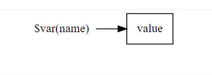

# 简介

OpenSIPS的路由脚本提供了几种不同类型的变量。不同类型的变量有以下几个方面的差异。

1. 变量的可见性
2. 变量引用的值
3. 变量的读写性质：有些变量是只读的，有些变量可读可写
4. 变量是否有多个值：有些变量只有一个值，有些变量有多个值


# 语法

```
$(<context>name(subname)[index]{tramsformation})
```
除了name以外 ，其他都是可选的值。

- name(必传)：变量名的类型，例如pvar, avp, ru, DLG_status等等
- subname: 变量名称，例如hdr(From), avp(name)
- index: 索引，某些变量可以有多个值，类似于数组。可以用索引去引用对应的元素。从0开始，也可以是负值如-1, 表示倒数第一个。
- transformation: 转换。做一些格式转换，字符串截取等等操作
- context: 上下文。OpenSIP有两个上下午，请求`request`、相应`reply`。想想一个场景，你在一个相应路由里如何拿到请求路由的某个值呢？ 可以使用$(<reqeust>ru).  或者在一个失败路由里获取一个Concact的信息$(<reply>hdr(Contact))

举例：

- 仅仅通过类型来引用：$ru
- 通过类型和名称来引用：$hrd(Contact), 引用某个SIP header的值
- 通过类型和索引来引用：$(ct[0])
- 通过类型、名称、索引来引用：$(avp(addr)[0])


# 变量的类型

## 脚本变量


- 脚本变量只有一个值
- 脚本变量可读可写
- 脚本变量在路由及其子路由中都是可见的
- 脚本变量使用前务必先初始化，否则可能会引用到之前的值
- 脚本变量的值可以是字符串，也可以是整数类型
- 脚本变量读写比avp变量快
- 脚本变量会持久存在一个OpenSIPS进程中
- 将脚本变量设置为NULL, 实际上是将变量的值设置为'0',  脚本变量没有NULL值。
- 脚本变量之存在与一个路由中

使用举例
```
route{
	$var(a) = 19
	$var(a) = "wdd"
	$var(a) =  "wdd" + "@" + $td;
  
  if(route(check_out, 1)){
  	xlog("check error");
  }
  
}

route[check_out]{
  # 注意，这里$var(a)的值就不存在了
	xlog("$var(a)");
  
  if ($param(1) > 1) {
  	return (-1);
  }
  return(1);
}


```


## avp变量


- avp变量一般会关联到一个sip消息或者SIP事务上.
- avp变量可以有多个值
- 可以avp变量理解成一个后进先出的栈
- 所有处理这个消息的子路由都可以获得avp的变量。但是如果想在响应路由中想获取请求路由中的avp变量，则需要设置TM模块的onreply_avp_mode参数：`modparam("tm","onreply_avp_mode", 1)`


```
$avp(trunk)="hello";
$avp(trunk)="duan";
$avp(trunk)="hi";

# 可以把trunk的值理解成下面的样子
# hi -> duan -> hello

xlog("$avp(trunk)"); 这里只能打印出hi
xlog("$(avp(trunk)[2])"); 这里能打印hello

$avp(trunk)=NULL; 这里能删除最后的一个值，如果只有一个值，那么整个avp会被删除

avp_delete("$avp(trunk)/g"); # 删除avp所有的值，包括这个avp自身。

$(avp(trunk)[1])="heihei"; 重新赋值

$(avp(trunk)[1])=NULL; 删除某一个值
```


## 伪变量
伪变量主要是对SIP消息的各个部分进行引用的

大部分伪变量很好接，都是缩写的单词的首字母。

- 伪变量以$开头，加sip消息字段的缩写，例如$ci,  代表sip callID

| 序号 | 名称 | 是否可修改 | 含义 |
| --- | --- | --- | --- |
| 1 | $ai | <br /> | 引用P-Asserted-Identify头的url |
| 2 | $adu | <br /> | Authentication Digest URI |
| 3 | $ar | <br /> | Authentication realm |
| 4 | $au |  | Auth username user |
| 5 | $ad |  | Auth username domain |
| 6 | $an |  | Auth nonce |
| 7 | $auth.resp |  | Auth response |
| 8 | $auth.nonce |  | Auth nonce |
| 9 | $auth.opaque |  | the opaque 字符串 |
| 10 | $auth.alg |  | 认证算法 |
| 11 | $auth.qop |  | qop参数的值 |
| 12 | $auth.nc |  | nonce count参数 |
| 13 | $aU |  | 整个username |
| 14 | $Au |  | 计费用的账户名，主要是acc会用 |
| 15 | **$argv** |  | 获取通过命令行参数设置参数-o。<br /><br />例如在启动opensips时```bash
opensips -o maxsiplength=1200
```
<br /><br />在脚本里就可以通过$argv(maxsiplength)<br />```bash
xlog("maxsiplength: is $argv(maxsiplength)")
```
 |
| 16 | $af |  | ip协议，可能是INET(ipv4), 或者是INET6(ipv6) |
| 17 | $branch |  | 用来创建新的分支<br />```bash
$branch="sip:new#domain";
```
 |
| 18 | $branch() |  | <br />- $branch(uri)<br />- $branch(duri)<br />- $branch(q)<br />- $branch(path)<br />- $branch(flags)<br />- $branch(socket)<br /> |
| 19 | **$ci** |  | 引用sip call-id。 (call-id) |
| 20 | **$cl** |  | 引用sip body部分的长度。(content-length) |
| 21 | $cs |  | 引用 cseq number |
| 22 | $ct |  | 引用Contact<br />- $ci<br />- $(ct[n])<br />- $(ct[-n])<br /> |
| 23 | $ct.fields() | <br /> | <br />- $ct.fields(name)<br />- $ct.fields(uri)<br />- $ct.fields(q)<br />- $ct.fields(expires)<br />- $ct.fields(methods)<br />- $ct.fields(received)<br />- $ct.fields(params) 所有的参数<br /> |
| 24 | $cT |  | <br />- $cT   Content-Type<br />- $(cT[n])<br />- $(cT[-n])<br />- $(cT[*])<br /> |
| 25 | **$dd** |  | 引用目标url里面的domain部分 |
| 26 | $di |  | diversion header |
| 27 | $dip |  | diversion privacy prameter |
| 29 | $dir |  | diversion reason parameter |
| 30 | $dp |  | 目标url的端口号部分 (destionation port) |
| 31 | $dP |  | 目标url的传输协议部分 (destionation protocol) |
| 32 | $ds |  | destionation set |
| 33 | **$du** |  | 引用 destionation url |
| 34 | $err.class |  | 错误的类别<br />- 1 解析错误<br /> |
| 35 | $err.level |  | 错误的级别 |
| 36 | $err.info |  | 错误信息的描述 |
| 37 | $err.rcode |  | error reply code |
| 38 | $err.rreason |  | error reply reason |
| 39 | **$fd** |  | From URI domain |
| 40 | **$fn** |  | From display name |
| 41 | **$fs** |  | 强制使用某个地址发送消息。 (forced socket)<br />格式：proto:ip:port |
| 42 | $ft |  | From tag |
| 43 | **$fu** |  | From URL |
| 44 | **$fU** |  | username in From URL |
| 45 | **$log_level** |  | 可以用来动态修改日志级别<br />$log_level=4;<br /><br />$log_level=NULL; 恢复默认值 |
| 46 | $mb |  | sip message buffer |
| 47 | $mf |  | message flags |
| 48 | $mi |  | sip message id |
| 49 | **$ml** |  | sip message length |
| 50 | $od |  |  domain in original R-URI |
| 51 | $op |  |  port in original R-URI |
| 52 | $oP |  | transport protocol of original R-URI |
| 53 | $ou |  | original URI |
| 54 | $oU |  | username in original URI |
| 55 | **$param(idx)** |  | 引用路由参数，从1开始<br />```bash
route{
	route(R_NAME, $var(debug), "pp");
}

route[R_NAME]{
	$param(1); #引用第一个参数 $var(debug)
  $param(2); #引用第二个参数 pp
}
```
 |
| 56 | $pd |  | domain in sip P-Prefered-Identify header |
| 57 | $pn |  | display name in sip P-Prefered-Identify header |
| 58 | $pp |  | process id |
| 59 | $pr $proto |  | 接受消息的协议 UDP, TCP, TLS, SCTP, WS |
| 60 | $pu |  | URL in sip P-Prefered-Identify header |
| 61 | **$rd** |  | domain in request url |
| 62 | $rb |  | body of request/replay<br />- $rb<br />- $(rb[*])<br />- $(rb[n])<br />- $(rb[-n])<br />- $rb(application/sdp)<br />- $rb(application/isup)<br /> |
| 63 | **$rc $retcode** |  | 上个函数的返回结果 |
| 64 | $re |  | remote-party-id |
| 65 | **$rm** |  | sip method |
| 66 | **$rp** |  | port of R-RUI |
| 67 | $rP |  | transport protocol pf R-URI |
| 68 | $rr |  | reply reason |
| 69 | **$rs** |  | reply status |
| 70 | **$ru** |  | request url |
| 71 | **$rU** |  |  |
| 72 | $ru_q |  |  |
| 73 | **$Ri** |  |  |
| 74 | **$Rp** |  |  |
| 75 | $sf |  |  |
| 76 | **$si** |  |  |
| 77 | **$sp** |  |  |
| 78 | $tt |  |  |
| 79 | **$tu** |  |  |
| 80 | **$tU** |  |  |
| 81 | $time(format) |  |  |
| 82 | $T_branch_idx |  |  |
| 83 | $Tf |  |  |
| 84 | $Ts |  |  |
| 85 | $Tsm |  |  |
| 86 | $TS |  |  |
| 87 | **$ua** |  |  |
| 88 | **$(hdr(name)[N])** |  |  |
| 89 | $rT |  |  |
| 90 | $cfg_line  $cfg_file |  |  |
| 91 | $xlog_level |  |  |


