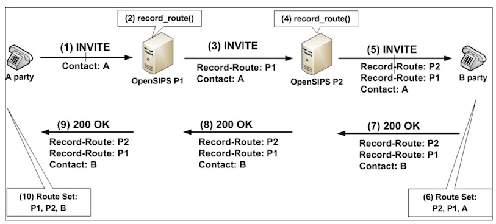
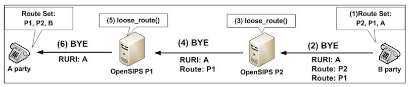

在说这两种路由前，先说一个故事。蚂蚁找食物。

> 蚁群里有一种蚂蚁负责搜寻食物叫做侦察兵，侦察兵得到消息，不远处可能有食物。于是侦察兵开始搜索食物的位置，并沿途留下自己的气味。翻过几座山之后，侦察兵发现了食物。然后又沿着气味回到了部落。然后通知搬运兵，沿着自己留下的气味，就可以找到食物。


在上面的故事中，侦查兵可以看成是初始化请求，搬运并可以看做是序列化请求。在学习opensips的路由过程中，能够区分初始化请求和序列化请求，是非常重要的。

一般路由处理，查数据库，查dns等都在初始化请求中做处理，序列化请求只需要简单的更具sip route字段去路由就可以了。

| 类型 | 功能 | message | 如何区分 | 特点 |
| --- | --- | --- | --- | --- |
| 初始化请求 | 创建session或者dialog | invite | has_totag()是false | <br />1. **发现被叫**：初始化请求经过不同的服务器，DNS服务器，前缀路由等各种复杂的路由方法，找到被叫<br />2. **记录路径: **记录到达被叫的路径，给后续的序列请求提供导航<br /> |
| 序列化请求 | 修改或者终止session | ack, bye, re-ivite, notify | has_totag()是true | <br />1. 只需要根据初始化请求提供的导航路径，来到达路径，不需要复杂的路由逻辑。<br /> |

区分初始化请求和序列化请求，是用header字段中的to字段是否含有tag标签。

tag参数被用于to和from字段。使用callid，fromtag和totag三个字段可以来唯一识别一个dialog。每个tag来自一个ua。

当一个ua发出一个不在对话中的请求时，fromtag提供一半的对话标识，当对话完成时，另一方参与者提供totag标识。

举例来说，对于一个invite请求，例如Alice->Proxy

1. invite请求to字段无tag参数
2. 当alice回ack请求时，已经含有了to tag。这就是一个序列化请求了。因为通过之前的200ok, alice已经知道到达bob的路径。


```bash
INVITE sip:bob@biloxi.example.com SIP/2.0
Via: SIP/2.0/TCP client.atlanta.example.com:5060;branch=z9hG4bK74b43
Max-Forwards: 70
Route: <sip:ss1.atlanta.example.com;lr>
From: Alice <sip:alice@atlanta.example.com>;tag=9fxced76sl  # 有from tag
To: Bob <sip:bob@biloxi.example.com>                        # 无to tag
Call-ID: 3848276298220188511@atlanta.example.com
CSeq: 1 INVITE
Contact: <sip:alice@client.atlanta.example.com;transport=tcp>
Content-Type: application/sdp
Content-Length: 151


ACK sip:bob@client.biloxi.example.com SIP/2.0
Via: SIP/2.0/TCP client.atlanta.example.com:5060;branch=z9hG4bK74b76
Max-Forwards: 70
Route: <sip:ss1.atlanta.example.com;lr>,
    <sip:ss2.biloxi.example.com;lr>
From: Alice <sip:alice@atlanta.example.com>;tag=9fxced76sl
To: Bob <sip:bob@biloxi.example.com>;tag=314159
Call-ID: 3848276298220188511@atlanta.example.com
CSeq: 2 ACK
Content-Length: 0
```


**注意，一定要明确一个消息，到底是请求还是响应。我们说初始化请求和序列化请求，说的都是请求，而不是响应。**

有些响应效应，例如代理返回的407响应，也会带有to tag。

```bash
SIP/2.0 407 Proxy Authorization Required
   Via: SIP/2.0/TCP client.atlanta.example.com:5060;branch=z9hG4bK74b43
    ;received=192.0.2.101
   From: Alice <sip:alice@atlanta.example.com>;tag=9fxced76sl
   To: Bob <sip:bob@biloxi.example.com>;tag=3flal12sf
   Call-ID: 3848276298220188511@atlanta.example.com
   CSeq: 1 INVITE
   Proxy-Authenticate: Digest realm="atlanta.example.com", qop="auth",
    nonce="f84f1cec41e6cbe5aea9c8e88d359",
    opaque="", stale=FALSE, algorithm=MD5
   Content-Length: 0
```


下图初始化请求




下图序列化请求




**路由脚本中，初始化请求都是许多下很多功夫去考虑如何处理的。而对于序列化请求的处理则要简单的多。**


