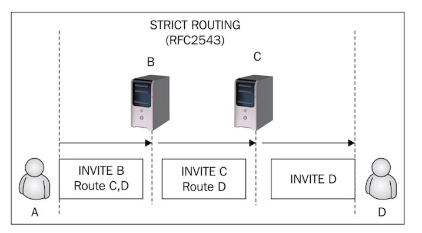
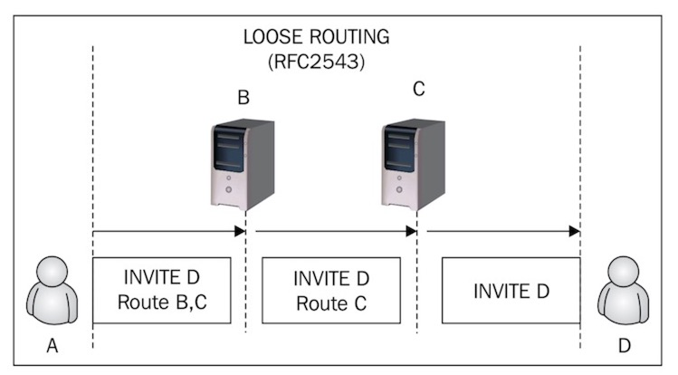
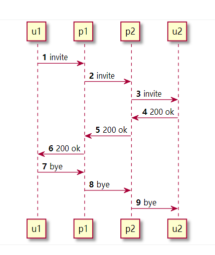

松散路由是sip 2版本的新的路由方法。严格路由是老的路由方法。


# 如何从sip消息中区分严格路由和松散路由

下图sip消息中Route字段中带有**lr,  **则说明这是松散路由。

```bash
REGISTER sip:127.0.0.1 SIP/2.0
Via: SIP/2.0/UDP 127.0.0.1:58979;rport;branch=z9hG4bKPjMRzNdeTKn9rHNDtyJuVoyrDb84.cPtL8
Route: <sip:127.0.0.1;lr>
Max-Forwards: 70
From: "1001" <sip:1001@172.17.0.2>;tag=oqkOzbQYd9cx5vXFjUnB1WufgWUZZxtZ
To: "1001" <sip:1001@172.17.0.2>
```


# 功能上的区别

严格路由，sip请求经过uas后，invite url每次都会被重写。



松散路由，sip请求经过uas后，invite url不变。





```bash
#1 invite
INVITE sip:callee@domain.com SIP/2.0
Contact: sip:caller@u1.example.com

#2 invite
INVITE sip:callee@domain.com SIP/2.0
Contact: sip:caller@u1.example.com
Record-Route: <sip:p1.example.com;lr>

#3 invite
INVITE sip:callee@u2.domain.com SIP/2.0
Contact: sip:caller@u1.example.com
Record-Route: <sip:p2.domain.com;lr>
Record-Route: <sip:p1.example.com;lr>

#4 200 ok
SIP/2.0 200 OK
Contact: sip:callee@u2.domain.com
Record-Route: <sip:p2.domain.com;lr>
Record-Route: <sip:p1.example.com;lr>

#7 bye
BYE sip:callee@u2.domain.com SIP/2.0
Route: <sip:p1.example.com;lr>,<sip:p2.domain.com;lr>

#8 bye
BYE sip:callee@u2.domain.com SIP/2.0
Route: <sip:p2.domain.com;lr>

#9 bye
BYE sip:callee@u2.domain.com SIP/2.0
```


# Traversing a Strict-Routing Proxy


