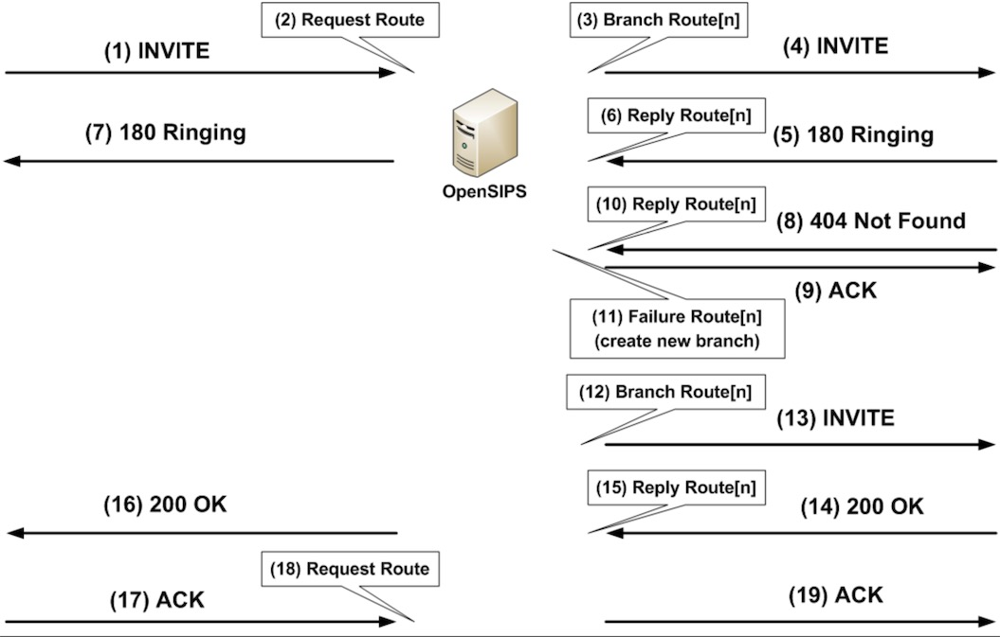

掌握路由触发时机的关键是以下几点

1. **消息是请求还是响应**
2. **消息是进入opensips的(incoming)，还是离开opensips的(outgoing)**
3. **从opensips发出去的ack请求，不会触发任何路由**

|  | **进入opensips(**incoming) | **离开opensip**s(outgoing) |
| --- | --- | --- |
| 请求 | 触发请求路由：例如invite, register, ack | 触发分支路由。如invite的转发 |
| 响应 | 触发响应路由。如果是大于等于300的响应，还会触发失败路由。 | 不会触发任何路由 |

