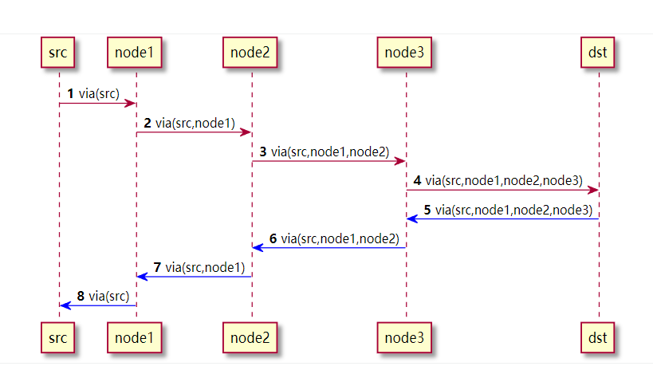

# 两种头
- via headers **响应按照Via字段向前走**
- route headers **请求按照route字段向前走**

# Via头

- 当uac发送请求时, 每个ua都会加上自己的via头, via都的顺序很重要，每个节点都需要将自己的Via头加在最上面
- 响应消息按照via头记录的地址返回，每次经过自己的node时候，要去掉自己的via头
- via用来指明消息应该按照什么

# Route头

# 路由模块

| 模块 |  |  |
| --- | --- | --- |
| CARRIERROUTE |  |  |
| DISPATCHER |  |  |
| DROUTING |  |  |
| LOAD_BALANCER |  |  |

