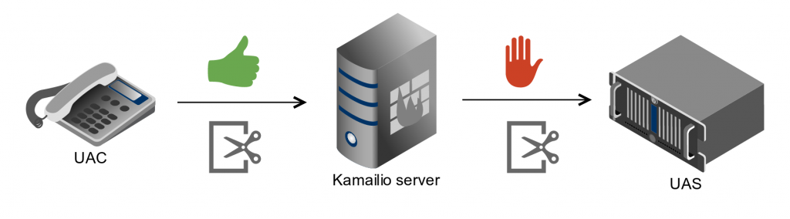
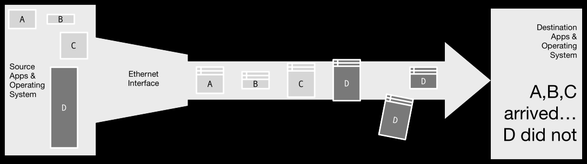
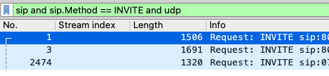
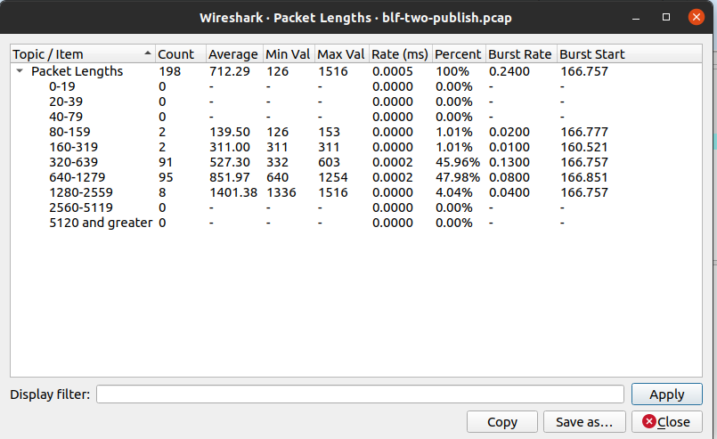

# 现象
有了开源的框架，我们可以很方便的运行一个VOIP系统。但是维护一个VOIP系统并非那么简单。特别是如果经常出现一些偶发的问题，需要用经验丰富的运维人员来从不同层面分析。

其中UDP分片，也可能是原因之一。


# 简介

以太网的最大MTU一般是1500字节，减去20字节的IP首部，8字节的UDP首部，UDP能承载的数据最大是1472字节。

如果一个SIP消息的报文超过1472就会分片。（实际上，如果网络的MTU比1500更小，那么达到分片的尺寸也会变小）

如下图，发送方通过以太网发送了4个报文，ABCD。其中D报文太了，而被分割成了三个报文。在传输过程中，D的一个分片丢失，接收方由于无法重新组装D报文，所以就将D报文的所有分片都丢弃。

这将会导致一下问题

1. 发送方因接收不到响应，所以产生了重传
2. 丢弃的分片导致其他的分片浪费了带宽
3. IP分片是对发送者来说是简单的，但是对于接收者来说，分片的组装将会占用更多的资源


RFC 3261中给出建议，某些情况下可以使用TCP来传输。

1. 当MTU是未知的情况下，如果消息超过1300字节，则选择使用TCP传输
2. 当MTU是已知情况下，SIP的消息的大小如果大于MTU-200, 则需要使用TCP传输。留下200字节的余量，是因为SIP消息的响应可能大于SIP消息的请求，为了避免响应消息超过MTU，所以要留下200字节的余量。

>    If a request is within 200 bytes of the path MTU, or if it is larger
>    than 1300 bytes and the path MTU is unknown, the request MUST be sent

>    using an RFC 2914 [43] congestion controlled transport protocol, such

>    as TCP. If this causes a change in the transport protocol from the

>    one indicated in the top Via, the value in the top Via MUST be

>    changed.  This prevents fragmentation of messages over UDP and

>    provides congestion control for larger messages.  However,

>    implementations MUST be able to handle messages up to the maximum

>    datagram packet size.  For UDP, this size is 65,535 bytes, including

>    IP and UDP headers.

> 

>    The 200 byte "buffer" between the message size and the MTU

>       accommodates the fact that the response in SIP can be larger than

>       the request.  This happens due to the addition of Record-Route

>       header field values to the responses to INVITE, for example.  With

>       the extra buffer, the response can be about 170 bytes larger than

>       the request, and still not be fragmented on IPv4 (about 30 bytes
>       is consumed by IP/UDP, assuming no IPSec).  1300 is chosen when

>       path MTU is not known, based on the assumption of a 1500 byte

>       Ethernet MTU.  RFC 3261 18.1.1


但是使用TCP来传输也有缺点，就是比使用UDP更占用资源。


# 如何发现问题


用tcpdump在路径中抓包，然后使用wireshark分析抓包文件的大小分布。




# 如何减少包的尺寸

1. 移除无用的SIP头或者无用的SDP信息, 以opensips脚本为例子
```bash
# 可以通过$ml来获取消息的长度

if ($ml > 1300) {
	xlog("L_WARN","$ci $rm $si $fu: message big then 1300: $ml");
}

if ($ml >= 1500) {
	xlog("L_ERR","$ci $rm $si $fu: message to big than 1500 $ml");
  sl_send_reply("513","Message too big");
}

# 可以通过remove_hf和codec_delete来移除多余的消息
if(is_present_hf("User-Agent")) {  
  remove_hf("User-Agent");  
}  

if (codec_exists("Speex")) {  
  codec_delete("Speex");  
}  
```

2. 使用SIP头压缩技术，opensips中也有头压缩的模块
3. 注意不要在脚本中随意使用append_hf去给SIP消息增加头


# 参考

- [https://www.yay.com/faq/voip-network/udp-maximum-mtu-size/](https://www.yay.com/faq/voip-network/udp-maximum-mtu-size/)
- [https://www.ibm.com/support/pages/sending-large-sip-request-exceeds-mtu-value-might-not-switch-udp-tcp](https://www.ibm.com/support/pages/sending-large-sip-request-exceeds-mtu-value-might-not-switch-udp-tcp)
- [http://www.rfcreader.com/#rfc3261_line6474](http://www.rfcreader.com/#rfc3261_line6474)
- [https://www.ecg.co/blog/125-sip-and-fragments-together-forever](https://www.ecg.co/blog/125-sip-and-fragments-together-forever)
- [https://en.wikipedia.org/wiki/IP_fragmentation](https://en.wikipedia.org/wiki/IP_fragmentation)
- [https://thomas.gelf.net/blog/archives/Smaller-SIP-packets-to-avoid-fragmentation,27.html](https://thomas.gelf.net/blog/archives/Smaller-SIP-packets-to-avoid-fragmentation,27.html)
- [http://www.evaristesys.com/blog/sip-udp-fragmentation-and-kamailio-the-sip-header-diet/](http://www.evaristesys.com/blog/sip-udp-fragmentation-and-kamailio-the-sip-header-diet/)

