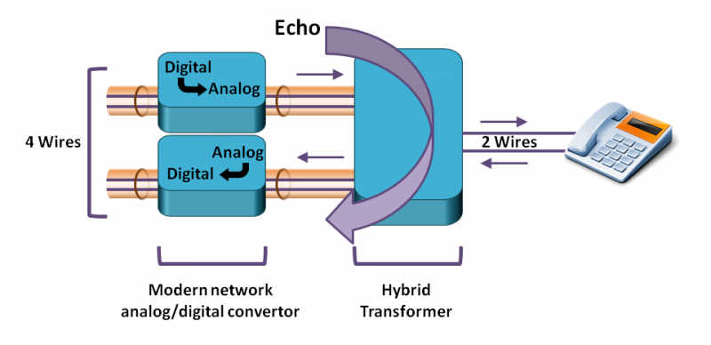

# 回音现象
说话人能在麦克风中听到自己的说话声。

# 回音的可能原因

- 有的开发，喜欢用分机打自己的号码，你分机和你的手机离得太近，自然回产生回音的。

# 参考资料

- [http://www.voiptroubleshooter.com/problems/echo.html](http://www.voiptroubleshooter.com/problems/echo.html)
- [https://www.lifewire.com/how-to-stop-producing-echo-3426515](https://www.lifewire.com/how-to-stop-producing-echo-3426515)
- [https://www.voipmechanic.com/voip-top-5-complaints.htm](https://www.voipmechanic.com/voip-top-5-complaints.htm)
- [https://getvoip.com/blog/2012/12/18/the-biggest-causes-behind-echo-in-voip/](https://getvoip.com/blog/2012/12/18/the-biggest-causes-behind-echo-in-voip/)
- [https://blog.csdn.net/huoppo/article/details/6643066](https://blog.csdn.net/huoppo/article/details/6643066)

