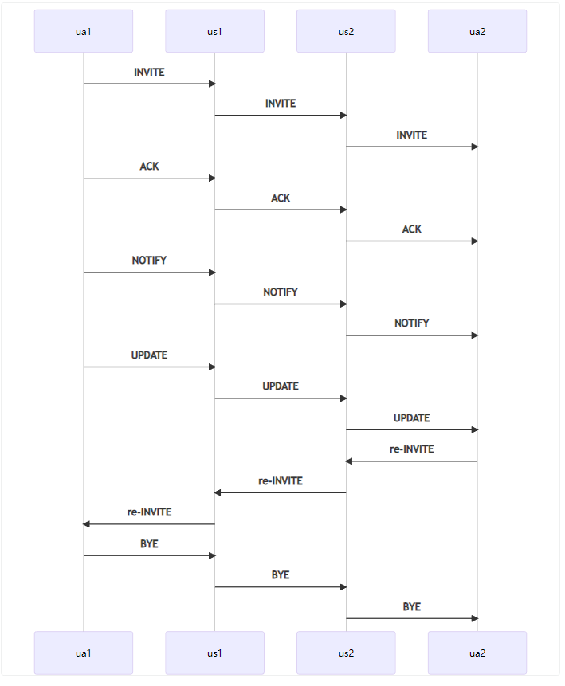
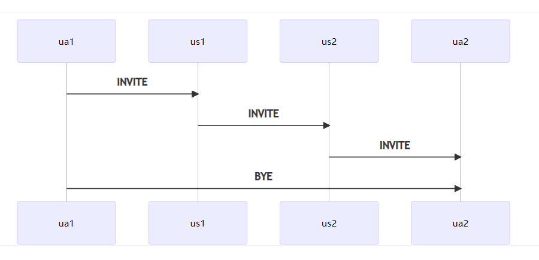
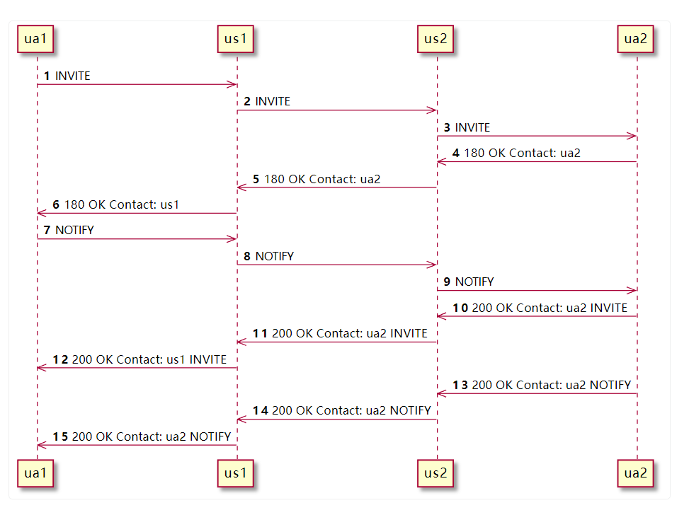

# 问题表现

在经过初始化请求之后，路径发现完成。在这个dialog中所有的请求，正常来ua1和ua2之间的所有请求，都应该经过us1和us2。

如下图所示：

某些时候，ua1可能直接把BYE消息直接发送给ua2, 但是一般ua1和ua2是存在uat网络的，所以这个BYE消息，ua2很可能收不到。

问题的表现就是电话无法正常挂断。

# 问题分析

- 可能原因1: us1和us2没有做record-route, 导致请求直接根据某个请求的响应消息的Contact头，直接发送了。
- 可能原因2: 某些请求的拓扑隐藏没有做好

## 拓扑隐藏问题具体分析
假如我们在us1上正确的做了拓扑隐藏，那么ua1的所有收到的响应，它的Contact头的地址都会改成us1的地址。那么ua1是无论如何都获取不到ua2的直接地址的。

但是，假如某个消息处理的不对呢？

- 注意180响应5到6, 其中us1正确的修改了Contact头
- ua1收到180后，立即发送了notify消息
- 如果us1没有正确处理notify的响应的Contact头，us1就会把ua2的Contact信息发送给ua1。有些notify的响应带有Contact头，有些没带有。
- 但是这里会出现一个**竞争条件，invite的200ok和notify的200ok，消息到达的顺序，将影响ua2的Contact信息**
   - 如果ua1后收到invite的200ok, 此时ua1获取ua2的地址是us1
   - 如果ua2后收到notify的200ok, 此时ua2获取的ua2的地址就是ua2
- 所以问题的表现可能是有偶现的，**这种问题处理其实是比较棘手的**
- 当然也是有解决方案的
   - 方案1， us1对notify正确处理响应消息Contact, 将其修改成us1
   - 方案2，us1直接删除notify响应消息的Contact头

