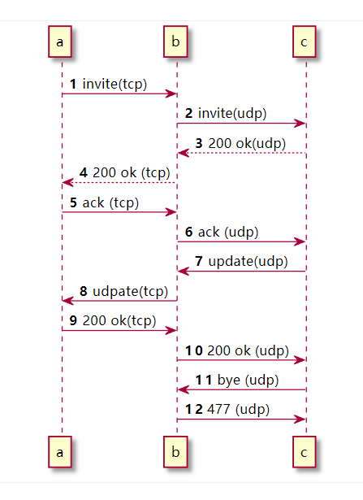

这个报错比较容易出现在tcp转udp的场景，可以看以下的时序图

ab之间用tcp通信，bc之间用udp通信。在通话建立后，c给b发送了bye请求，但是b发送给了c 477。正常来说b应该把bye转发给a.

那么问题出在哪里呢？

问题就出在update请求的响应上，update的响应200ok中带有Contact头，如果是Contact是个nat的地址，没有经过fixed nat, 那么b是无法直接给nat内部的地址发送请求的。

处理的办法也很简单，就是在收到a返回的200ok时，执行fix_nated_contact()

遇到这种问题，往往进入一种思维误区，就是在INVITE请求成功后，fix了nat Contact后，Contact头是不会变的。

但是实际上，很多SIP请求，例如NOTIFY, UPDATE都会携带请求和响应都会携带Contact, 如果只处理了INVITE的Contact头，没有处理其他携带Contact的sip请求或者响应，就必然也会遇到类似的问题。

我们知道SIP的Contact后，决定了序列化请求的request url。如果Contact处理的有问题，必然在按照request url转发的时候出现问题。

综上所述：无论请求还是响应，都要考虑这个消息是否携带了Contact头，以及是否需要fix nat Contact。

