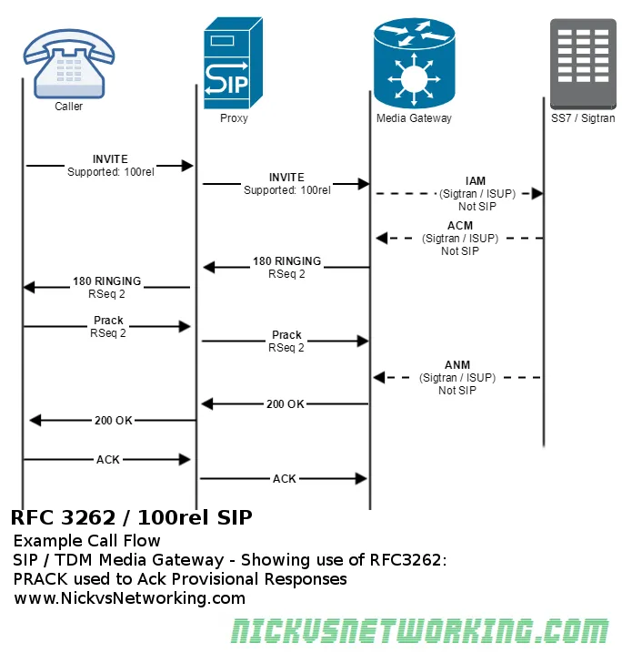

[sbc_100rel.pdf](./sbc_100rel.pdf)

在fs中配置：

- enable-100rel 设置为true
```bash
➜  fs-conf ack 100rel
sip_profiles/internal.xml
112:        There are known issues (asserts and segfaults) when 100rel is enabled.
113:        It is not recommended to enable 100rel at this time.
115:    <!--<param name="enable-100rel" value="true"/>-->

sip_profiles/external-ipv6.xml
36:    <!--<param name="enable-100rel" value="true"/>-->

sip_profiles/internal-ipv6.xml
27:    <!--<param name="enable-100rel" value="false"/>-->

sip_profiles/external.xml
36:    <!--<param name="enable-100rel" value="true"/>-->
```

##### 

# enable-100rel
This enable support for 100rel (100% reliability - PRACK message as defined in[RFC3262](http://tools.ietf.org/html/rfc3262)) This fixes a problem with SIP where provisional messages like "180 Ringing" are not ACK'd and therefore could be dropped over a poor connection without retransmission. *2009-07-08:* Enabling this may cause FreeSWITCH to crash, see[FSCORE-392](http://jira.freeswitch.org/browse/FSCORE-392).<br /><param name="enable-100rel" value="true"/>


# 参考

- [http://lists.freeswitch.org/pipermail/freeswitch-users/2018-April/129473.html](http://lists.freeswitch.org/pipermail/freeswitch-users/2018-April/129473.html)
- [https://freeswitch.org/confluence/display/FREESWITCH/Sofia+Configuration+Files](https://freeswitch.org/confluence/display/FREESWITCH/Sofia+Configuration+Files)
- [https://tools.ietf.org/html/draft-ietf-sip-100rel-02](https://tools.ietf.org/html/draft-ietf-sip-100rel-02)
- [https://nickvsnetworking.com/sip-extensions-100rel-sip-rfc3262/](https://nickvsnetworking.com/sip-extensions-100rel-sip-rfc3262/)

