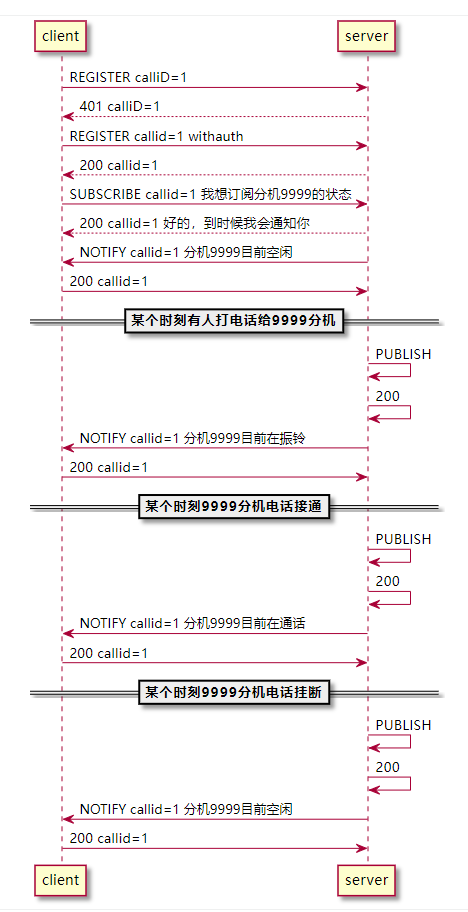

# BLF功能简介
BLF是busy lamp field的缩写。一句话介绍就是，一个分机可以监控另一个分机的呼叫状态，状态可以通过分机上的指示灯来表示。

例如：<br />分机A通过配置过后，监控了分机B。

- 如果分机B没有通话，那么分机A上的指示灯显示绿色
- 如果分机B上有一个呼叫正在振铃，那么分机A指示灯红色灯闪烁
- 如果分机B正在打电话，那么分机A的指示灯显示红色

这个功能的使用场景往往时例如秘书B监控了老板A的话机，在秘书把电话转给老板之前，可以通过自己电话上的指示灯，来判断老板有没有在打电话，如果没有再打电话，才可以把电话转过去。


# 信令实现逻辑




# 信令分析

## 空闲通知
```shell
NOTIFY sip:8003@192.168.2.109:5060 SIP/2.0
Via: SIP/2.0/UDP 192.168.2.109:18627;branch=z9hG4bKfef7.27d86e6.0
To: <sip:8003@wdd.cc>;tag=1
From: <sip:9999@wdd.cc>;tag=d009-12c2f272e7622c1cd9b6aa285a7b9736
CSeq: 1 NOTIFY
Call-ID: 1-774753@127.0.1.1
Route: <sip:192.168.2.109:19666;ftag=1;lr>
Max-Forwards: 70
Content-Length: 140
User-Agent:WMS
Event: dialog
Contact: <sip:core@192.168.2.109:18627>
Subscription-State: active;expires=120
Content-Type: application/dialog-info+xml

<?xml version="1.0"?>
<dialog-info xmlns="urn:ietf:params:xml:ns:dialog-info" version="0"           state="full" entity="sip:9999@wdd.cc"/>
```

```xml
<?xml version="1.0" encoding="utf-8"?>

<dialog-info xmlns="urn:ietf:params:xml:ns:dialog-info" version="0" state="full" entity="sip:9999@wdd.cc"></dialog-info>
```


## 通话通知
```shell
NOTIFY sip:8003@192.168.2.109:5060 SIP/2.0
Via: SIP/2.0/UDP 192.168.2.109:18627;branch=z9hG4bKcef7.91c1e716.0
To: <sip:8003@wdd.cc>;tag=1
From: <sip:9999@wdd.cc>;tag=d009-12c2f272e7622c1cd9b6aa285a7b9736
CSeq: 2 NOTIFY
Call-ID: 1-774753@127.0.1.1
Route: <sip:192.168.2.109:19666;ftag=1;lr>
Max-Forwards: 70
Content-Length: 466
User-Agent:WMS
Event: dialog
Contact: <sip:core@192.168.2.109:18627>
Subscription-State: active;expires=108
Content-Type: application/dialog-info+xml

<?xml version="1.0"?>
<dialog-info xmlns="urn:ietf:params:xml:ns:dialog-info" version="1"           entity="sip:9999@wdd.cc" state="partial"><dialog id="dSY.1nmnTyMLGx-qR3pCvNHbvKgx
9N" call-id="dSY.1nmnTyMLGx-qR3pCvNHbvKgxtp9N" direction="recipient"><state>confirmed</state><remote><identity>sip:8001@wdd.cc</identity><target uri="sip:8001@
d.cc"/></remote><local><identity>sip:9999@wdd.cc</identity><target uri="sip:9999@wdd.cc"/></local></dialog></dialog-info>
```

```shell
<?xml version="1.0"?>
<dialog-info
    xmlns="urn:ietf:params:xml:ns:dialog-info" version="1"           entity="sip:9999@wdd.cc" state="partial">
    <dialog id="dSY.1nmnTyMLGx-qR3pCvNHbvKgx
9N" call-id="dSY.1nmnTyMLGx-qR3pCvNHbvKgxtp9N" direction="recipient">
        <state>confirmed</state>
        <remote>
            <identity>sip:8001@wdd.cc</identity>
            <target uri="sip:8001@wdd.cc"/>
        </remote>
        <local>
            <identity>sip:9999@wdd.cc</identity>
            <target uri="sip:9999@wdd.cc"/>
        </local>
    </dialog>
</dialog-info>
```

请求体的格式说明参见：[https://tools.ietf.org/html/rfc4235#section-4](https://tools.ietf.org/html/rfc4235#section-4)


## 挂断Body
```shell
<?xml version="1.0"?>
<dialog-info xmlns="urn:ietf:params:xml:ns:dialog-info" version="1"           entity="sip:8001@wdd.cc" state="partial"><dialog id="45f1115c-fc32-1239-7198-b827
6c4366" call-id="45f1115c-fc32-1239-7198-b827eb6c4366" direction="recipient"><state>terminated</state><remote><identity>sip:0000000000@192.168.2.53</identity><
rget uri="sip:0000000000@192.168.2.53"/></remote><local><identity>sip:8001@wdd.cc</identity><target uri="sip:8001@wdd.cc"/></local></dialog></dialog-info>
```


# 参考

- [https://www.opensips.org/Documentation/Tutorials-Presence-PuaDialoinfoConfig](https://www.opensips.org/Documentation/Tutorials-Presence-PuaDialoinfoConfig)
- [https://www.yuque.com/wangdd/fyikfz/qs2vqx](https://www.yuque.com/wangdd/fyikfz/qs2vqx)
- [https://tools.ietf.org/html/rfc4235](https://tools.ietf.org/html/rfc4235)

