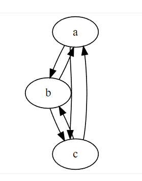

共享分机注册信息有两种方式

1. 集群使用相同的数据库，多个节点实时读取数据
   1. 优点：使用简单，即使所有节点重启，也能立即从数据库中恢复分机注册数据
   2. 缺点：对数据库过于依赖，一旦数据库出现性能瓶颈，则会立即影响所有的呼叫
2. 是用cluster模块，不使用数据库，通过opensips自带的二进制同步方式
   1. 优点：不用数据库，消息处理速度快，减少对数据库的压力
   2. 缺点：一旦所有节点挂掉，所有的分机注册信息都会损失。但是挂掉所有节点的概率还是比较小的。

今天要讲的方式就是通过cluster的方式进行共享注册信息的方案。

假设有三个节点：

- 在其中一个节点上注册的分机信息会同步给其他的节点
- 假设其中节点a重启了，节点a会自动选择b或者c来拉取第一次初始化的分机信息



举例来说：

1. 8001分机在b上注册成功
2. b把8001的注册信息通过cluster模块通知给a和c
3. 8002分机在a上注册成功
4. a把8002的注册信息通过cluster模块通知给b和c
5. 此时整个集群有两个分机8001和8002
6. 节点c突然崩溃重启
7. 节点c重启之后，向b发出请求，获取所有注册的分机
8. 节点b像节点c推送全量的分机注册信息
9. 此时三个节点又恢复同步状态

cluster表设计:

- 空的字段我就没写了，flags字段必须设置为seed,  这样节点重启后，才知道要像哪个节点同步全量数据
```
id,cluster_id,node_id,url,state,flags
1,1,1,bin:a:5000,1,seed
2,1,2,bin:b:5000,1,seed
3,1,3,bin:c:5000,1,seed
```

脚本修改：

```
# 增加 bin的listen, 对应cluster表的url
listen=bin:192.168.2.130:5000

# 加载proto_bin和clusterer模块
loadmodule "proto_bin.so"

loadmodule "clusterer.so"
modparam("clusterer", "db_url", "mysql:xxxx") # 设置数据库地址
modparam("clusterer", "current_id", 1) # 设置当前node_id

modparam("usrloc", "working_mode_preset", "full-sharing-cluster")
modparam("usrloc", "location_cluster", 1) # 设置当前的集群id
```

其他操作保持原样，opensips就会自动同步分机数据了。

