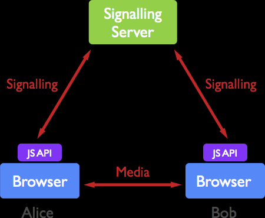
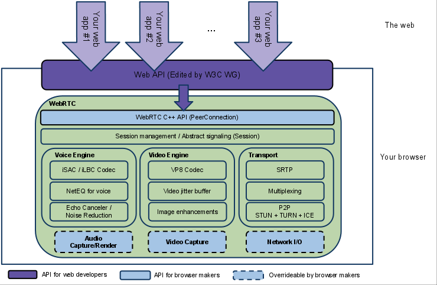
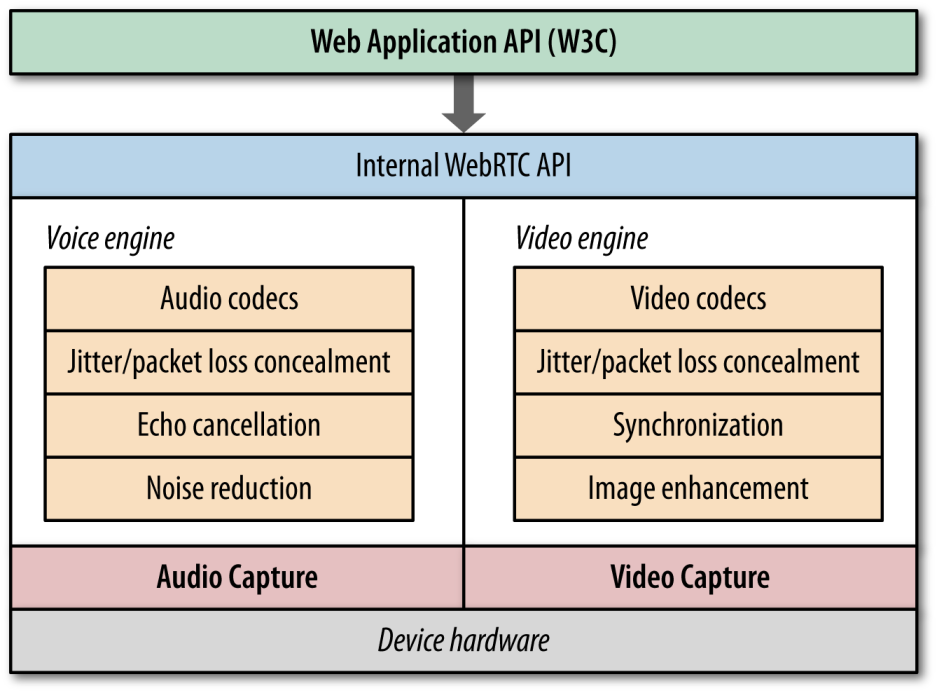

# WebRTC 功能

- 音频视频通话
- 视频会议
- 数据传输

# WebRTC 架构

- 对等实体之间通过信令服务传递信令
- 对等实体之间的媒体流可以直接传递，无需中间服务器




# 内部结构



- 紫色部分是Web开发者API层
- 蓝色实线部分是面向浏览器厂商的API层
- 蓝色虚线部分浏览器厂商可以自定义实现

WebRTC有三个模块：

- Voice Engine（音频引擎）
   - Voice Engine包含iSAC/iLBC Codec（音频编解码器，前者是针对宽带和超宽带，后者是针对窄带）
   - NetEQ for voice（处理网络抖动和语音包丢失）
   - Echo Canceler（回声消除器）/ Noise Reduction（噪声抑制）
- Video Engine（视频引擎）
   - VP8 Codec（视频图像编解码器）
   - Video jitter buffer（视频抖动缓冲器，处理视频抖动和视频信息包丢失）
   - Image enhancements（图像质量增强）
- Transport
   - SRTP（安全的实时传输协议，用以音视频流传输）
   - Multiplexing（多路复用）
   - P2P，STUN+TURN+ICE（用于NAT网络和防火墙穿越的）
   - 除此之外，安全传输可能还会用到DTLS（数据报安全传输），用于加密传输和密钥协商
   - 整个WebRTC通信是基于UDP的

# WebRTC 如何通信

- getUserMedia用来捕获本地的语音流或者视频流
- RTCPeerConnection用来代表WebRTC链接，用来处理对等实体之间的流数据
- RTCDataChannel 用来传递各种数据

# WebRTC 的核心组件

- 音视频引擎：OPUS、VP8 / VP9、H264
- 传输层协议：底层传输协议为 UDP
- 媒体协议：SRTP / SRTCP
- 数据协议：DTLS / SCTP
- P2P 内网穿透：STUN / TURN / ICE / Trickle ICE
- 信令与 SDP 协商：HTTP / WebSocket / SIP、 Offer Answer 模型

# WebRTC 音频和视频引擎


- 最底层是硬件设备，上面是音频捕获模块和视频捕获模块
- 中间部分为音视频引擎。音频引擎负责音频采集和传输，具有降噪、回声消除等功能。视频引擎负责网络抖动优化，互联网传输编解码优化
- 在音视频引擎之上是 一套 C++ API，在 C++ 的 API 之上是提供给浏览器的Javascript API 　　　　

# WebRTC 底层协议
[](https://user-images.githubusercontent.com/16631306/54601706-a965d700-4a7a-11e9-9a91-9dd75f50cf92.png)

- **WebRTC 核心的协议都是在右侧基于 UDP 基础上搭建起来的**
- 其中，ICE、STUN、TURN 用于内网穿透, 解决了获取与绑定外网映射地址，以及 keep alive 机制
- DTLS 用于对传输内容进行加密，可以看做是 UDP 版的 TLS。**由于 WebRTC 对安全比较重视，这一层是必须的**。所有WebRTC组件都必须加密，并且其JavaScript API只能用于安全源（HTTPS或本地主机）。信令机制并不是由WebRTC标准定义的，所以您必须确保使用安全协议。
- SRTP 与 SRTCP 是对媒体数据的封装与传输控制协议
- SCTP 是流控制传输协议，提供类似 TCP 的特性，SCTP 可以基于 UDP 上构建，在 WebRTC 里是在 DTLS 协议之上
- RTCPeerConnection 用来建立和维护端到端连接，并提供高效的音视频流传输
- RTCDataChannel 用来支持端到端的任意二进制数据传输
- WebRTC 协议栈解释
   - ICE：互动式连接建立（RFC 5245）
   - STUN：用于NAT的会话遍历实用程序（RFC 5389）
   - TURN：在NAT周围使用继电器进行遍历（RFC 5766）
   - SDP：会话描述协议（RFC 4566）
   - DTLS：数据报传输层安全性（RFC 6347）
   - SCTP：流控制传输协议（RFC 4960）
   - SRTP：安全实时传输协议（RFC 3711）

浏览器和某些非浏览器之间的呼叫，有些时候以为没有DTLS指纹，而导致呼叫失败。如下图使用JsSIP, 一个sipPhone和WebRTC之间的呼叫，因为没有携带DTLS指纹而导致呼叫失败。

**emit ****"peerconnection:setremotedescriptionfailed"**** [error****:****DOMException****:**** Failed to execute ****'setRemoteDescription'**** on ****'RTCPeerConnection'****:**** Failed to set remote offer sdp****:**** Called ****with**** ****SDP**** without ****DTLS**** fingerprint.**

一个完整的SIP INVITE信令。其中a=fingerprint:sha-256字段表示DTLS指纹。

a=fingerprint:sha-256 74:CD:F4:A0:3B:46:01:1C:0C:5D:04:D0:17:E5:A4:A1:04:35:97:1C:34:A3:61:60:79:52:02:F3:05:9E:7D:FE


# SDP: Session Description Protocol
SDP协议用来协商两个SIP UA之间能力，例如媒体编解码能力。<br />sdp协议举例。sdp协议的详细介绍可以参考 [RFC4566](https://tools.ietf.org/html/rfc4566)

```bash
v=0
o=- 7158718066157017333 2 IN IP4 127.0.0.1
s=-
t=0 0
a=group:BUNDLE 0
a=msid-semantic: WMS byn72RFJBCUzdSPhnaBU4vSz7LFwfwNaF2Sy
m=audio 64030 UDP/TLS/RTP/SAVPF 111 103 104 9 0 8 106 105 13 110 112 113 126
c=IN IP4 192.168.2.180
```

- Protocol Version ("v=")
- Origin ("o=")
- Session Name ("s=")
- Session Information ("i=")
- URI ("u=")
- Email Address and Phone Number ("e=" and "p=")
- Connection Data ("c=")
- Bandwidth ("b=")
- Timing ("t=")
- Repeat Times ("r=")
- Time Zones ("z=")
- Encryption Keys ("k=")
- Attributes ("a=")
- Media Descriptions ("m=")

# 加密
WebRTC对安全性是要求非常高的。无论是信令还是与语音流，WebRTC要求信息传递必须加密。

- 数据流使用DTLS协议
- 媒体流使用SRTP

# JavaScript API

- getUserMedia()：捕捉音频和视频
- RTCPeerConnection：在用户之间流式传输音频和视频
- RTCDataChannel：在用户之间传输数据
- MediaRecorder：录制音频和视频

# 参考

- [WebRTC官网](https://webrtc.org/)
- [WebRTC中文网](http://webrtc.org.cn/)
- [一步一步学习WebRTC](https://codelabs.developers.google.com/codelabs/webrtc-web/)
- [A Study of WebRTC Security](http://webrtc-security.github.io/)

