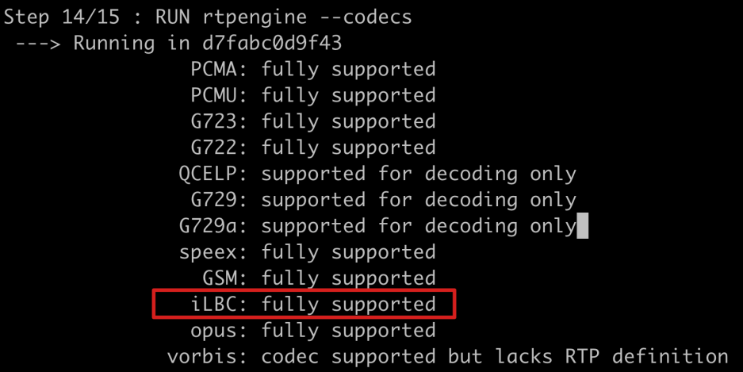

ilbc的编码特定是占用带宽小，并且抗丢表。但是rtpengine是不支持ilbc编码的，可以参考的资料有以下两个

- [https://github.com/sipwise/rtpengine/issues/897](https://github.com/sipwise/rtpengine/issues/897)
- [https://sr-users.sip-router.narkive.com/f3jhDeyU/rtpengine-and-ilbc-support](https://sr-users.sip-router.narkive.com/f3jhDeyU/rtpengine-and-ilbc-support)

使用`rtpengine --codecs`可以打印出rtpengine支持的编解码
```bash
rtpengine --codecs
PCMA: fully supported
PCMU: fully supported
G723: fully supported
G722: fully supported
QCELP: supported for decoding only
G729: supported for decoding only
speex: fully supported
GSM: fully supported
iLBC: not supported
opus: fully supported
vorbis: fully supported
ac3: fully supported
eac3: fully supported
ATRAC3: supported for decoding only
ATRAC-X: supported for decoding only
AMR: fully supported
AMR-WB: fully supported
PCM-S16LE: fully supported
MP3: fully supported
```

下面的操作基于debian:9-slim的基础镜像构建的，在构建rtpengine之前，我们先编译ilbc的依赖库

```bash
RUN echo "deb http://www.deb-multimedia.org stretch main" >> /etc/apt/sources.list \
	&& apt-get update \
	&& apt-get install deb-multimedia-keyring -y --allow-unauthenticated \
	&& apt-get install libilbc-dev libavcodec-dev libilbc2 -y --allow-unauthenticated
```
安装以来之后，继续构建rtpengine, rtpengine构建完之后，执行`rtpengine --codecs`


