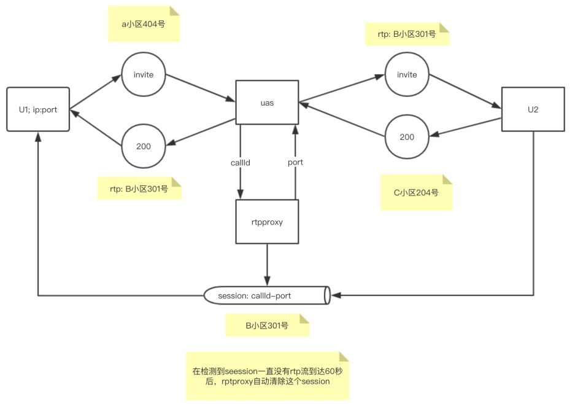

# rtppoxy能提供什么功能？
- VoIP NAT穿透
- 传输声音、视频等任何RTP流
- 播放预先设置的呼入放音
- RTP包重新分片
- 包传输优化
- VoIP VPN 穿透
- 实时流复制

# rtpproxy一般和那些软件集成？

- opensips
- Kamailio
- Sippy B2BUA
- freeswitch
- reSIProcate B2BUA

# rtpporxy的工作原理

# 启动参数介绍
| 参数 | 功能说明 | 例子 |
| --- | --- | --- |
| -l | ipv4监听的地址 | -l 192.168.3.47 |
| -6 | ipv6监听的地址 |  |
| -s | 控制Socket, 通过这个socket来修改，创建或者删除rtp session | -s udp:192.168.3.49:6890 |
| -F | 默认情况下，rtpproxy会警告用户以超级用户的身份运行rtpproxy并且不允许远程控制。使用-F可以关闭这个限制 |  |
| -m | 最小使用的端口号，默认35000 | -m 20000 |
| -M | 最大使用的端口号，默认65000 | -M 50000 |
| -L | 单个进程最多可以使用的文件描述符。rtpproxy要求每个session使用4个文件描述符。 | -L 20000 |
| -d | 日志级别，可选DBUG, INFO, WARN, ERR and CRIT, 默认DBUG | -d ERR |
| -A | 广播地址，用于rtpprxy在NAT防火墙内部时使用 | -A 171.16.200.13 |
| -f | 让rtpproxy前台运行，在做rtpproxy容器化时，启动脚本必须带有-f，否则容器运行后会立即退出 |  |
| -V | 输出rtpproxy的版本 |  |

# 参考

- [https://www.rtpproxy.org/](https://www.rtpproxy.org/)
- [https://www.rtpproxy.org/doc/master/user_manual.html](https://www.rtpproxy.org/doc/master/user_manual.html)
- [https://github.com/sippy/rtpproxy](https://github.com/sippy/rtpproxy)

