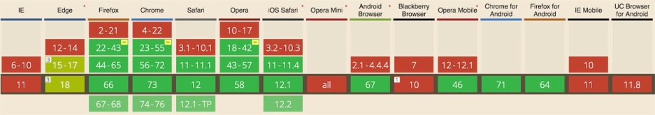

目前在做基于WebRTC的语音和视频终端，语音和视频通话的质量都不错。感谢WebRTC，站在巨人的肩膀上，我们可以看得更远。

# WebRTC浏览器兼容性

# github demos
下面两个都是github项目，项目中有各种WebRTC的demo。除了demo之外，这两个项目的issuese也是非常值得看的，可以解决常见的问题

- [https://webrtc.github.io/samples/](https://webrtc.github.io/samples/)
- [https://github.com/muaz-khan/WebRTC-Experiment](https://github.com/muaz-khan/WebRTC-Experiment)

# 相关资料网站

- webrtc官网： [https://webrtc.org/](https://webrtc.org/)
- webrtchacks： [https://webrtchacks.com/](https://webrtchacks.com/)
- webrtc官网： [https://webrtc.org.cn/](https://webrtc.org.cn/)
- webrtc安全相关： [http://webrtc-security.github.io/](http://webrtc-security.github.io/)
- webrtc谷歌开发者教程： [https://codelabs.developers.google.com/codelabs/webrtc-web/](https://codelabs.developers.google.com/codelabs/webrtc-web/)
- sdp for webrtc [https://tools.ietf.org/id/draft-nandakumar-rtcweb-sdp-01.html](https://tools.ietf.org/id/draft-nandakumar-rtcweb-sdp-01.html)
- 各种资料 [https://webrtc.org/start/](https://webrtc.org/start/)
- [https://www.w3.org/TR/webrtc/](https://www.w3.org/TR/webrtc/)

# 浏览器内核

- webkit官网：[https://webkit.org/](https://webkit.org/)

# WebRTC相关库

- webrtc-adapter [https://github.com/webrtchacks/adapter](https://github.com/webrtchacks/adapter)

# WebRTC周边js库
| 库 | 地址 |
| --- | --- |
| Addlive | [http://www.addlive.com/platform-overview/](http://www.addlive.com/platform-overview/) |
| Apidaze | [https://developers.apidaze.io/webrtc](https://developers.apidaze.io/webrtc) |
| Bistri | [http://developers.bistri.com/webrtc-sdk/#js-sdk](http://developers.bistri.com/webrtc-sdk/#js-sdk) |
| Crocodile | [https://www.crocodilertc.net/documentation/javascript/](https://www.crocodilertc.net/documentation/javascript/) |
| EasyRTC | [http://www.easyrtc.com/docs/](http://www.easyrtc.com/docs/) |
| Janus | [http://janus.conf.meetecho.com/docs/JS.html](http://janus.conf.meetecho.com/docs/JS.html) |
| JsSIP | [http://jssip.net/documentation/](http://jssip.net/documentation/) |
| Openclove | [http://developer.openclove.com/docs/read/ovxjs_api_doc](http://developer.openclove.com/docs/read/ovxjs_api_doc) |
| Oracle | [http://docs.oracle.com/cd/E40972_01/doc.70/e49239/index.html](http://docs.oracle.com/cd/E40972_01/doc.70/e49239/index.html) |
| Peerjs | [http://peerjs.com/docs/#api](http://peerjs.com/docs/#api) |
| Phono | [http://phono.com/docs](http://phono.com/docs) |
| Plivo | [https://plivo.com/docs/sdk/web/](https://plivo.com/docs/sdk/web/) |
| Pubnub | [http://www.pubnub.com/docs/javascript/javascript-sdk.html](http://www.pubnub.com/docs/javascript/javascript-sdk.html) |
| Quobis | [https://quobis.atlassian.net/wiki/display/QoffeeSIP/API](https://quobis.atlassian.net/wiki/display/QoffeeSIP/API) |
| SimpleWebRTC from &Yet | [http://simplewebrtc.com/](http://simplewebrtc.com/) |
| SIPML5 | [http://sipml5.org/docgen/symbols/SIPml.html](http://sipml5.org/docgen/symbols/SIPml.html) |
| TenHands | [https://www.tenhands.net/developer/docs.htm](https://www.tenhands.net/developer/docs.htm) |
| TokBox | [http://tokbox.com/opentok](http://tokbox.com/opentok) |
| Twilio | [http://www.twilio.com/client/api](http://www.twilio.com/client/api) |
| Voximplant | [http://voximplant.com/docs/references/websdk/](http://voximplant.com/docs/references/websdk/) |
| Vline | [https://vline.com/developer/docs/vline.js/](https://vline.com/developer/docs/vline.js/) |
| Weemo | [http://docs.weemo.com/js/](http://docs.weemo.com/js/) |
| Xirsys | [http://xirsys.com/_static_content/xirsys.com/docs/](http://xirsys.com/_static_content/xirsys.com/docs/) |
| Xsockets.net | [http://xsockets.net/docs/javascript-client-api](http://xsockets.net/docs/javascript-client-api) |

# VoIP/PSTN

- [https://kamailio.org](https://kamailio.org/)
- [https://freeswitch.org/](https://freeswitch.org/)

# 值得关注的人

- [https://github.com/muaz-khan](https://github.com/muaz-khan)
- [https://github.com/chadwallacehart](https://github.com/chadwallacehart)
- [https://github.com/fippo](https://github.com/fippo)

# WebRTC主题
github上webrtc主题相关的仓库，干货非常多 [https://github.com/topics/webrtc](https://github.com/topics/webrtc)

# 相关文章

- [guide-to-safari-webrtc](https://webrtchacks.com/guide-to-safari-webrtc/)
- [WebKit: On the Road to WebRTC 1.0, Including VP8](https://webkit.org/blog/8672/on-the-road-to-webrtc-1-0-including-vp8/)
- [whats-in-a-webrtc-javascript-library](https://webrtchacks.com/whats-in-a-webrtc-javascript-library/)

