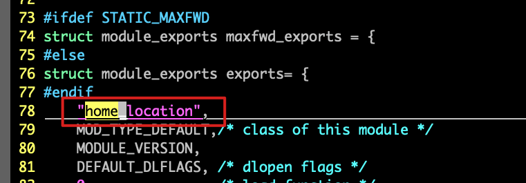

从头写一个模块是比较麻烦的，我们可以基于一个简单的模块，然后在这个模块上进行一些修改。

我们基于maxfwd这个模块，复制一个模块，叫做home_location。

> 为什么叫做home_location呢？因为我想根据一个手机号，查出它的归属地，然后根据当地的归属地，判断号码前要不要加0

```bash
cd modules
cp -R maxfwd home_location

➜  home_location git:(home_location) ✗ ll
total 300K
drwxr-xr-x 2 root root 4.0K Apr 20 13:56 doc
-rw-r--r-- 1 root root  217 Apr 20 14:00 Makefile
-rw-r--r-- 1 root root 4.7K Apr 20 14:00 maxfwd.c
-rw-r--r-- 1 root root 2.0K Apr 20 13:56 maxfwd.d
-rw-r--r-- 1 root root  77K Apr 20 13:56 maxfwd.o
-rwxr-xr-x 1 root root  93K Apr 20 13:56 maxfwd.so
-rw-r--r-- 1 root root 4.0K Apr 20 13:56 mf_funcs.c
-rw-r--r-- 1 root root 2.1K Apr 20 13:56 mf_funcs.d
-rw-r--r-- 1 root root 1.2K Apr 20 13:56 mf_funcs.h
-rw-r--r-- 1 root root  84K Apr 20 13:56 mf_funcs.o
-rw-r--r-- 1 root root 7.0K Apr 20 13:56 README
```

下面的操作都是操作home_location目录下的文件。


# 修改Makefile
NAME改为home_location.so
```bash
NAME=home_location.so
```


# 修改maxfwd.c

module_exports的结构体的第一个参数，改为home_location



# 编译home_location模块
上面的操作，其实只是给maxfwd模块改了个名字，没有修改任何具体代码。

我们在home_location目录下创建一个dev.sh脚本文件，用来做一些快速起停，或者编译模块的事项


## dev.sh
```bash
#!/bin/bash

case $1 in
    build)
        cd ../../
        pwd;
        make modules modules=modules/home_location
    ;;
    start)
        killall opensips
        ulimit -t unlimited
        sleep 1
        /usr/local/sbin/opensips -f ./dev.cfg -w . &> log.txt &
        echo $?
    ;;
    stop)
        killall opensips
        echo stop
    ;;
    *) echo bad;;
esac
```

```bash
chmod +x dev.sh

 # 用来编译home_location模块
./dev.sh build

# 用来启动opensips, 启动opensips之后，输出的日志会写到log.txt文件中，
./dev.sh start 

# 用来停止opensips
./dev.sh stop 
```


## dev.cfg
启动opensips需要一个cfg脚本文件，我们自己做一个简单的

脚本有以下的注意点：

- loadmodule加载home_location.so我使用了绝对路径，如果在你自己的机器上，目录可能需要修改

```bash
log_level=3
log_stderror=yes
log_facility=LOG_LOCAL0
debug_mode=no
memdump=1
auto_aliases=no

listen=udp:0.0.0.0:17634
listen=tcp:0.0.0.0:17634

mpath="/usr/local/lib64/opensips/modules/"

loadmodule "proto_udp.so"
loadmodule "proto_tcp.so"
loadmodule "mi_fifo.so"
modparam("mi_fifo", "fifo_name", "/tmp/opensips_fifo")
modparam("mi_fifo", "fifo_mode", 0666)

loadmodule "/root/code/gitee/opensips/modules/home_location/home_location.so"

startup_route{
    xlog("opensips startup");
}

route{
    xlog("hello");
}
```


# 运行demo

```bash
./dev.sh build # 构建脚本
./dev.sh start # 启动opensips
```

没有意外的话，opensips启动成功，可以看下log.txt的内容， 也可以通过`netstat -nulp | grep opensips` 查找opensips的进程
```bash
➜  home_location git:(home_location) ✗ tail log.txt
Apr 20 23:00:37 [748389] INFO:core:main: using 2 Mb of private process memory
Apr 20 23:00:37 [748389] INFO:core:init_reactor_size: reactor size 1024 (using up to 0.03Mb of memory per process)
Apr 20 23:00:37 [748389] INFO:core:evi_publish_event: Registered event <E_CORE_THRESHOLD(0)>
Apr 20 23:00:37 [748389] INFO:core:evi_publish_event: Registered event <E_CORE_SHM_THRESHOLD(1)>
Apr 20 23:00:37 [748389] INFO:core:evi_publish_event: Registered event <E_CORE_PKG_THRESHOLD(2)>
Apr 20 23:00:37 [748389] INFO:core:mod_init: initializing UDP-plain protocol
Apr 20 23:00:37 [748389] INFO:core:mod_init: initializing TCP-plain protocol
Apr 20 23:00:37 [748389] INFO:home_location:mod_init: initializing...
Apr 20 23:00:37 [748396] opensips startupApr 20 23:00:37 [748380] INFO:core:daemonize: pre-daemon process exiting with 0
Apr 21 05:32:32 [748410] WARNING:core:handle_timer_job: timer job <blcore-expire> has a 100000 us delay in execution
```

