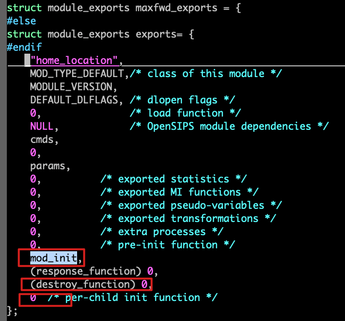
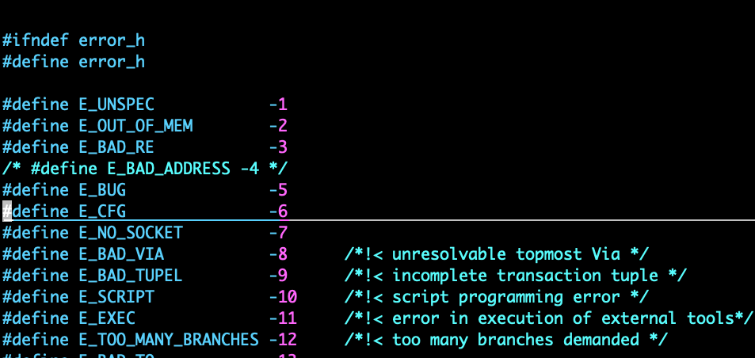

# 开始
我们需要给home_location模块增加一个参数，配置当地的号码区号

首先，我们删除maxfwd.c文件中开头的很多注释，我们先把注意力集中在代码上。

删除了30多行注释，代码还剩160多行。

首先我们一个变量，用来保存本地的区号。这个变量是个str类型。
```bash
str local_zone_code = {"",0};
```

## str
关于str类型，可以参考opensips/str.h头文件。

```bash
struct __str {
	char* s; /**< string as char array */
	int len; /**< string length, not including null-termination */
};

typedef struct __str str;
```

实际上，str是个指向__str结构体，可以看出这个结构体有指向字符串的char*类型的指针，以及一个代表字符串长度的len属性。这样做的好处是可以高效的获取字符串的长度，很多有名的开源项目都有类似的结构体。

opensips几乎所有的字符串都是用的str类型


## param_export_t

param_export_t这个结构体是用来通过脚本里面的modparam向模块传递参数的。这个数组最后一向是`{0,0,0}` 这最后一项其实是个标志，标志着数组的结束。
```bash
static param_export_t params[]={
     {"max_limit",    INT_PARAM,  &max_limit},
     {"local_zone_code", STR_PARAM,  &local_zone_code.s},
     {0,0,0}
};
```

在sr_module_deps.h和sr_module.h中有下面的代码

```bash
typedef struct param_export_ param_export_t;
```
param_export_t实际上是指向param_export_这个结构体。

这个结构体有三个参数

- name 表示参数的名称
- modparam_t 表示参数的类型。参数类型有以下几种
   - STR_PARAM 字符串类型
   - INT_PARAM 整数类型
   - USE_FUNC_PARAM 函数类型
   - PARAM_TYPE_MASK 这个用到的时候再说
- param_pointer 是一个指针，用到的时候再具体说明
```bash
  struct param_export_ {
      char* name;             /*!< null terminated param. name */
      modparam_t type;        /*!< param. type */
      void* param_pointer;    /*!< pointer to the param. memory location */
  };
  
  #define STR_PARAM        (1U<<0)  /* String parameter type */
  #define INT_PARAM        (1U<<1)  /* Integer parameter type */
  #define USE_FUNC_PARAM   (1U<<(8*sizeof(int)-1))
  #define PARAM_TYPE_MASK(_x)   ((_x)&(~USE_FUNC_PARAM))

  typedef unsigned int modparam_t;
```
回过头来，看看local_zone_code这个参数的配置，是不是就非常明确了呀
```bash
 {"local_zone_code", STR_PARAM,  &local_zone_code.s},
```

接着，你可能会问，加入我们配置好了这个参数，如何再运行的时候将local_zone_code这个变量的值打印出来呢？

再module_exports这个结构体里面，最后的几个参数实际上是一个函数。

这些函数再模块的生命周期内会调用。比如那个mod_init, 就是模块初始化的时候就会调用这个函数。



那么，我们就在模块初始化的时候打印local_zone_code的值好了。

下面的代码，我们其实只插入了一行, LM_INFO, 用来打印。其他就保持原样好了。

mod_init函数的返回值是有特殊含义的，如果返回是0，表示成功。如果返回的是负数, 例如E_CFG, 这时候opensips就会认为你的脚本写的有问题，就不会继续启动opensips。
```bash
static int mod_init(void)
  {
     LM_INFO("initializing...\n");
     LM_INFO("Initializing local_zone_code: %s\n", local_zone_code.s);

      if ( max_limit<1 || max_limit>MAXFWD_UPPER_LIMIT ) {
          LM_ERR("invalid max limit (%d) [1,%d]\n",
              max_limit,MAXFWD_UPPER_LIMIT);
          return E_CFG;
      }
      return 0;
  }
```
再error.h中，可以看到opensips定义了很多的错误码。




# 编译模块

源码的c文件我们修改好了，下面就是编译它，不知道会不会报错呢？😂

```bash
➜  home_location git:(home_location) ✗ ./dev.sh build
/root/code/gitee/opensips


make[1]: Entering directory '/root/code/gitee/opensips/modules/home_location'
Compiling maxfwd.c
Linking home_location.so
make[1]: Leaving directory '/root/code/gitee/opensips/modules/home_location'
```
似乎没啥问题


# 编辑dev.cfg 增加local_zone_code参数

```bash
  loadmodule "/root/code/gitee/opensips/modules/home_location/home_location.so"
+ modparam("home_location", "local_zone_code", "010")
```

```bash
./dev.sh start
```
看看log.txt, local_zone_code已经被打印出来，并且他的值是我们在cfg脚本里配置的010。
```bash
~ Apr 21 13:47:40 [1048372] INFO:home_location:mod_init: initializing...
~ Apr 21 13:47:40 [1048372] INFO:home_location:mod_init: Initializing local_zone_code: 010
```

ok, 第三章结束。


