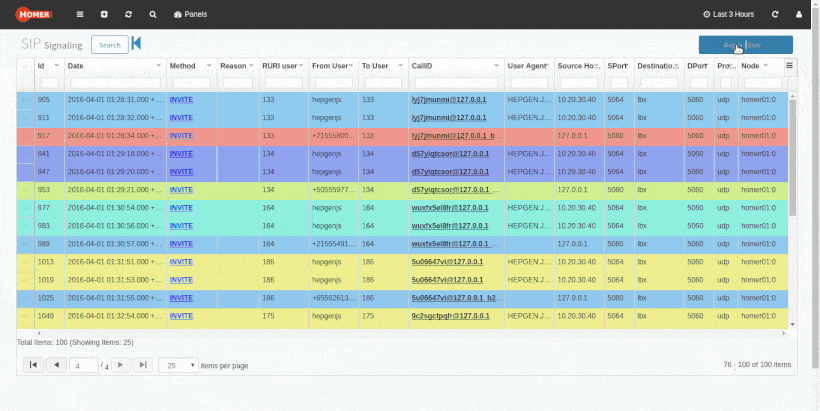

相比于sngrep, Homer能够保存从历史记录中搜索SIP包信息。除此以外，Homer可以很方便的与OpenSIPS或FS进行集成。

最精简版本的Homer部署需要三个服务。

1. postgres 数据库，用来存储SIP信息
2. heplify-server 用来处理Hep消息，存储到数据库
3. homer-app 前端搜索查询界面

这三个服务都可以用docker镜像的方式部署，非常方便。

说实话：homer实际上并不好用。你可以对比一下siphub就知道了。

# 参考资料
[https://blog.opensips.org/2017/03/22/capturing-beyond-sip/](https://blog.opensips.org/2017/03/22/capturing-beyond-sip/) [https://www.opensips.org/Documentation/Tutorials-Tracing](https://www.opensips.org/Documentation/Tutorials-Tracing)

