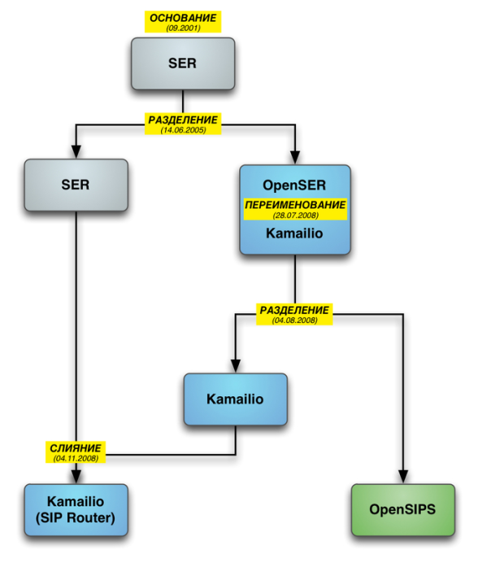

之前我写过OpenSIPS的文章，所以在学习Kamailio是，会尝试和OpenSIPS做对比。

从下图可以看出，Kamailio和Opensips算是同根同源了。很多语法、伪变量、模块使用方式，两者都极为相似。

# 不一样的点

然而总体来说，kamailio相比OpenSIPS，更加灵活。 如果有机会，尝试下kamailio也未尝不可。而且kamailio的git start数量比OpenSIPS多很多，而且issue也比OpenSIPS少。

1. Kamailio 有wiki社区，注册之后，可以来编辑文档，相比于OpenSIPS只有官方文档，kamailio显得更容易让人亲近，提高了用户的参与度。
2. 脚本上
   1. kamailio支持三种不同的注释风格，opensips只支持一种
   2. kamailio支持类似c语言的宏定义的方式写脚本，因而kamailio的脚本可以不借助外部工具的情况下，写的非常灵活。可以参考 [https://www.kamailio.org/wiki/cookbooks/5.5.x/core](https://www.kamailio.org/wiki/cookbooks/5.5.x/core) 的define部分
3. 代码质量上
   1. 我觉得也是kaimailio也是更胜一筹，至少kamailioo还做了c的单元测试

总体而言，如果你要是第一次来选择，我更希望你用kamailio作为sip服务器。我之所以用OpenSIPS只不过是路径依赖而已。

但是如果你学会了OpenSIPS, 那你学习kamailio就会非常轻松。

# 参考

- [https://weekly-geekly.github.io/articles/150280/index.html](https://weekly-geekly.github.io/articles/150280/index.html)
- [https://github.com/kamailio/kamailio](https://github.com/kamailio/kamailio)
- [https://www.kamailio.org/wiki/](https://www.kamailio.org/wiki/)

