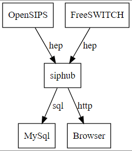
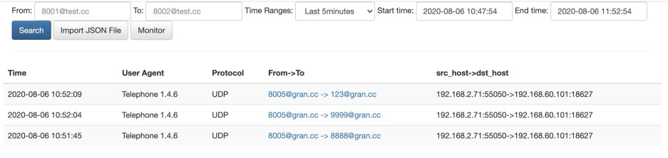
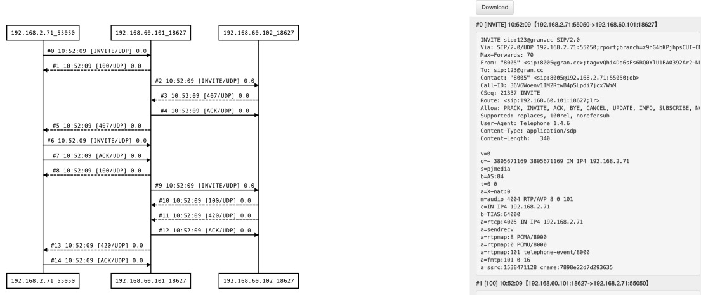

o我写siphub的原因是homer太难用了！！经常查不到想查的数据，查询的速度也很慢。

项目地址：[https://github.com/wangduanduan/siphub](https://github.com/wangduanduan/siphub)


# 架构
SIP服务器例如OpenSIPS或者FS可以通过hep协议将数据写到siphub, siphub将数据规整之后写入MySql, siphub同时也提供Web页面来查询和展示SIP消息。


# 功能介绍

sip-hub是一个专注sip信令的搜索以及时序图可视化展示的服务。

相比于Homer, sip-hub做了大量的功能简化。同时也提供了一些个性化的查询，例如**被叫后缀查询，仅域名查询等。**

sip-hub服务仅有3个页面

- sip消息搜索页面，用于按照主被叫、域名和时间范围搜索呼叫记录
- 时序图展示页面，用于展示SIP时序图和原始SIP消息
- 可以导入导出SIP消息
- 可以查找A-Leg
- 监控功能
- 大量简化搜索结果页面。siphub的搜索结果页面，每个callId相同的消息，只展示一条。


# 相关截图


## 搜索页面

- siphub的搜索结果仅仅展示callId相同的最早的一条记录，这样就避免了像homer那种，看起来很多个消息，实际上都是属于一个INVITE的。
- From字段和To字段都支持域名查询：@test.cc
- From字段也支持后缀查询，例如1234这种号码，可以只输入234就能查到，但是后缀要写完整，只查23是查不到的。
- To字段仅仅支持精确查询



## 信令展示页面

- 点击对应的消息，详情也会自动跳转出来。



# 安装

1. 首先需要安装MySql数据库，并在其中建立一个名为siphub的数据库
2. 运行
   - dbHost 数据库地址
   - dbUser 数据库用户
   - dbName 数据库名
   - dataKeepDays 抓包保存天数
   - 3000端口是web页面端口
   - 9060是hep消息收取端口

```bash
docker run -d -p 3000:3000 -p 9060:9060/udp \
--env NODE_ENV=production \
--env dbHost=1.2.3.4 \
--env dbUser=root \
--env dbPwd=123456 \
--env dbName=siphub \
--env dataKeepDays=3 \
--name siphub wangduanduan/siphub
```


# 集成


## OpenSIPS集成

test witch OpenSIPS 2.4

```bash
# add hep listen
listen=hep_udp:your_ip:9061

loadmodule "proto_hep.so"
# replace SIP_HUB_IP_PORT with siphub‘s ip:port
modparam("proto_hep", "hep_id","[hep_dst] SIP_HUB_IP_PORT;transport=udp;version=3") 
loadmodule "siptrace.so"
modparam("siptrace", "trace_id","[tid]uri=hep:hep_dst")

# add ite in request route();
if(!is_method("REGISTER") && !has_totag()){
  sip_trace("tid", "d", "sip");
}
```


## FreeSWITCH集成

fs version 版本要高于 1.6.8+

编辑： sofia.conf.xml

用真实的siphub ip:port替换SIP_HUB_IP_PORT

```
<param name="capture-server" value="udp:SIP_HUB_IP_PORT"/>
```

```
freeswitch@fsnode04> sofia global capture on
 
+OK Global capture on
freeswitch@fsnode04> sofia global capture off
 
+OK Global capture off
```

注意：sip_profiles里面的也要设置为yes
```bash
sip_profiles/internal.xml
 <param name="sip-capture" value="yes"/>

sip_profiles/external-ipv6.xml
<param name="sip-capture" value="yes"/>

sip_profiles/external.xml
<param name="sip-capture" value="yes"/>
```

