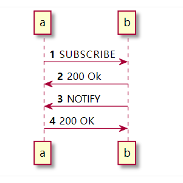
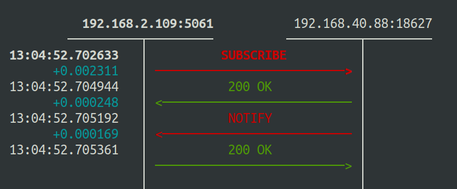

# 时序图


# 场景解释
```bash
step1: SUBSCRIBE 客户端想要订阅某个分机的状态
step2: 200 Ok 服务端接受了这个订阅消息
step3: NOTIFY 服务端向客户端返回他的订阅目标的状态
step4: 200 Ok 客户端返回表示接受
```

# 场景文件
```bash
<?xml version="1.0" encoding="iso-8859-2" ?>
<!DOCTYPE scenario SYSTEM "sipp.dtd">

<scenario name="subscibe wait notify">
  
  <send retrans="500">
    <![CDATA[

    SUBSCRIBE sip:[my_monitor]@[my_domain] SIP/2.0
    Via: SIP/2.0/[transport] [local_ip]:[local_port];branch=[branch]
    From: sipp <sip:[my_ext]@[my_domain]>;tag=[call_number]
    To: <sip:[my_monitor]@[my_domain]:[remote_port]>
    Call-ID: [call_id]
    CSeq: [cseq] SUBSCRIBE
    Contact: sip:[my_ext]@[local_ip]:[local_port]
    Max-Forwards: 10
    Event: dialog
    Expires: 120
    User-Agent: SIPp/Win32
    Accept: application/dialog-info+xml, multipart/related, application/rlmi+xml
    Content-Length: 0

    ]]>
  </send>

  <recv response="200" rtd="true">
  </recv>

  <recv request="NOTIFY" crlf="true" rrs="true">
  </recv>

  <send>
    <![CDATA[

      SIP/2.0 200 OK
      [last_Via:]
      [last_From:]
      [last_To:]
      [last_Call-ID:]
      [last_CSeq:]
      Content-Length: 0

    ]]>
  </send>
  <!--
  <nop>
      <action>
          <exec int_cmd="stop_now"/>
      </action>
  </nop>
  -->

  <!-- definition of the response time repartition table (unit is ms)   -->
  <ResponseTimeRepartition value="10, 20, 30, 40, 50, 100, 150, 200"/>

  <!-- definition of the call length repartition table (unit is ms)     -->
  <CallLengthRepartition value="10, 50, 100, 500, 1000, 5000, 10000"/>

</scenario>
```

# 定义配置文件
```bash
#!/bin/bash
# conf.sh

edge_address='192.168.40.88:18627'
my_ext='8003'
my_domain='ss.cc'
my_monitor='8004'
```

# 定义状态码处理函数
用来处理来自sipp的返回的状态码
```bash
#!/bin/bash
# util.sh
log_error () {
    case $1 in
    0) echo INFO: test success 
    ;;
    1) echo ERROR: At least one call failed
    ;;
    97) echo ERROR: Exit on internal command. Calls may have been processed
    ;;
    99) echo ERROR: Normal exit without calls processed
    ;;
    -1) echo ERROR: Fatal error
    ;;
    -2) echo ERROR: Fatal error binding a socket
    ;;
    *)  echo ERROR: Unknow exit code $0
    ;;
    esac
}
```

# 启动文件

- `-key` 用来定义变量，在场景文件中存在三个变量
   - [my_ext] 当前分机号
   - [my_domain] 当前分机域名
   - [my_monitor] 当前分机想要监控的分机号
- `-recv_timeout` 表示设置接受消息的超时时间为1000毫秒
- `-timeout` 设置整个运行过程的超时时间
- `-sf` 指定场景文件
- `-m`  设置最大处理的呼叫数   
- `-l`  设置并发呼叫数量
- `-r` 设置呼叫速度
```bash
#!/bin/bash
# test.sh

source ../util.sh
source ./conf.sh

rm *.log

sipp -trace_logs $edge_address \
        -key my_ext $my_ext \
        -key my_domain $my_domain \
        -key my_monitor $my_monitor \
        -recv_timeout 1000 \
        -timeout 2 \
        -sf ./subscibe.xml -m 1 -l 1 -r 1;

log_error $?
```

# 执行测试：
```bash
chmod +x test.sh
./test.sh
```


# sngrep 抓包



