# 1. 安装

## 1.1. centos

vim /etc/yum.repos.d/irontec.repo

```bash
[irontec]
name=Irontec RPMs repository
baseurl=http://packages.irontec.com/centos/$releasever/$basearch/
```

rpm --import http://packages.irontec.com/public.key<br />yum install sngrep


## 1.2 debian/ubuntu
```bash
# debian 安装sngrep 
echo "deb http://packages.irontec.com/debian jessie main" >> /etc/apt/sources.list
wget http://packages.irontec.com/public.key -q -O - | apt-key add -
apt-get install sngrep -y
```

debian buster 即 debian10以上可以直接 `apt-get install sngrep` 


## 1.3 arch/manjaro
```
yay -Syu sngrep
```
参考： [https://aur.archlinux.org/packages/sngrep/](https://aur.archlinux.org/packages/sngrep/)

如果报错，编辑 /etc/makepkg.conf文件，删除其中的`-Werror=format-security`

```
CFLAGS="-march=x86-64 -mtune=generic -O2 -pipe -fno-plt -fexceptions \
    -Wp,-D_FORTIFY_SOURCE=2 -Wformat -Werror=format-security \
    -fstack-clash-protection -fcf-protection"
```


# 2. 命令行参数

```
sngrep
	[-hVcivNqrD]
	[-IO pcap_dump]
  [-d dev]
  [-l limit]
  [-k keyfile]
  [-LH capture_url]
  [<match expression>]
  [<bpf filter>]
```

- `-h --help`: 显示帮助信息
- `-V --version`: 显示版本信息
- `-d --device`: 指定抓包的网卡
- `-I --input`: 从pacp文件中解析sip包
- `-O --output`: 输出捕获的包到pacp文件中
- `-c --calls`: 仅显示invite消息
- `-r --rtp`: Capture RTP packets payload 捕获rtp包
- `-l --limit`: 限制捕获对话的数量
- `-i --icase`: 使大小写不敏感
- `-v --invert`: 颠倒（不太明白）
- `-N --no-interface`: Don't display sngrep interface, just capture
- `-q --quiet`: Don't print captured dialogs in no interface mode
- `-D --dump-config`: Print active configuration settings and exit
- `-f --config`: Read configuration from file
- `-R --rotate`: Rotate calls when capture limit have been reached.
- `-H --eep-send`: Homer sipcapture url (udp:X.X.X.X:XXXX)
- `-L --eep-listen`: Listen for encapsulated packets (udp:X.X.X.X:XXXX)
- `-k --keyfile`: RSA private keyfile to decrypt captured packets


# 3. 页面
sngrep有四个页面，每个页面都有一些不同的快捷键。

1. 呼叫列表页面
2. 呼叫流程页面
3. 原始呼叫信息页面
4. 信息对比页面

## 3.1 呼叫列表页面

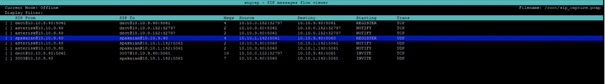

**快捷键**

- **Arrow keys**: Move through the list，除了上下箭头还可以使用j,k来移动光标
- **Enter**: Display current or selected dialog(s) message flow
- **A**: Auto scroll to new calls，自动滚动到新的call
- **F2 or s**: Save selected/all dialog(s) to a PCAP file, 保存dialog到pacp文件
- **F3 or / or TAB**: Enter a display filter. This filter will be applied to the text lines in the list，进入搜索
- **F4 or x**: Display current selected dialog and its related one. 回到第一个sip消息上
- **F5**: Clear call list, 清空呼叫列表
- **F6 or r**: Display selected dialog(s) messages in raw text, 显示原始的sip消息
- **F7 or f**: Show advanded filters dialogs 显示高级过滤弹窗
- **F9 or l**: Turn on/off address resolution if enabled
- **F10 or t**: Select displayed columns, 显示或者隐藏侧边sip消息栏

呼叫列表页面还能够显示两个弹窗, **按f可以显示高级过滤配置**

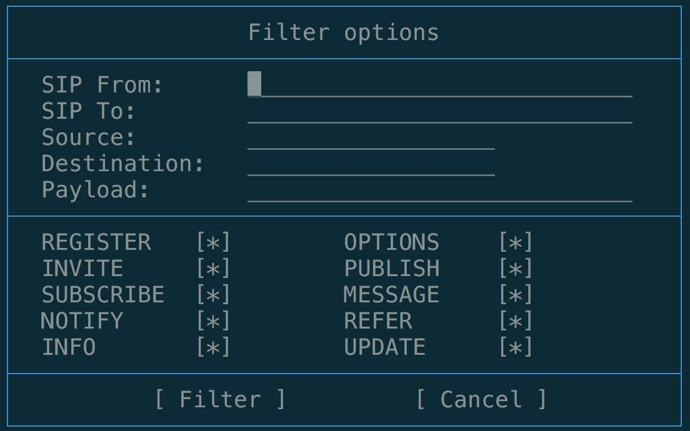


**按t可以显示, 自定义呼叫列选项弹窗**

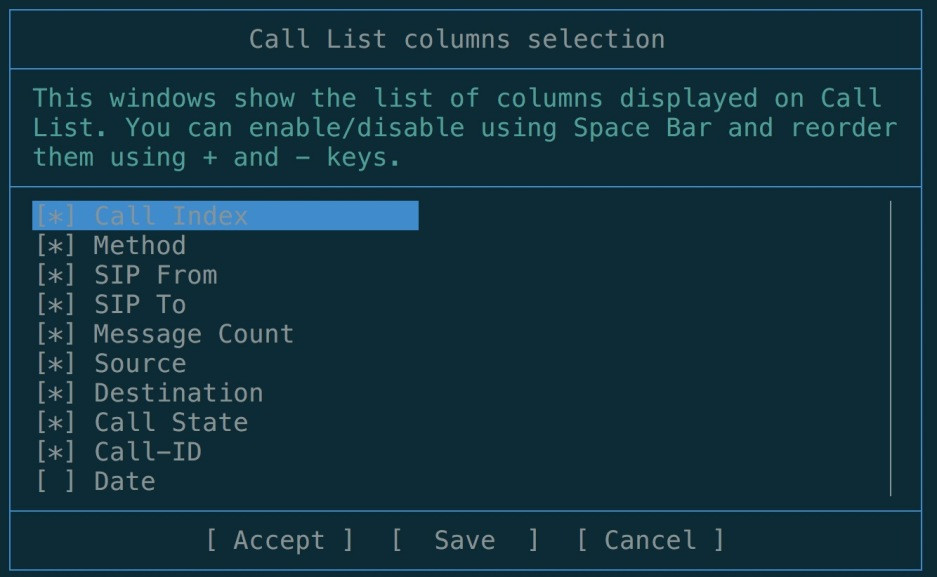


## 3.2 呼叫流程页面

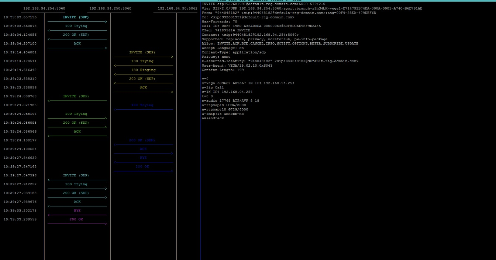

**快捷键**

**Keybindings:

- **Arrow keys**: Move through messages
- **Enter**: Display current message raw (so you can copy payload)
- **F2 or d**: 显示sdp消息，f2的某个模式会让时序图更紧凑
- **F3 or t**: 显示或者关闭sip侧边栏
- **F4 or x**: 回到顶部
- **F5 or s**: 每个ip地址仅仅显示一列
- **F6 or R**: 显示原始的sip消息
- **F7 or c**: 改变颜色模式, 有的颜色模式很容易让人无法区分当前查看的sip消息是哪一个，所以需要改变颜色模式
- **F9 or l**: Turn on/off address resolution if enabled
- **9 and 0**: 增加或者减少侧边栏的宽度
- **T**: 重绘侧边栏
- **D**: 仅显示带有sdp的消息
- 空格键：选中一个sip消息，再次找个sip消息，然后就会进入对比模式
- F1 or h: 显式帮助信息页面

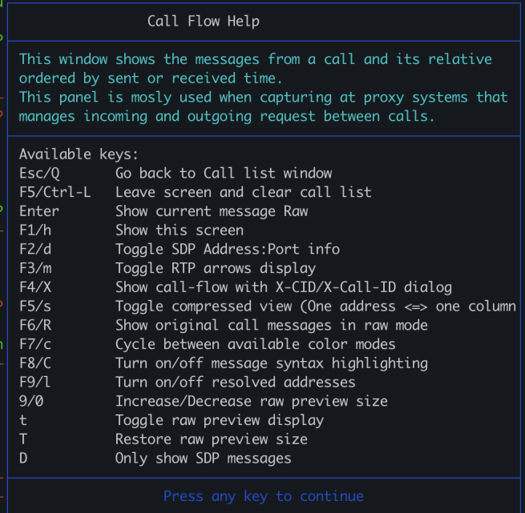


## 3.3 原始sip消息界面

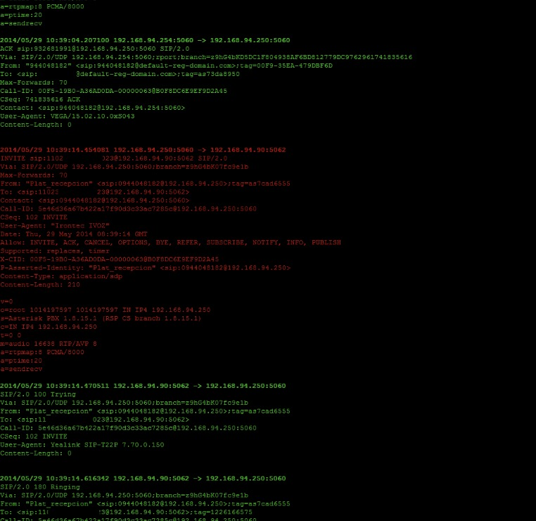


## 3.3 消息对比界面

在呼叫列表页面按空格键选中一个消息，然后选择另外一个sip消息后，再次按空格键，就可以进入消息对比页面

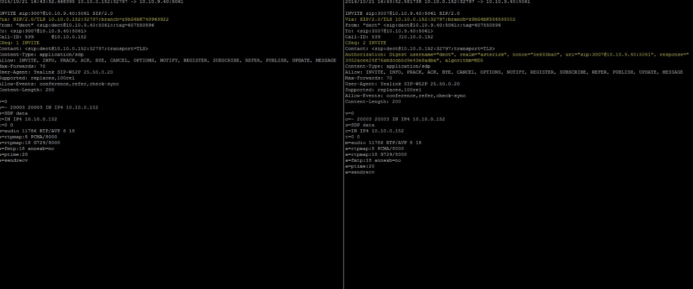


# 4. 分析媒体问题
使用 `sngrep -r` 可以用来捕获媒体流，默认不加 `-r` 则只能显示信令。

在呼叫流程页面，按下F3, 可以动态的查看媒体流的情况。在分析语音问题时，这是非常方便的分析工具。
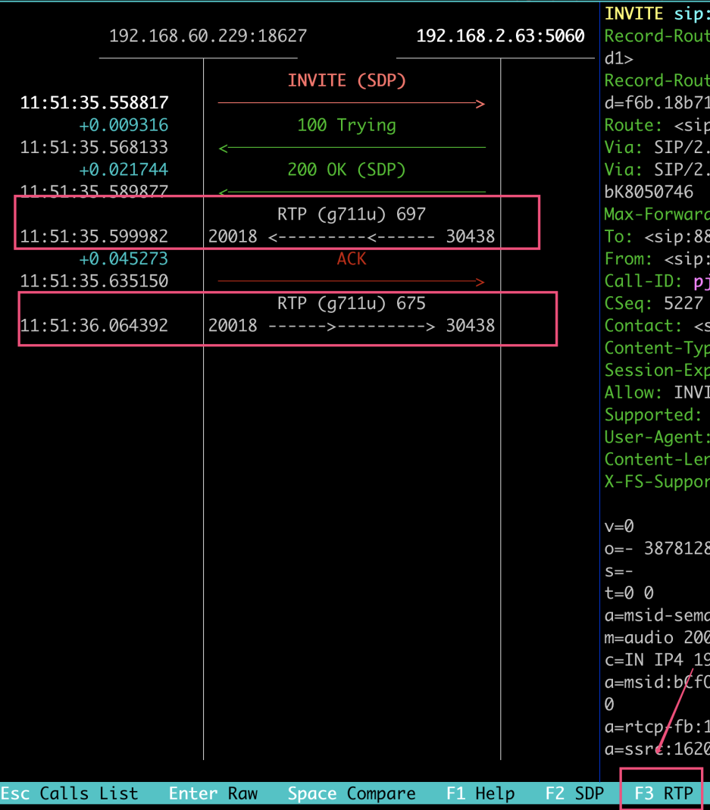


# 5. 扩展技法


## 5.1 无界面模式

假如说有个很大的语音文件，假如说有1.5G吧，如果用wireshark直接打开，有可能wireshark直接卡死，也有可能在搜索的时候就崩溃了。

即使有sngrep来直接读取pcap文件，也可能会非常慢。

假如说我们只想从这1.5G文件中找到本叫号码包含1234的，应该怎么处理呢？

用下面的命令就可以：

```systemverilog
sngrep -rI test.pcap 1234 -N -O dst.pcap
Dialog count: 17
```

- -r 读区语音流
- -I 从pcap文件中读取
- -N 不要界面
- -O 将匹配的结果写到其他文件中

经过上面的命令，一个很大的pcap文件，在处理之后，就会变成我们关心的小的包文件。比较容易处理了。


## 5.2 个性化配置

在呼叫列表界面，按F8可以进入到个性化配置界面，如下：

个性化配置页面有三个Tab页面, 三个页面可以用翻页的pageUp， pageDown来切换。在macbook上可能没有翻页键，那你要用fn + 上下方向键 来翻页

- Interface
- Capture
- Call Flow

在每个页面可以用上下键来选择不同的设置项，按左右键改变对应的值。也可以按空格键来改变对应的值。

在每个Tab页面，可以按Tab键在设置项和下面的Accept和Save、Cancel之间切换。

我们的个性化配置可以用Save来保存下来，不然每次都要再设置一边。


### 1. interface 页面
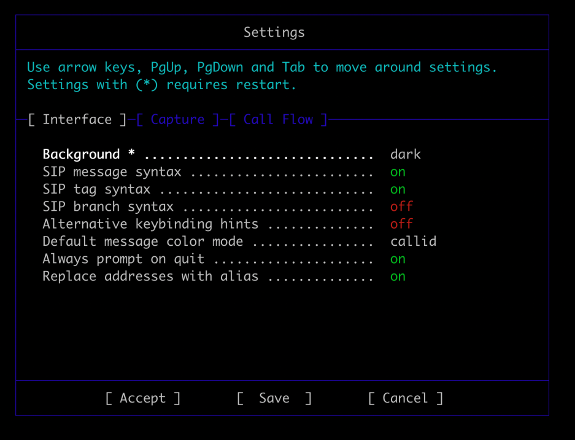


### 2. Capture设置界面

配置抓包相关的信息，例如最大抓包的数量，网卡设备，是否启用事务，默认的保存文件路径等等。
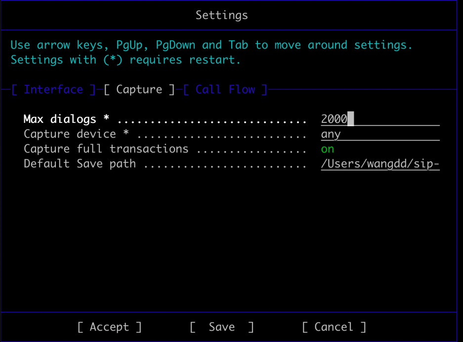


### 3. Call Flow页面

这个页面用来设置呼叫时序图页面。就不再过多介绍。

我用的比较多的，可能是Merge Columns witch same addrsss。 sngrep默认用IP:PORT作为时序图中的一个竖线。但是如果IP相同，端口号不同。sngrep就会划出很多竖线。启用了改项之后，就只会根据IP来划竖线。<br />
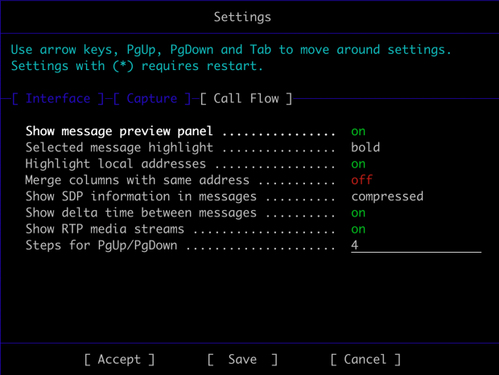

#### 区分IP和端口： Merge columns with same address

   - on 表示只根据IP来划竖线
   - off 表示根据IP:PORT来划线，如果你想在竖线上能看到端口信息，则需要设置为off

如下图所示，Merge columns with same address: off
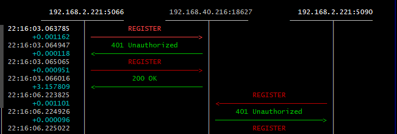


#### 如何更容易区分当前是在哪一信令上？
有时候移动的快一点，例如只能看到SIP消息是REGISTER, 但是具体是哪一个REGISTER， 看的眼疼也区分不出来。
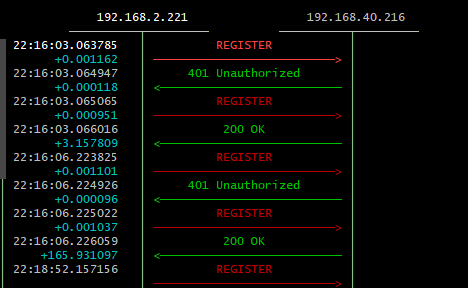

这时候Call Flow中的Selected message highlight就派上用场。

- blod  加粗
- reverse 反色
- reverseblod 反色并且加粗

一般情况下，reverse或者reverseblod都能让你更好的区分，下面就是使用reverser模式下的时序图

可以很明显的看到，第三个REGISTER的背景色变一大块，所以当前就是在第三个REGISTER信令上。
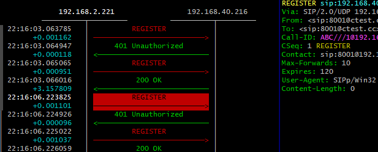

### 4. 自定义呼叫列表的字段

原始的呼叫列表页面可能只有如下7个字段，现在我想增加其他字段。

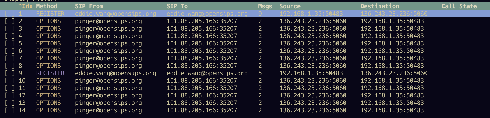

可以按F10，然后弹出列选择字段。
- 可以用 + 和 - 移动列的显示顺序
- 可以用空格键来显示和隐藏对应的字段

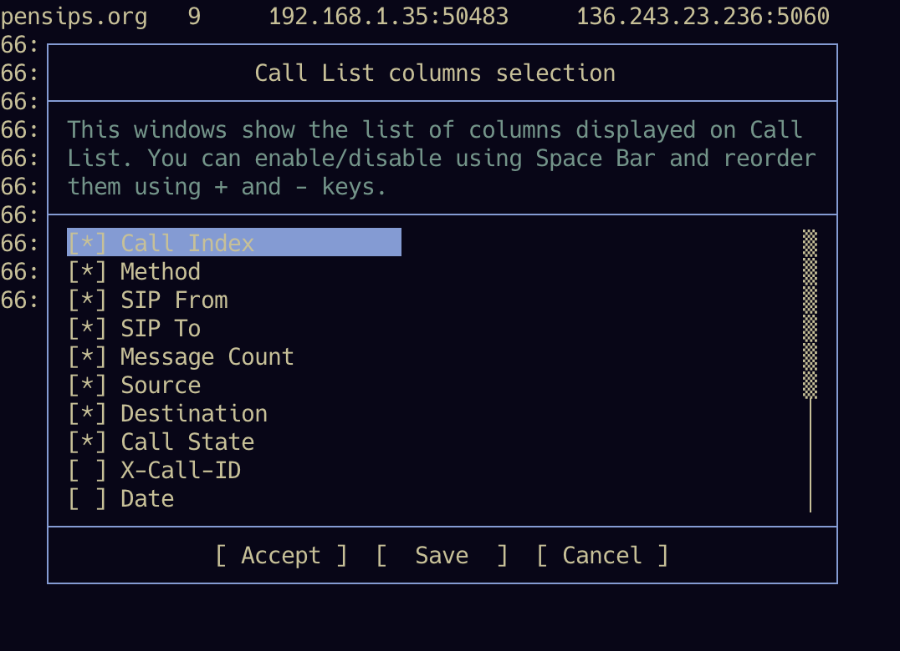

如下我增加了Time字段，并移动到了第一列
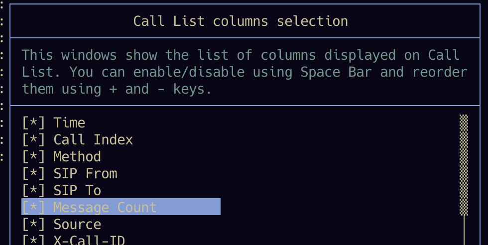

应用之后，第一列就是time字段了
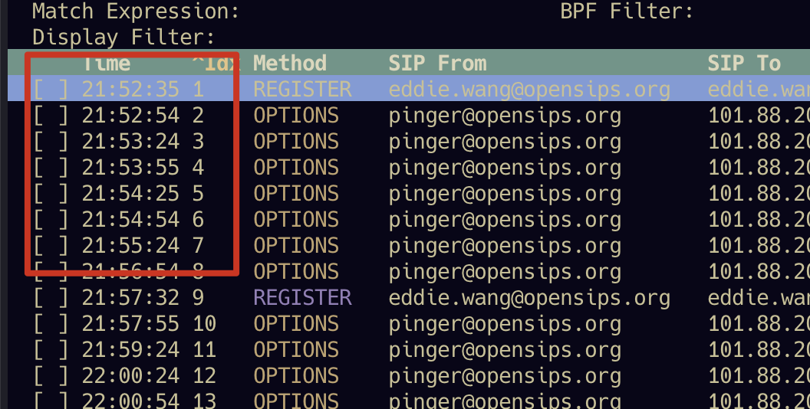


# 6 . sngrep使用注意点

-  不要长时间用sngrep抓包，否则sgrep会占用非常多的内存。如果必须抓一段时间的包，务必使用tcpdump。
- 某些情况下，sngrep会丢包
- 某些情况下，sngrep会什么包都抓包不到，注意此时很可能要使用-d去指定抓包的网卡
- sngrep只能捕获本机网卡的收到和发送的流量。假如ABC分别是三台独立虚拟机的SIP服务器，在B上抓包只能分析A-B, 和B-C直接的流量。
- 再次强调：sngrep不适合长时间抓包，只适合短时间抓包分析问题。如果你需要记录所有的sip消息，并展示。可以考虑使用siphub，或者homer。

