语雀官方的Graphviz感觉太复杂，我还是写一个简单一点的吧。


# 两个圆一条线

注意

- **graph**是用来标记无向图，里面只能用--，不能用->，否则无法显然出图片
- **digraph**用来标记有向图，里面只用用-> 不能用--, 否则无法显然出图片

```bash
graph easy {
  a -- b;
}
```

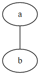

# 连线加个备注

```bash
graph easy{
  a--b [label="你真漂亮"]
}
```


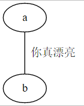


# 你真漂亮，要大点，红色显眼点


```bash
graph easy{
  a--b [label="你真漂亮", fontcolor=red, fontsize=34]
}
```

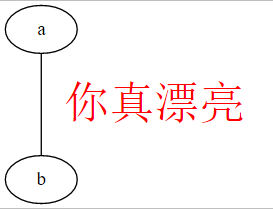


# 两个圆，一个带有箭头的线

注意，这里用的**digraph， 用来表示有向图**

```bash
digraph easy {
  a -> b;
}
```


# 如何画虚线呢？

```bash
digraph easy {
  a -> b [style=dashed];
}
```


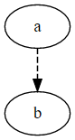


# 椭圆太单调了，有没有其他形状？

shape

- box  矩形
- polygon
- ellipse
- circle  圆形
- point
- egg 蛋形
- triangle 三角形
- plaintext 使用文字
- diamond 钻石型
- trapezium 梯形
- parallelogram 斜的长方形
- house
- hexagon
- octagon
- doublecircle
- doubleoctagon
- tripleoctagon
- invtriangle
- invtrapezium
- invhouse
- Mdiamond
- Msquare
- Mcircle
- none
- record
- Mrecord

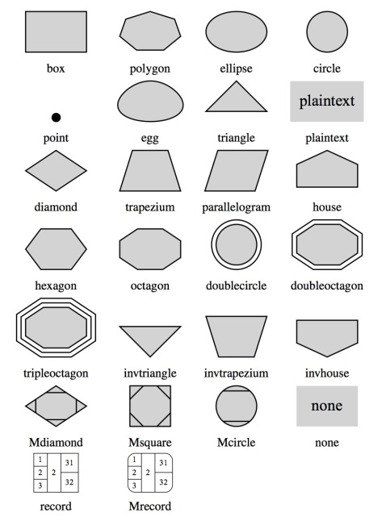

```bash
graph easy {
	node [shape=box]
  a -- b;
}
```

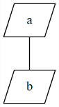

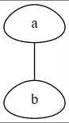

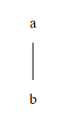

形状也可以直接给节点定义。
```bash
graph easy{
	a [shape=parallelogram]
	b [shape=egg]
  a--b;
}
```

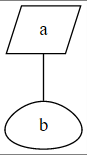


# 还有什么布局姿势？
默认图是从上到下画的，你可以用`rankdir = LR`来让图从左往右绘制

```bash
digraph easy {
	rankdir = LR;
  a -> b;
}
```


当然，还有其他姿势

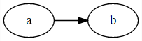

**rankdir**

- LR  从左往右布局
- RL 从右往左布局
- TB  从上下往下布局（默认）
- BT 从下往上布局

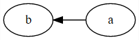


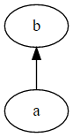

# 多来几个圆，看看效果


```bash
digraph easy {
	rankdir = LR;
  a -> b;
  b -> c;
  a -> c;
  c -> d;
  a -> d;
}
```


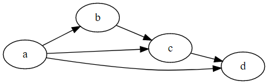


# 怎么加注释？
支持两种注释

- //
- /**/

```bash
digraph easy {
  a -> b; // 从a到b
  b -> c; /* 从b到c */
}
```
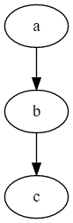

# 句尾要不要加分号？
答：分号不是必须的，你随意


# 如何起个别名？

不起别名的时候，名字太长，引用不方便。

```bash
graph easy{
  "直到确定，手的温度来自你心里"--"这一刻，也终于勇敢说爱你";
  "这一刻，也终于勇敢说爱你" -- "一开始 我只顾着看你, 装做不经意 心却飘过去"
}
```

起个别名，快速引用

```bash
graph easy{
	a [label="直到确定，手的温度来自你心里"];
  b [label="这一刻，也终于勇敢说爱你"];
  c [label="一开始 我只顾着看你, 装做不经意 心却飘过去"]
  a -- b;
  b -- c;
}
```


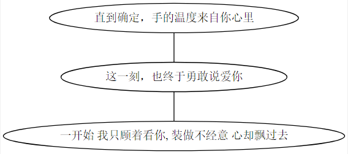


# 统一设置点线的样式

```bash
digraph easy{
	rankdir = LR;
	node [color=Red,shape=egg]
	edge [color=Pink, style=dashed]
  a -> b;
  b -> c;
  a -> c;
  c -> d;
	a -> d;
}
```

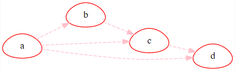

# 加点颜色

```bash
digraph easy{
	bgcolor=Pink;
	b [style=filled, fillcolor=yellow, center=true]
  a->b;
}
```

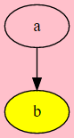
# 

# 禁用关键词
下面的关键词，不区分大小写，不能作为节点的名字，如果你用了，你的图就画不出来

 **node**, **edge**, **graph**, **digraph**, **subgraph**, and **strict**

下面的写法会导致绘图失败

```bash
graph a {
 node -- edge
}
```

但是关键词可以作为Label

```bash
graph a {
	a [label="node"]
  b [label="edge"]
	a -> b
}
```
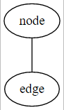


# 快捷方式 - 串起来

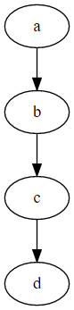

```bash
# 方式1 两点之间一个一个连接
digraph {
	a -> b;
  b -> c;
  c -> d;
}

# 方式2 直接串起来所有的点
digraph {
	a -> b -> c -> d;
}

# 方式3 直接串起来所有的点, 也可换行
digraph {
	a->b 
  ->c
  ->d
  ->e;
}
```


对比发现，**直接串起来的话，更简单，速度更快**。对于无向图 也可以用 `a -- b -- c -- d` 的方式串起来。


# 快捷方式 - 大括号

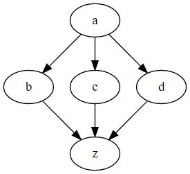

对于上面的图，也有两种绘制方法。**用大括号的方式明显更好呀！ 😺**

```bash
# 方式1 
digraph {
	a -> b;
	a -> c;
	a -> d;
	b -> z;
	c -> z;
	d -> z;
}

# 方式2
digraph {
	a -> {b;c;d}
	{b;c;d} -> z
}
```


# 数据结构 UML 怎么画呀？

比如说下面的typescript数据结构
```typescript
interface Man {
	name: string;
  age: number;
  isAdmin: boolean
}

interface Phone {
	id: number;
  type: string;
}
```

注意：node [shape="record"]
```typescript
digraph {
	node [shape="record"]
	man[label="{Man|name:string|age:number|isAdmin:boolean}"]
	
	phone[label="{Phone|id:number|type:string}"]
}
```
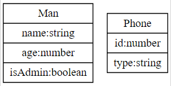

# 数据结构之间的关系如何表示？ 锚点

例如Man类型有个字段phone, 是Phone类型的

```typescript
interface Man {
	name: string;
  age: number;
  isAdmin: boolean；
  phone: Phone
}

interface Phone {
	id: number;
  type: string;
}

interface Plain {
	key1:aaa;
  key2:bbb;
}
```

注意lable里面的内容，其中<>这个符号可以理解为一个锚点。

`man:age->plain:key1`  这个意思是man的age锚点连接到plain的key1锚点。

```typescript
digraph {
	node [shape="record"]
	man[label="{Man|name:string|<age>age:number|isAdmin:boolean｜<phone>phone:Phone}"]
	phone[label="{Phone|id:number|<type>type:string}"]
	plain[label="{Plain|<key1>key1:aaa|key2:bbb}"]
	
	man:phone->phone
	man:age->plain:key1 [color="red"]
	phone:type->plain:key1
}
```

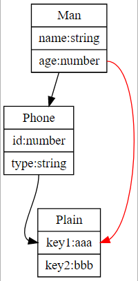

# hash 链表

```typescript
digraph {
rankdir=LR;
node [shape="record",height=.1, width=.1];

node0 [label = "<f0>a |<f1>b |<f2>c|", height=2.5];

node1 [label = "{<n> a1 | a2 | a3 | a4 |<p> }"];
node2 [label = "{<n> b1 | b2 |<p> }"];
node3 [label = "{<n> c1 | c2 |<p> }"];

node0:f0->node1:n [headlabel="a link"]
node0:f1->node2:n [headlabel="b link"]
node0:f2->node3:n [headlabel="c link"]
}
```

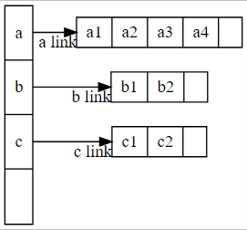


# label {}的作用

```typescript
digraph {
	node [shape="record"];
	node0 [label = "0|a|b|c|d|e",height=2.5];
	node1 [label = "{1|a|b|c|d|e}",height=2.5];
}
```

对于record而言

- 有{} , 则属性作用于整体
- 无{},  则属性作用于个体

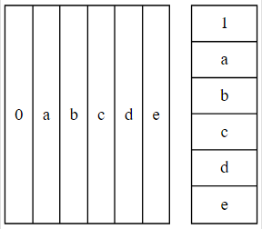


# 分组子图

- **subgraph 关键词标记分组**
- **组名必需以cluster开头**
```typescript
graph {
  rankdir=LR
  node [shape="box"]

  subgraph cluster_1 {
    label="network1";
    bgcolor="mintcream";
    host_11 [label="router"];
    host_12;
    host_13;
  }

  subgraph cluster_2 {
    label="network2";
    bgcolor="mintcream";
    host_21 [label="router"];
    host_22;
    host_23;
  }

  host_12--host_11;
  host_13--host_11;

  host_11--host_21;

  host_22--host_21;
  host_23--host_21;
}
```

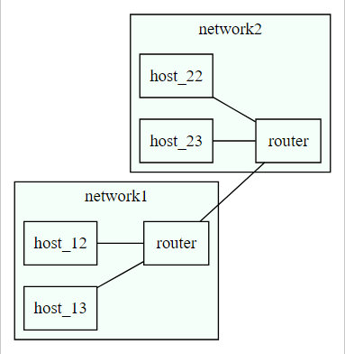

# 流程图

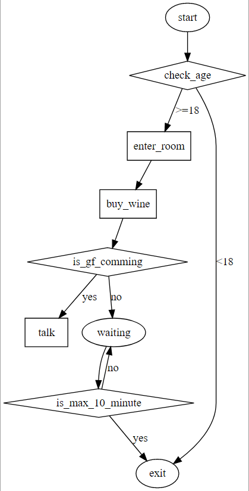

# 二等车厢座位示意图

```typescript
digraph{
	label="二等车厢座位示意图"
	node [shape=record];
  struct3 [
	shape=record,
	label="车窗|{
	{01A|01B|01C}|
	{02A|02B|02C}|
	{03A|03B|03C}
	}
	|过道|{
	{01D|01F}|
	{02D|02F}|
	{03D|03F}
	}|车窗"
	];
}
```
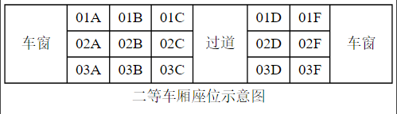


# Node Port
可以使用nodePort来调整目标的连接点, node Port可以理解为地图上的东南西北。

```
      n
      |
w<----+----> e
      |
      s
```
```
digraph {
	rankdir=LR
	node [shape=box]
	
	a->b:n [label=n]
	a->b:ne [label=ne]
	a->b:e [label=e]
	a->b:se [label=se]
	a->b:s [label=s]
	a->b:sw [label=sw]
	a->b:w [label=w]
	a->b:nw [label=nw]
}
```
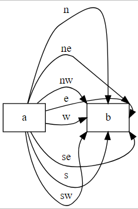


# 电磁感应线圈
<>可以用来自定义锚点，锚点可以用来连线。
```
digraph{
	node [shape=record];
	edge[style=dashed]

	t [style=filled;fillcolor=gray;label="<l>N| ｜｜｜｜｜｜|<r>S"]

	t:l->t:r [color=red]
	t:l->t:r[color=red]
	t:l->t:r[color=red]
	t:l->t:r[color=red]
	t:l->t:r[color=red]
	t:r:s->t:l:s[color=green]
	t:r:s->t:l:s[color=green]
	t:r:s->t:l:s[color=green]
	t:r:s->t:l:s[color=green]
	t:r:s->t:l:s[color=green]
}
```
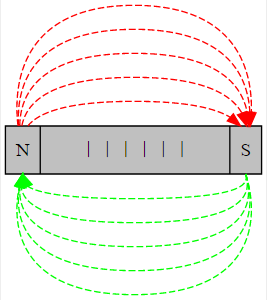

# 三体纠缠

```
digraph{
nodesep=.8
ranksep=1
rankdir=TD
node[shape=circle]
edge [style=dashed]


a[style=filled;fillcolor=red;label="";color=red]
b[style=filled;fillcolor=red2;label="";color=red2]
c[style=filled;fillcolor=red4;label="";color=red4]

a->b[color=red]
a->c[color=green]
a->b[color=red]
a->c[color=green]
a->b[color=red]
a->c[color=green]


b->c[color=orange]
b->a[color=red]
b->c[color=orange]
b->a[color=red]
b->c[color=orange]
b->a[color=red]

c->a[color=green]
c->b[color=orange]
c->a[color=green]
c->b[color=orange]
c->a[color=green]
c->b[color=orange]
}
```

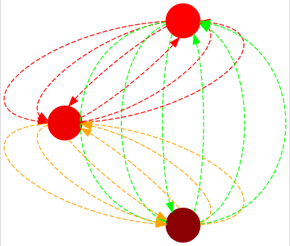

# 二叉树

```typescript
digraph {
	node [shape = record,height=.1];
	t0 [label="<l>|9|<r>"]
	t1 [label="<l>|1|<r>"]
	t5 [label="<l>|5|<r>"]
	t6 [label="<l>|6|<r>"]
	t11 [label="<l>|11|<r>"]
	t34 [label="<l>|34|<r>"]
	t0:l->t5
	t0:r->t11
	t5:l->t1
	t5:r->t6
	t11:r->t34
}
```
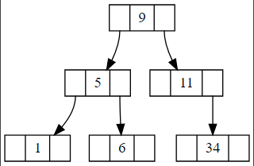

# 水平分层

相关的节点，可以使用rank属性，使其分布在相同的水平层次。
```javascript
digraph{
	nodesep=.3
	ranksep=.8
	node [shape=none]
	应用层 -> 运输层 -> 网络层 -> 链路层;

	node [shape=box];
	http;websocket;sip;ssh;
	tcp;udp;
	icmp;ip;igmp;
	arp;rarp;
	
	{rank=same;应用层;http;websocket;sip;ssh}
	{rank=same;运输层;tcp;udp}
	{rank=same;网络层;icmp;ip;igmp}
	{rank=same;链路层;arp;硬件接口;rarp}
	
	http->tcp
	websocket->tcp;
	sip->tcp;
	sip->udp;
	ssh->tcp;
	tcp->ip;
	udp->ip;
	ip->igmp;
	icmp->ip;
	ip->硬件接口;
	arp->硬件接口;
	硬件接口->rarp;
}
```
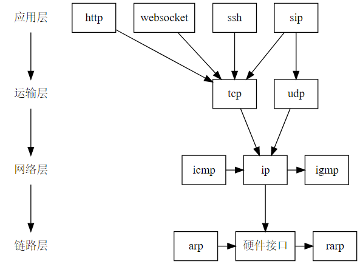

# 最后挑战，画个小人

```bash
digraph easy{
	nodesep = 0.5
	header [shape=circle, label="^_^", style=filled, fillcolor=pink]
	body [shape=invhouse, label="~ ~\n~ ~\n~ ~", center=true, style=filled, fillcolor=peru]
	leftHand [shape=Mcircle, label="", style=filled, fillcolor=palegoldenrod]
	rightHand [shape=Mcircle, label="", style=filled, fillcolor=palegoldenrod]
	
	leftFoot [shape=egg, label="", style=filled, fillcolor=palegoldenrod]
	rightFoot [shape=egg, label="", style=filled, fillcolor=palegoldenrod]
	
  header->body [arrowhead=crow];
	body->leftHand [arrowhead=invodot, penwidth=3, color=cornflowerblue, tailport=ne];
	body-> rightHand [arrowhead=invodot, penwidth=3, color=cornflowerblue, tailport=nw];
	
	body -> leftFoot [arrowhead=tee, penwidth=5, color=cornflowerblue]
	body -> rightFoot [arrowhead=tee, penwidth=5, color=cornflowerblue]
}
```

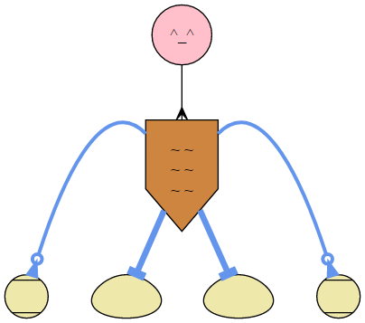


# 还有那些颜色可以使用呢？

颜色预览：[http://www.graphviz.org/doc/info/colors.html](http://www.graphviz.org/doc/info/colors.html)


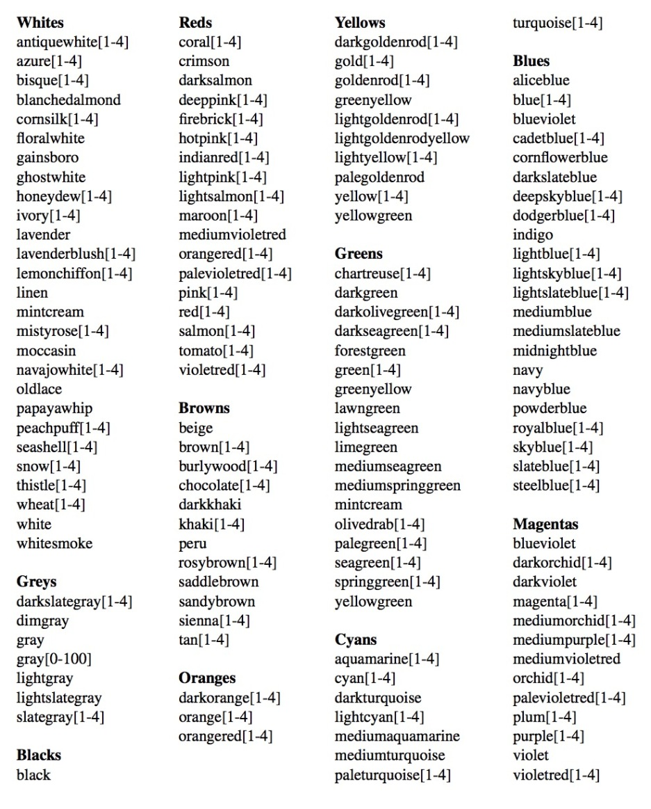


# 还有那些箭头的样式可以用呢？

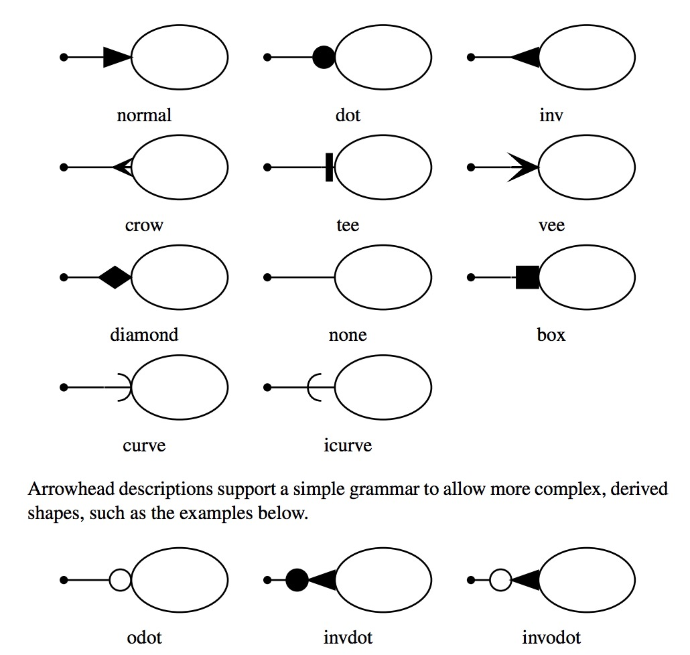


# 我的图没预览出来，怎么办？

一般来说，如果图没有渲染出来，都是因为绘图语法出问题了。

我刚刚开始用的时候，就常常把--用在有向图中，导致图无法预览。建议官方可以把报错信息提示给用户。

目前来说，这个错误信息只在控制台中打印了，需要按F12打开浏览器的console界面。看看哪里出错了，然后找到对应的位置修改。

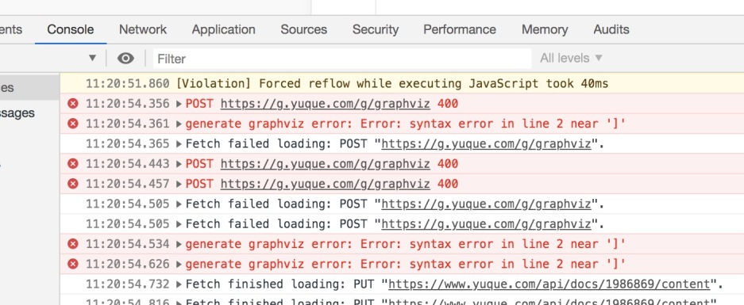


# 参考

- [https://graphviz.gitlab.io/_pages/pdf/dotguide.pdf](https://graphviz.gitlab.io/_pages/pdf/dotguide.pdf)
- [https://casatwy.com/shi-yong-dotyu-yan-he-graphvizhui-tu-fan-yi.html](https://casatwy.com/shi-yong-dotyu-yan-he-graphvizhui-tu-fan-yi.html)


# 附件
[dotguide.pdf](https://www.yuque.com/attachments/yuque/0/2020/pdf/280451/1599198969349-e2c6aa8b-f68a-460b-abc0-fe17696756b0.pdf?_lake_card=%7B%22src%22%3A%22https%3A%2F%2Fwww.yuque.com%2Fattachments%2Fyuque%2F0%2F2020%2Fpdf%2F280451%2F1599198969349-e2c6aa8b-f68a-460b-abc0-fe17696756b0.pdf%22%2C%22name%22%3A%22dotguide.pdf%22%2C%22size%22%3A283995%2C%22type%22%3A%22application%2Fpdf%22%2C%22ext%22%3A%22pdf%22%2C%22source%22%3A%22%22%2C%22status%22%3A%22done%22%2C%22mode%22%3A%22title%22%2C%22download%22%3Atrue%2C%22uid%22%3A%221599198969224-0%22%2C%22progress%22%3A%7B%22percent%22%3A99%7D%2C%22percent%22%3A0%2C%22id%22%3A%22hCefO%22%2C%22card%22%3A%22file%22%7D)


