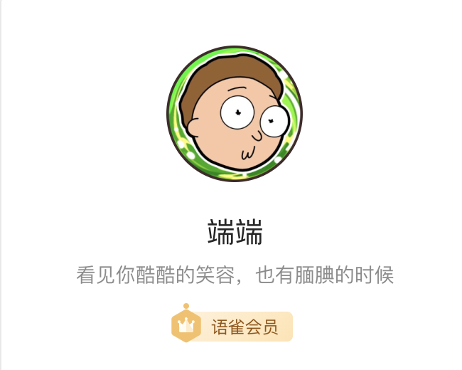

今天打开语雀，发现已经有了会员功能。说实在的，相比普通用户，会员的优势并不大。除非你是哪种重度文字控患者，10个知识库并不够你用了。

我在出现会员服务之前，已经有了多于10个知识库。

相比于免费服务，我更喜欢付费的服务。**免费的服务永远是最贵的服务。**

很多人，可以买爱奇艺的会员、优酷视频、腾讯视频、京东会员，但是往往对于能够真正提升自己能力的投资，往往安于免费，不忍付出。

除非是动辄几千的会员，我会考虑自己是否真正需要。一百左右的年费会员，在上海，也就是喝三四杯奶茶的价钱。

所以，我就买了会员。

买了会员有什么感觉，感觉我可能会多创建几个知识库吧。

