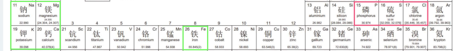

大多数人可能由下面的两种方式去判断食物的酸碱性

1. 舌头👅。用嘴巴尝一下，酸的食物就是酸性的。
2. ph值。可以用ph试纸

**以上两种判断食物酸碱性的方法都是错误的。** 

食物的酸碱性，取决于食物中含有矿物质的种类和含量。

- 碱性食物：含有钠、钾、钙、镁、铁
- 酸性食物：还有磷、氯、硫

从元素周期表中也可以看出来，酸碱性相同的物质基本都是比较靠近的。

含有钠钾钙镁铝的食物，进入人体之后，在人体的氧化作用下，最终代谢产物呈现碱性。

另外，大部分的水果，例如柠檬、橙子、苹果这种的，吃起来是酸的，而实际上他们是碱性食物。

食物分类表

| 项目 | 举例 |
| --- | --- |
| 强酸性食物 | 牛肉、猪肉、鸡肉、金枪鱼、牡蛎、比目鱼、奶酪、米、麦、面包、酒类、花生、核桃、糖、饼干、啤酒等 |
| 弱酸性食物 | 火腿、鸡蛋、龙虾、章鱼、鱿鱼、荞麦、奶油、豌豆、鳗鱼、河鱼、巧克力、葱、空心粉、炸豆腐等 |
| 强碱性食物 | 茶、白菜、柿子、黄瓜、胡萝卜、菠菜、卷心菜、生菜、芋头、海带、柑橘、无花果、西瓜、葡萄、板栗、咖啡、葡萄酒等 |
| 弱碱性食物 | 豆腐、豌豆、大豆、绿豆、竹笋、马铃薯、香菇、蘑菇、油菜、南瓜、芹菜、番薯、莲藕、洋葱、茄子、萝卜、牛奶、苹果、梨、香蕉、樱桃等 |

