思考题：当你用ssh登录到一个linux机器，并且执行了某个hello.sh之后，有哪些进程参与了该过程?


# linux系统架构

- kernel mode
- user mode
- 内核态和用户态的区别

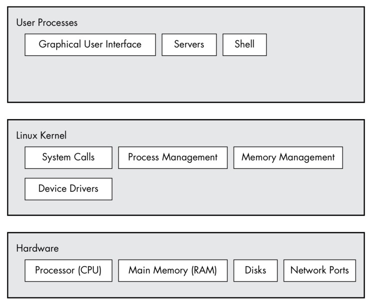
<br />

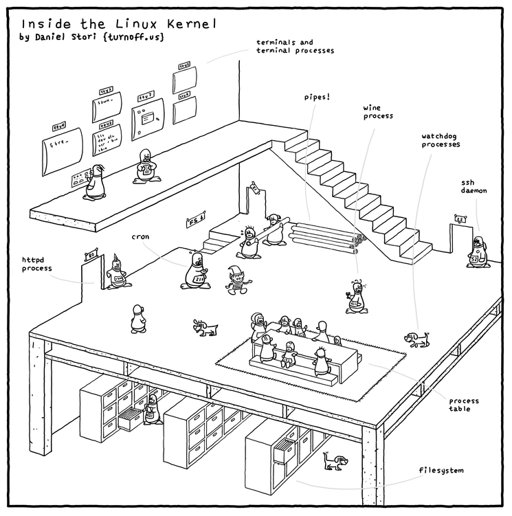

# 

# 什么是进程

- 进程是运行的程序
- process 是对 processor 虚拟化，通过时间片

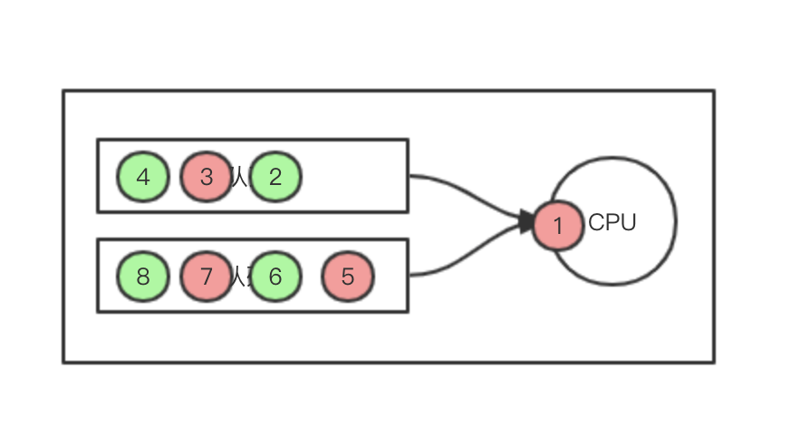


# 进程都有uid
nginx访问某个目录，**Permission denied**<br />

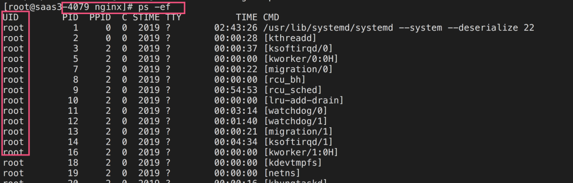


# 进程都有pid

- $$

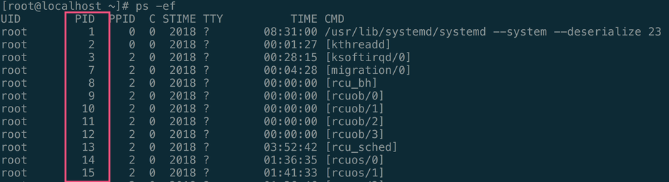


# 进程都有父进程

- 准确来说，除了pid为0的进程之外，其他进程都有父进程
- 有时候，你用kill命令杀死了一个进程，但是立马你就发现这个进程又起来了。你就要看看，这个进程是不是有个非init进程的父进程。一般这个进程负责监控子进程，一旦子进程挂掉，就会去重新创建一个进程。所以你需要找到这个父进程的Id，先把父进程kill掉，然后在kill子进程。

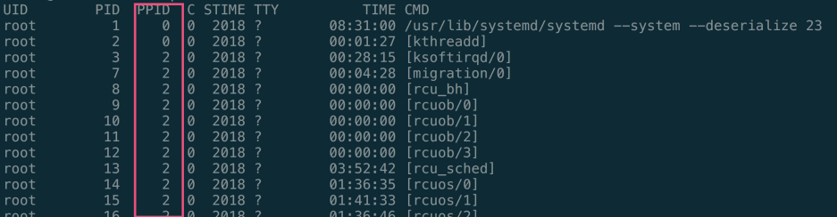

# 进程是一棵树

```shell
#!/bin/bash
echo "pid is $$"
times=0

while true
do
	sleep 2s;
	let times++;
	echo $times hello;
done
```

```shell
➜  ~ pstree 24601
sshd─┬─3*[sshd───zsh]
     ├─sshd───zsh───pstree
     └─sshd───zsh───world.sh───sleep
```


# 进程都有生命周期

- 创建
- 销毁


# 进程都有状态

- runing 进程占用CPU, 正在执行指令
- ready 进程所有需要的资源都已经就绪，等待进入CPU执行
- blocked 进程被某些事件阻断，例如IO。

进程的状态转移图<br />

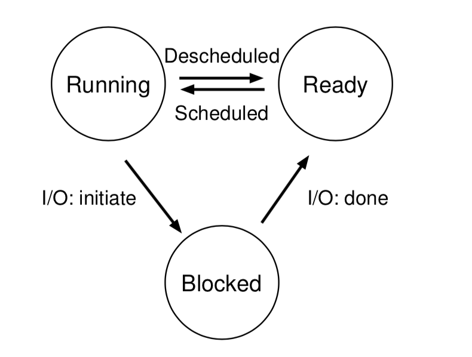


# 进程都有打开的文件描述符

使用lsof命令，可以查看某个进程所打开的文件描述符

**/proc/pid/fd/目录下也有文件描述符**

**lsof -c 进程名**<br />**lsof -p 进程号**<br />**lsof filename # 查看某个文件被哪个进程打开**<br />**
```bash
[root@localhost ~]# lsof -c rtpproxy
COMMAND   PID USER   FD   TYPE             DEVICE SIZE/OFF     NODE NAME
rtpproxy 2073 root  cwd    DIR              253,0     4096      128 /
rtpproxy 2073 root  rtd    DIR              253,0     4096      128 /
rtpproxy 2073 root  txt    REG              253,0   933247 18295252 /usr/local/bin/rtpproxy
rtpproxy 2073 root  mem    REG              253,0  2127336 33617010 /usr/lib64/libc-2.17.so
rtpproxy 2073 root  mem    REG              253,0    44448 33617041 /usr/lib64/librt-2.17.so
rtpproxy 2073 root  mem    REG              253,0    19776 34757658 /usr/lib64/libdl-2.17.so
rtpproxy 2073 root  mem    REG              253,0  1139680 34757660 /usr/lib64/libm-2.17.so
rtpproxy 2073 root  mem    REG              253,0   144792 33617035 /usr/lib64/libpthread-2.17.so
rtpproxy 2073 root  mem    REG              253,0   164112 33595530 /usr/lib64/ld-2.17.so
rtpproxy 2073 root    0u   CHR                1,3      0t0     1028 /dev/null
rtpproxy 2073 root    1u   CHR                1,3      0t0     1028 /dev/null
rtpproxy 2073 root    2u   CHR                1,3      0t0     1028 /dev/null
rtpproxy 2073 root    3u  IPv4              17641      0t0      UDP 192.168.40.100:7890
rtpproxy 2073 root    4u  unix 0xffff880079260000      0t0    17642 socket
rtpproxy 2073 root    8u  IPv4           72592335      0t0      UDP 192.168.40.100:25257
```


# 进程都有资源限制
/proc/pid/limits

以rtpproxy为例子，rtpproxy的pid为2073, /proc/pid/limits文件记录进程的资源限制

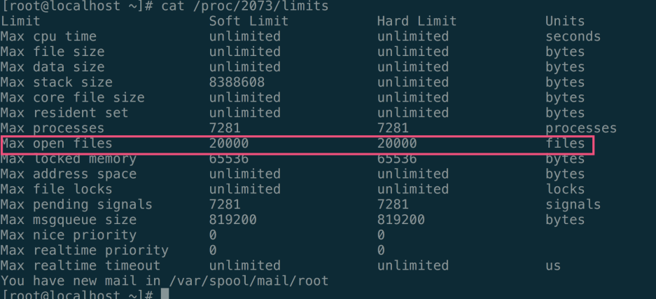


# 进程都有环境变量

**/proc/pid/environ**

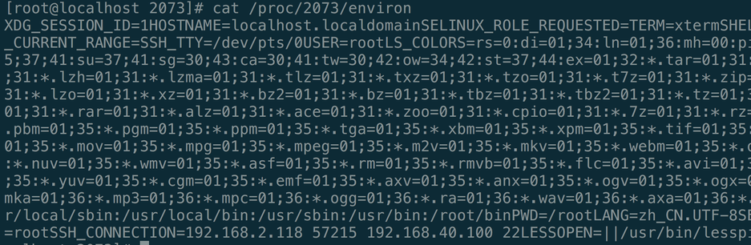


# 进程都有参数

**/proc/pid/cmdline**

```bash
rtpproxy-A192.168.40.100-l192.168.40.100-sudp:192.168.40.1007890-F-m20000-M40000-L20000-dDBUG[root@localhost 2073]#
```


# 进程都有名字

**/proc/2073/status**

```bash
Name:	rtpproxy
State:	S (sleeping)
Tgid:	2073
Ngid:	0
Pid:	2073
PPid:	1
TracerPid:	0
Uid:	0	0	0	0
Gid:	0	0	0	0
```


# 进程皆有退出码

- 非0的退出码一般是异常退出
- $?

```bash
[root@localhost 2073]# cat "test"
[root@localhost 2073]# echo $?
1
[root@localhost 2073]# echo $?
0
```


# 进程可以fork

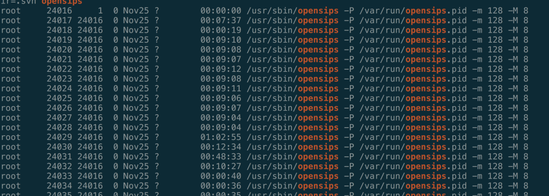

# 孤儿进程

孤儿进程：一个父进程退出，而它的一个或多个子进程还在运行，那么那些子进程将成为孤儿进程。孤儿进程将被init进程(进程号为1)所收养，并由init进程对它们完成状态收集工作。


# 僵尸进程

 僵尸进程：一个进程使用fork创建子进程，如果子进程退出，而父进程并没有调用wait或waitpid获取子进程的状态信息，那么子进程的进程描述符仍然保存在系统中。这种进程称之为僵死进程。 僵尸进程占用进程描述符，无法释放，会导致系统无法正常的创建进程。

```shell
> cat /proc/sys/kernel/pid_max
32768
```


# 进程间通信
进程之间的所有资源都是完全隔离的，所以进程之间如何通信呢？

在liunx底层，有个套接字API

```bash
SOCKET socket (int domain, int type, int protocol)
```

- domain 表示域，一般由两个值
   - AF_INET 即因特网
   - AF_LOCAL 用于同一台机器上的进程间通信
- type 表示类型
   - SOCK_STREAM 提供可靠的、全双工、面向链接的字节流，一般就是TCP
   - SOCK_DGRAM 提供不可靠、尽力而为的数据报服务，一般就是UDP
   - SOCK_RAW 允许直接访问IP层原生的数据报

也就是说，进程间通信，实际上也是用的socket


# 守护进程

守护进程一般是后台运行的进程，例如sshd, mysqld, dockerd等等，他们的特点就是他们的ppid是1， 也就是说，守护进程也是孤儿进程的一种。

```bash
root      9696     1  0 Oct06 ?        00:05:16 /usr/sbin/sshd -D
```


# idle进程与init进程

Linux下有3个特殊的进程**，idle进程(PID = 0), init进程(PID = 1)和kthreadd(PID = 2)**

- idle进程由系统自动创建, 运行在内核态。idle进程其pid=0，其前身是系统创建的第一个进程，也是唯一一个没有通过fork或者kernel_thread产生的进程。完成加载系统后，演变为进程调度、交换
-  init进程由idle通过kernel_thread创建，在内核空间完成初始化后, 加载init程序, 并最终用户空间。由0进程创建，完成系统的初始化. 是系统中所有其它用户进程的祖先进程
- Linux中的所有进程都是有init进程创建并运行的。首先Linux内核启动，然后在用户空间中启动init进程，再启动其他系统进程。在系统启动完成完成后，init将变为守护进程监视系统其他进程。
-  kthreadd进程由idle通过kernel_thread创建，并始终运行在内核空间, 负责所有内核线程的调度和管理

参考：[https://blog.csdn.net/gatieme/article/details/51484562](https://blog.csdn.net/gatieme/article/details/51484562)


# 线程

ps -m可以在进程之后显示线程。线程的tid也会占用一个/proc/tid目录，和进程的/proc/pid 目录没什么区别。

只不过进程的Tgid(线程组Id)是自己的pid, 而其他线程的Tgid是主线程的pid。

```shell
ps -em -o pid,tid,command | grep rtpproxy -A10
 2112     - rtpproxy -l 192.168.40.101 -s udp:192.168.40.101 7890 -F -m 20000 -M 40000 -L 20000 -d DBUG
    -  2112 -
    -  2113 -
    -  2114 -
    -  2115 -
    -  2116 -
    -  2117 -
    -  2118 -
```

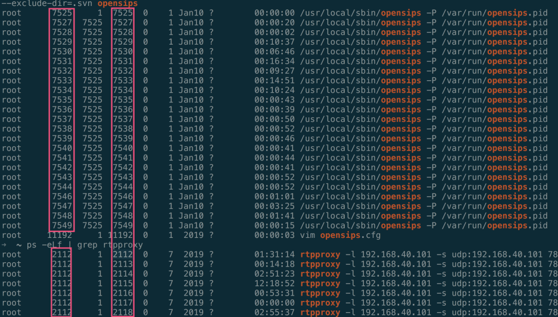


# 进程与线程的区别

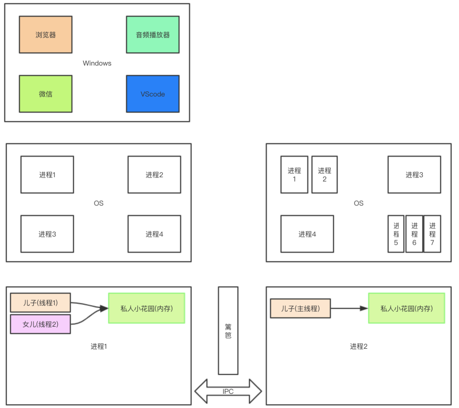


# 关于/proc目录
proc目录是一个虚拟的文件系统，实际上是内核的数据结构的映射。里面的大部分的文件都是只读的，只有少部分是可写的。

关于进程运行时信息，都可以在这个目录找到。

下面的链接详细的介绍了每个目录的作用。

- [https://www.linux.com/news/discover-possibilities-proc-directory/](https://www.linux.com/news/discover-possibilities-proc-directory/)
- [https://www.tldp.org/LDP/sag/html/proc-fs.html](https://www.tldp.org/LDP/sag/html/proc-fs.html)
- [http://man7.org/linux/man-pages/man5/proc.5.html](http://man7.org/linux/man-pages/man5/proc.5.html)

- 思考
   - 如何获取某个执行进程的可执行文件的路径？
   - proc目录下的文件有何特点？

以下的几个文件是比较重要的，着重说明一下。

- **cmdline 执行参数**
- **environ 环境变量**
- ** exe -> /usr/local/bin/rtpproxy  可执行文件位置**
- ** fd 文件描述符信息**
- ** limits 资源限制**
- **oom killer机制：杀掉最胖的那个进程**
   - **oom_adj**
   - **oom_score**
   - **oom_score_adj**
- **status 状态信息**

```shell
dr-xr-xr-x. 2 root root 0 Jan 14 15:56 attr
-rw-r--r--. 1 root root 0 Jan 14 15:56 autogroup
-r--------. 1 root root 0 Jan 14 15:56 auxv
-r--r--r--. 1 root root 0 Nov  6 17:59 cgroup
--w-------. 1 root root 0 Jan 14 15:56 clear_refs
-r--r--r--. 1 root root 0 Nov  6 10:26 cmdline
-rw-r--r--. 1 root root 0 Nov  6 17:59 comm
-rw-r--r--. 1 root root 0 Jan 14 15:56 coredump_filter
-r--r--r--. 1 root root 0 Jan 14 15:56 cpuset
lrwxrwxrwx. 1 root root 0 Jan 14 15:56 cwd -> /
-r--------. 1 root root 0 Jan 14 15:56 environ
lrwxrwxrwx. 1 root root 0 Nov  6 17:59 exe -> /usr/local/bin/rtpproxy
dr-x------. 2 root root 0 Jan 14 15:56 fd
dr-x------. 2 root root 0 Jan 14 15:56 fdinfo
-rw-r--r--. 1 root root 0 Jan 14 15:56 gid_map
-r--------. 1 root root 0 Jan 14 15:56 io
-r--r--r--. 1 root root 0 Jan 14 15:56 limits
-rw-r--r--. 1 root root 0 Nov  6 17:59 loginuid
dr-x------. 2 root root 0 Jan 14 15:56 map_files
-r--r--r--. 1 root root 0 Jan 14 15:56 maps
-rw-------. 1 root root 0 Jan 14 15:56 mem
-r--r--r--. 1 root root 0 Jan 14 15:56 mountinfo
-r--r--r--. 1 root root 0 Jan 14 15:56 mounts
-r--------. 1 root root 0 Jan 14 15:56 mountstats
dr-xr-xr-x. 5 root root 0 Jan 14 15:56 net
dr-x--x--x. 2 root root 0 Jan 14 15:56 ns
-r--r--r--. 1 root root 0 Jan 14 15:56 numa_maps
-rw-r--r--. 1 root root 0 Jan 14 15:56 oom_adj
-r--r--r--. 1 root root 0 Jan 14 15:56 oom_score
-rw-r--r--. 1 root root 0 Jan 14 15:56 oom_score_adj
-r--r--r--. 1 root root 0 Jan 14 15:56 pagemap
-r--r--r--. 1 root root 0 Jan 14 15:56 personality
-rw-r--r--. 1 root root 0 Jan 14 15:56 projid_map
lrwxrwxrwx. 1 root root 0 Jan 14 15:56 root -> /
-rw-r--r--. 1 root root 0 Jan 14 15:56 sched
-r--r--r--. 1 root root 0 Nov  6 17:59 sessionid
-rw-r--r--. 1 root root 0 Jan 14 15:56 setgroups
-r--r--r--. 1 root root 0 Jan 14 15:56 smaps
-r--r--r--. 1 root root 0 Jan 14 15:56 stack
-r--r--r--. 1 root root 0 Jan 14 15:56 stat
-r--r--r--. 1 root root 0 Jan 14 15:56 statm
-r--r--r--. 1 root root 0 Nov  6 10:26 status
-r--r--r--. 1 root root 0 Jan 14 15:56 syscall
dr-xr-xr-x. 9 root root 0 Jan 14 15:56 task
-r--r--r--. 1 root root 0 Jan 14 15:56 timers
-rw-r--r--. 1 root root 0 Jan 14 15:56 uid_map
-r--r--r--. 1 root root 0 Jan 14 15:56 wchan
```


# 工具简介

## ps
ps有三种风格的使用方式，我们一般使用前两种

- Unix风格 参数以-开头，如-a
- BSD风格，直接用参数 如a
- GUN风格，以--开头

常用的有

- ps -ef
- ps aux
   - VSZ 虚拟内存，单位kb
   - RSS 物理内存，单位kb

```shell
➜  2112 ps -ef | head
UID        PID  PPID  C STIME TTY          TIME CMD
root         1     0  0  2018 ?        01:57:34 /usr/lib/systemd/systemd --system --deserialize 23
root         2     0  0  2018 ?        00:00:44 [kthreadd]
root         3     2  0  2018 ?        00:05:44 [ksoftirqd/0]
root         7     2  0  2018 ?        00:08:04 [migration/0]
root         8     2  0  2018 ?        00:00:00 [rcu_bh]
root         9     2  0  2018 ?        00:00:00 [rcuob/0]
root        10     2  0  2018 ?        00:00:00 [rcuob/1]
root        11     2  0  2018 ?        00:00:00 [rcuob/2]
root        12     2  0  2018 ?        00:00:00 [rcuob/3]

➜  2112 ps aux | head
USER       PID %CPU %MEM    VSZ   RSS TTY      STAT START   TIME COMMAND
root         1  0.0  0.0 193524  3572 ?        Ss    2018 117:34 /usr/lib/systemd/systemd --system --deserialize 23
root         2  0.0  0.0      0     0 ?        S     2018   0:44 [kthreadd]
root         3  0.0  0.0      0     0 ?        S     2018   5:44 [ksoftirqd/0]
root         7  0.0  0.0      0     0 ?        S     2018   8:04 [migration/0]
root         8  0.0  0.0      0     0 ?        S     2018   0:00 [rcu_bh]
root         9  0.0  0.0      0     0 ?        S     2018   0:00 [rcuob/0]
root        10  0.0  0.0      0     0 ?        S     2018   0:00 [rcuob/1]
root        11  0.0  0.0      0     0 ?        S     2018   0:00 [rcuob/2]
root        12  0.0  0.0      0     0 ?        S     2018   0:00 [rcuob/3]
```

ps 查看线程

```shell
➜  2118 ps -em -o pid,tid,command  | grep rtpproxy -A 10
 2112     - rtpproxy -l 192.168.40.101 -s udp:192.168.40.101 7890 -F -m 20000 -M 40000 -L 20000 -d DBUG
    -  2112 -
    -  2113 -
    -  2114 -
    -  2115 -
    -  2116 -
    -  2117 -
    -  2118 -

cat /proc/2112/status
Name:	rtpproxy
State:	S (sleeping)
Tgid:	2112
Ngid:	0
Pid:	2112
PPid:	1
TracerPid:	0
Uid:	0	0	0	0
Gid:	0	0	0	0
FDSize:	16384
Groups:	0
VmPeak:	  390896 kB
VmSize:	  259824 kB
VmLck:	       0 kB
VmPin:	       0 kB
VmHWM:	  121708 kB
VmRSS:	    3532 kB
VmData:	  246120 kB
VmStk:	     136 kB
VmExe:	     176 kB
VmLib:	    3092 kB
VmPTE:	     316 kB
VmSwap:	    2272 kB
Threads:	7
SigQ:	2/15086
SigPnd:	0000000000000000
ShdPnd:	0000000000000000
SigBlk:	0000000000000000
SigIgn:	0000000000001000
SigCgt:	0000000187804a03
CapInh:	0000000000000000
CapPrm:	0000001fffffffff
CapEff:	0000001fffffffff
CapBnd:	0000001fffffffff
Seccomp:	0
Cpus_allowed:	f
Cpus_allowed_list:	0-3
Mems_allowed:	00000000,00000000,00000000,00000000,00000000,00000000,00000000,00000000,00000000,00000000,00000000,00000000,00000000,00000000,00000000,00000000,00000000,00000000,00000000,00000000,00000000,00000000,00000000,00000000,00000000,00000000,00000000,00000000,00000000,00000000,00000000,00000001
Mems_allowed_list:	0
voluntary_ctxt_switches:	259223710
nonvoluntary_ctxt_switches:	2216
```


## nestat

- netstat -nulp 
- netstat -ntulp
- netstat -nap

## lsof
Linux下所有信息都是文件，那么查看打开文件就比较重要了。 lisf open file, 查看打开的文件

- lsof -c processName  按照进程名查看
- lsof -c pid  按照pid查看
- lsof file  查看文件被哪些进程打开
- losf -i:8080 查看8080被那个进程占用

## top

- top
- 1
- P
- M


# 参考

- [http://turnoff.us/geek/inside-the-linux-kernel/](http://turnoff.us/geek/inside-the-linux-kernel/)
- 《How Linux Works》
- 《Operating Systems there easy pieces》 讲虚拟化、并发、持久化三块
- 《理解Unix进程》
- 《Linux Shell Script cookbook》
- [https://www.internalpointers.com/post/gentle-introduction-multithreading](https://www.internalpointers.com/post/gentle-introduction-multithreading)
- [https://dev.to/rrampage/surviving-the-linux-oom-killer-2ki9](https://dev.to/rrampage/surviving-the-linux-oom-killer-2ki9)


# 附件书籍
[proc(5) - Linux manual page.pdf](https://www.yuque.com/attachments/yuque/0/2020/pdf/280451/1587817845090-09fbe306-7379-476f-ad01-a15a15f35fac.pdf?_lake_card=%7B%22uid%22%3A%221579238860200-0%22%2C%22src%22%3A%22https%3A%2F%2Fwww.yuque.com%2Fattachments%2Fyuque%2F0%2F2020%2Fpdf%2F280451%2F1587817845090-09fbe306-7379-476f-ad01-a15a15f35fac.pdf%22%2C%22name%22%3A%22proc(5)%20-%20Linux%20manual%20page.pdf%22%2C%22size%22%3A525962%2C%22type%22%3A%22application%2Fpdf%22%2C%22ext%22%3A%22pdf%22%2C%22progress%22%3A%7B%22percent%22%3A99%7D%2C%22status%22%3A%22done%22%2C%22percent%22%3A0%2C%22id%22%3A%22UBGZL%22%2C%22refSrc%22%3A%22https%3A%2F%2Fwww.yuque.com%2Fattachments%2Fyuque%2F0%2F2020%2Fpdf%2F280451%2F1579238862829-00c99636-edcb-468d-a426-11f0af5f122b.pdf%22%2C%22card%22%3A%22file%22%7D)<br />[Command Line Text Processing - Sundeep Agarwal.pdf](https://www.yuque.com/attachments/yuque/0/2020/pdf/280451/1587817845069-c2bbf9f7-f50f-4415-ba82-a8096425d7bb.pdf?_lake_card=%7B%22uid%22%3A%221579238878151-0%22%2C%22src%22%3A%22https%3A%2F%2Fwww.yuque.com%2Fattachments%2Fyuque%2F0%2F2020%2Fpdf%2F280451%2F1587817845069-c2bbf9f7-f50f-4415-ba82-a8096425d7bb.pdf%22%2C%22name%22%3A%22Command%20Line%20Text%20Processing%20-%20Sundeep%20Agarwal.pdf%22%2C%22size%22%3A1624036%2C%22type%22%3A%22application%2Fpdf%22%2C%22ext%22%3A%22pdf%22%2C%22progress%22%3A%7B%22percent%22%3A99%7D%2C%22status%22%3A%22done%22%2C%22percent%22%3A0%2C%22id%22%3A%22xde8k%22%2C%22refSrc%22%3A%22https%3A%2F%2Fwww.yuque.com%2Fattachments%2Fyuque%2F0%2F2020%2Fpdf%2F280451%2F1579238880104-cea1391b-c420-46f0-9695-37f86beb0ad5.pdf%22%2C%22card%22%3A%22file%22%7D)<br />[How Linux Works _ What Every Superuser Sho - Brian Ward(Author).pdf](https://www.yuque.com/attachments/yuque/0/2020/pdf/280451/1587817845076-a9f5c105-d678-4490-9300-331841deb5e7.pdf?_lake_card=%7B%22uid%22%3A%221579238892903-0%22%2C%22src%22%3A%22https%3A%2F%2Fwww.yuque.com%2Fattachments%2Fyuque%2F0%2F2020%2Fpdf%2F280451%2F1587817845076-a9f5c105-d678-4490-9300-331841deb5e7.pdf%22%2C%22name%22%3A%22How%20Linux%20Works%20_%20What%20Every%20Superuser%20Sho%20-%20Brian%20Ward(Author).pdf%22%2C%22size%22%3A5743040%2C%22type%22%3A%22application%2Fpdf%22%2C%22ext%22%3A%22pdf%22%2C%22progress%22%3A%7B%22percent%22%3A99%7D%2C%22status%22%3A%22done%22%2C%22percent%22%3A0%2C%22id%22%3A%22BHZtT%22%2C%22refSrc%22%3A%22https%3A%2F%2Fwww.yuque.com%2Fattachments%2Fyuque%2F0%2F2020%2Fpdf%2F280451%2F1579238898990-c17ce880-3ef6-49ff-92cf-f03897e0978c.pdf%22%2C%22card%22%3A%22file%22%7D)<br />[Operating Systems three easy pieces - Unknown.pdf](https://www.yuque.com/attachments/yuque/0/2020/pdf/280451/1587817845072-7d1f36b7-59ea-4168-890e-7cfbf0f7f38b.pdf?_lake_card=%7B%22uid%22%3A%221579238910772-0%22%2C%22src%22%3A%22https%3A%2F%2Fwww.yuque.com%2Fattachments%2Fyuque%2F0%2F2020%2Fpdf%2F280451%2F1587817845072-7d1f36b7-59ea-4168-890e-7cfbf0f7f38b.pdf%22%2C%22name%22%3A%22Operating%20Systems%20three%20easy%20pieces%20-%20Unknown.pdf%22%2C%22size%22%3A4423091%2C%22type%22%3A%22application%2Fpdf%22%2C%22ext%22%3A%22pdf%22%2C%22progress%22%3A%7B%22percent%22%3A99%7D%2C%22status%22%3A%22done%22%2C%22percent%22%3A0%2C%22id%22%3A%22jd13F%22%2C%22refSrc%22%3A%22https%3A%2F%2Fwww.yuque.com%2Fattachments%2Fyuque%2F0%2F2020%2Fpdf%2F280451%2F1579238920174-b3646f53-7e2c-4c08-879c-c042ceb75b94.pdf%22%2C%22card%22%3A%22file%22%7D)<br />[[Sarath Lakshman] Linux Shell Scripting Co - Unknown.pdf](https://www.yuque.com/attachments/yuque/0/2020/pdf/280451/1587817845085-902ac099-f656-4e98-9740-d4d1e0ac6c95.pdf?_lake_card=%7B%22uid%22%3A%221579238945590-0%22%2C%22src%22%3A%22https%3A%2F%2Fwww.yuque.com%2Fattachments%2Fyuque%2F0%2F2020%2Fpdf%2F280451%2F1587817845085-902ac099-f656-4e98-9740-d4d1e0ac6c95.pdf%22%2C%22name%22%3A%22%5BSarath%20Lakshman%5D%20Linux%20Shell%20Scripting%20Co%20-%20Unknown.pdf%22%2C%22size%22%3A13062238%2C%22type%22%3A%22application%2Fpdf%22%2C%22ext%22%3A%22pdf%22%2C%22progress%22%3A%7B%22percent%22%3A99%7D%2C%22status%22%3A%22done%22%2C%22percent%22%3A0%2C%22id%22%3A%22OTOfx%22%2C%22refSrc%22%3A%22https%3A%2F%2Fwww.yuque.com%2Fattachments%2Fyuque%2F0%2F2020%2Fpdf%2F280451%2F1579238957575-3e61dc3f-0917-4f45-b8b1-84369a64f2a4.pdf%22%2C%22card%22%3A%22file%22%7D)<br />[tcp_ipGao Xiao Bian Cheng __Gai Shan Wang - Unknown.pdf](https://www.yuque.com/attachments/yuque/0/2020/pdf/280451/1587817845091-b47dbe1f-46d5-4a81-a48e-6970938587b4.pdf?_lake_card=%7B%22uid%22%3A%221579239137673-0%22%2C%22src%22%3A%22https%3A%2F%2Fwww.yuque.com%2Fattachments%2Fyuque%2F0%2F2020%2Fpdf%2F280451%2F1587817845091-b47dbe1f-46d5-4a81-a48e-6970938587b4.pdf%22%2C%22name%22%3A%22tcp_ipGao%20Xiao%20Bian%20Cheng%20__Gai%20Shan%20Wang%20-%20Unknown.pdf%22%2C%22size%22%3A26474025%2C%22type%22%3A%22application%2Fpdf%22%2C%22ext%22%3A%22pdf%22%2C%22progress%22%3A%7B%22percent%22%3A99%7D%2C%22status%22%3A%22done%22%2C%22percent%22%3A0%2C%22id%22%3A%220szKj%22%2C%22refSrc%22%3A%22https%3A%2F%2Fwww.yuque.com%2Fattachments%2Fyuque%2F0%2F2020%2Fpdf%2F280451%2F1579239166937-7f9747ee-e2f9-4e77-9c96-f5e6255e13e1.pdf%22%2C%22card%22%3A%22file%22%7D)


