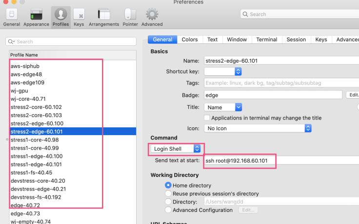
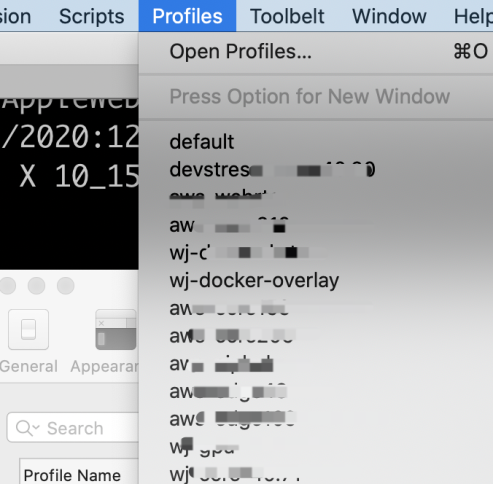
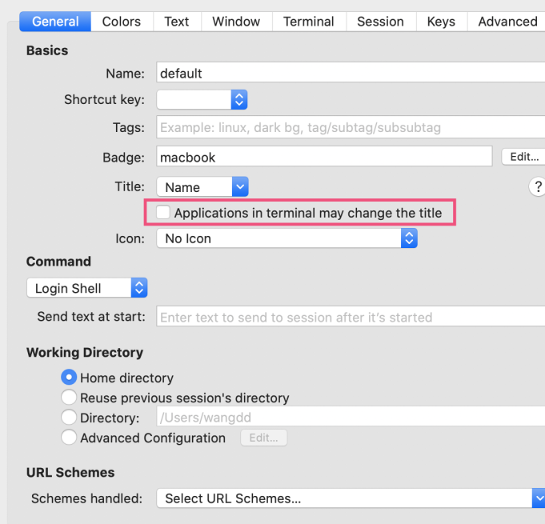
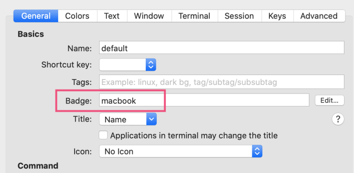
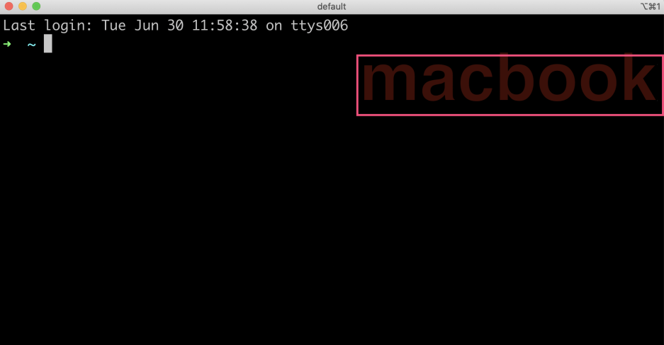

iTerm我已经使用了很长时间了，总体各方面的特点都非常好，但是有几个地方也是让我苦恼的地方。

1. tab 页面的标题会根据执行的命令或者路径发生变化，如果你开了七八个ssh远程，有时候很难区分这个tab页面到底是连接的哪台机器。
2. 如果你有十几个机器需要连接，你不可能手动输入ssh root@ip地址的方式去连接，太多了记不住。

# 如何维护多个远程host?

**使用profile维护多个远程host, 每个profile对应连接到一台机器。profile name填入该host的名字。**

注意右边的Command, Send text at start的输入框，这个输入框，就是要执行的ssh指令，里面包含了远程host的地址。

然后你就可以在Profils的菜单中选择一个profile进行连接了。

# 如何让tab页面的标题不改变？

- 一定不要勾选Applications in terminal may change the title,  默认这项是勾选的。
- Ttile一定要选择Name,

# badge的妙用？

如果标签页的tab的名称还不够强调当前tab页面是连接哪个标签页面的，你可以用用Badge去强调一下。

