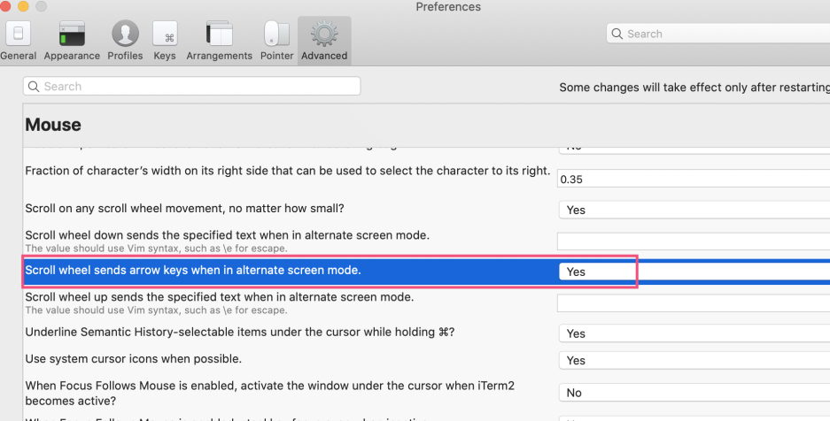

以前有个iTerm2有个很贴心的功能，鼠标向下滚动时，相关命令的输出也会自动向下。

但是不知道最近是升级系统还是升级iTerm2的原因，这个功能实现不了。😭😭😭😭😭😭😭

例如用vim打开一个大文件，或者使用man去查看一个命令的介绍文档时。如果要想向下滚动命令的输出内容。只能按j或者按空格或者回车。然而按键虽然精确，却没有用触摸板滚动来的爽。

为了让vim能够接受鼠标向下滚动功能，我也曾设置了 `set mouse=a` 这个设置虽然可以用触摸板来向下滚屏了，但是也出现了意想不到的问题。

然后我就去研究iTerm2的配置，发现关于鼠标的配置中，有一个 `Scroll wheel send arrow keys when in alternat screen mode` , 把这个指设置为Yes。那么无论Vim， 还是man命令，都可以用触摸板去滚动屏幕了。

