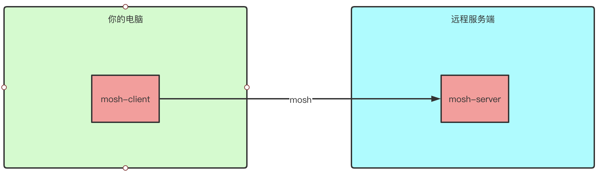
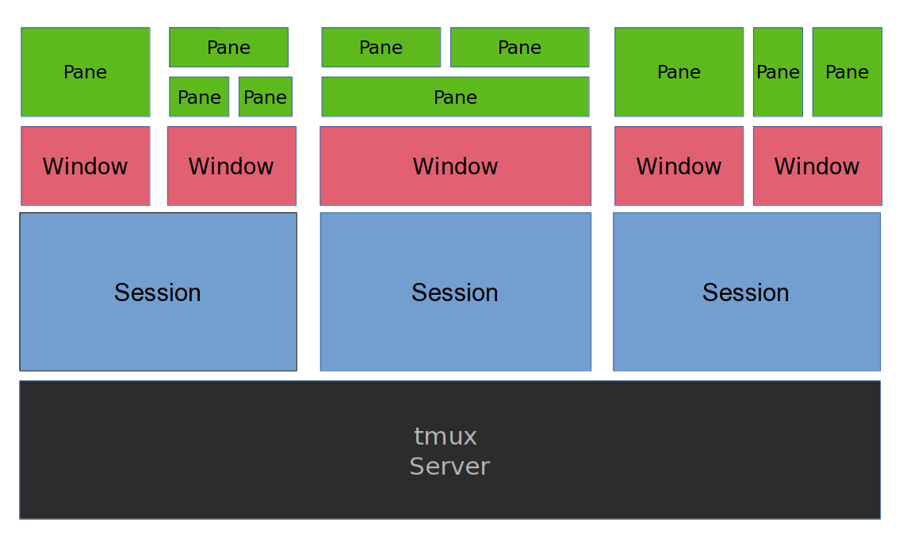
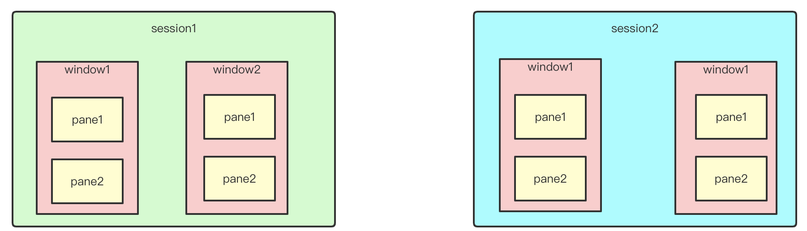

# tmux使用场景
远程ssh连接到服务器，最难受的是随时有可能ssh掉线，然后一切都需要花额外的时间重新恢复，也有可能一些工作只能重新开始。

在接续介绍tmux之前，先说说mosh。



<br />【mosh架构图】

我曾使用过[mosh](https://mosh.org/), 据说mosh永远不会掉线。实际上有可能的确如此，但是mosh实际上安装比较麻烦。mosh需要在服务端安装server, 然后要在你本地的电脑上安装client, 然后通过这个client去连接mosh服务端的守护进程。mosh需要安装在客户端服务端都安装软件，然后可能还要设置一下网络策略，才能真正使用。

mosh需要改变很多，这在生产环境是不可能的。另外即使是自己的开发环境，这样搞起来也是比较麻烦的。


下图是tmux的架构图。实际上我们只需要在服务端安装tmux, 剩下的ssh的连接都可以用标准的功能。<br />

<br />【tmux架构图】


# tmux概念：sesssion, window, panes
概念不清楚，往往是觉得tmux难用的关键点。

- session之间是相互隔离的，tmux可以启动多个session
- 一个session可以有多个window
- 一个window可以有多个panes


<br />在tmux中按ctrl-b w, 可以在sesion，window和panel之间跳转。<br />


注意：默认情况下，**一个sesion默认会打开一个window, 一个window会默认打开一个pane。**


# session操作

- 创建新的sesssion: `tmux new -s some_name` 
- 脱离session: `ctrl-b +d`  注意即使脱离session， session中的内容还是在继续工作的
- 进入某个session: `tmux attach -t some_name` 
- 查看sesion列表: `tmux ls` 
- kill某个session: `tmux kill-session -t some_name` 
- kill所有session: `tmux kill-server` 
- 重命名session: `ctrl-b $` 
- 选择session: `ctrl-b s` 

# window操作

- 新建: `ctrl-b c` 
- 查看列表: `ctrl-b w` 
- 关闭当前window: `ctrl-b &` 
- 重命名当前window: `ctrl-b ,` 
- 切换到上一个window: `ctrl-b p` 
- 切换到下一个window: `ctrl-b n` 
- 按序号切换到制定的window: `ctrl-b 数字`  数字可以用0-9

# panes操作
pane相当于分屏，所有pane都是在一个窗口里都显示出来的。这点和window不同，一个window显示出来，则意味着其他window是隐藏的。

在做代码对比，或者一遍参考另一个代码，一遍写当前代码时，可以考虑使用pane分屏。

- 垂直分屏: `ctrl-b %` 
- 水平分屏: `ctrl-b "` 
- 依次切换: `ctrl-b o` 
- 按箭头键切换: `ctrl-b 箭头` 
- 重新布局: `ctrl-b 空格键` 
- 最大化当前pane: `ctrl-b z` 
- 关闭当前pane: `ctrl-b x` 
- 将panne转为新的window: `ctrl-b !` 
- 显示Pannel编号 ctrl-b q
- 向左移动pannel ctrl-b {
- 向右移动pannel ctrl-b }

resize panne

| resize-pane -D 20 | resize down |
| --- | --- |
| resize-pane -U 20 | resize up |
| resize-pane -L 20 | resize left |
| resize-pane -R 20 | resize right |


# 杂项

- 查看时间： `ctrl-b t` 


# 内部操作
当你已经进入tmux时，如何新建一个session或者关闭一个session呢？

- 新建session `ctrl-b :` 进入命令行模式，然后输入： `new -s session-name` 
- 关闭sesssion `ctrl-b :` 进入命令行模式，然后输入： `kill-session -t session-name`  


# tmux 设置活跃window的状态栏背景色

```makefile
# tmux 1.x
set-window-option -g window-status-current-bg red

# tmux 2.9
setw -g window-status-current-style fg=black,bg=white
```


# 参考

- [https://unix.stackexchange.com/questions/210174/set-the-active-tmux-tab-color](https://unix.stackexchange.com/questions/210174/set-the-active-tmux-tab-color)

