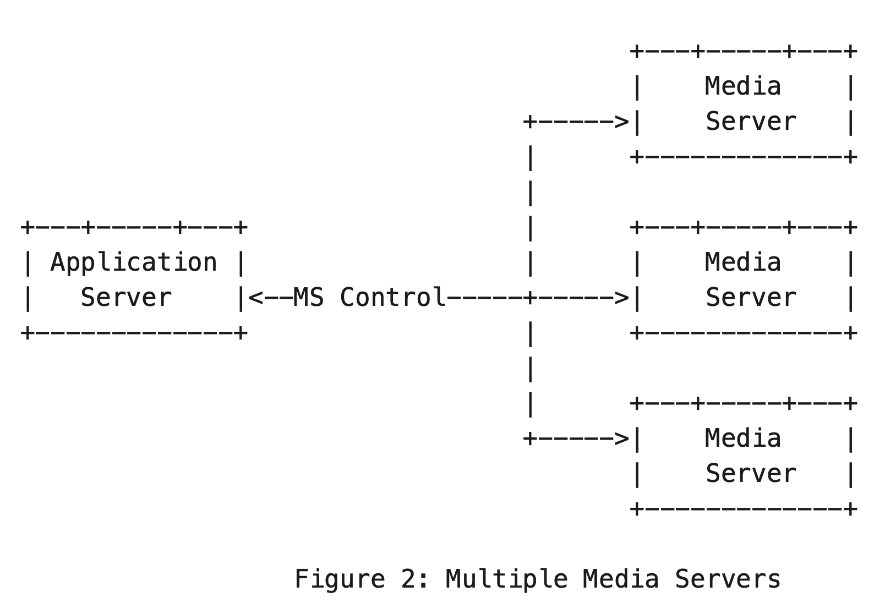
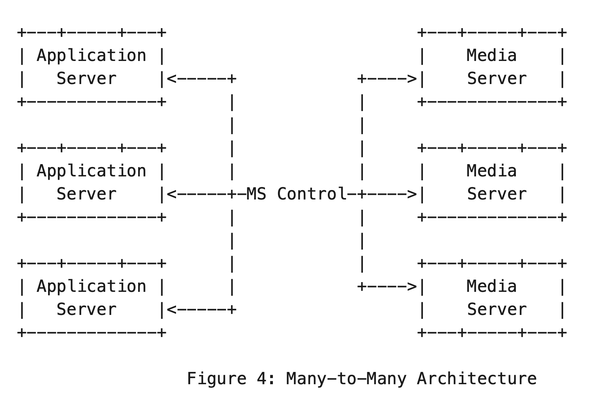

when considered in conjunction with deployment architectures that include 1:M and M:N combinations of Application Servers and Media Servers

Media Resource Broker (MRB) entity, which manages the availability of Media Servers and the media resource demands of Application Servers.  The document includes potential deployment options for an MRB and appropriate interfaces to Application Servers and Media Servers.

