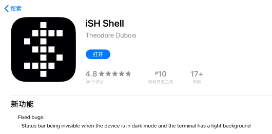
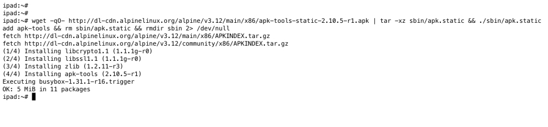
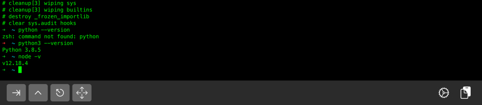
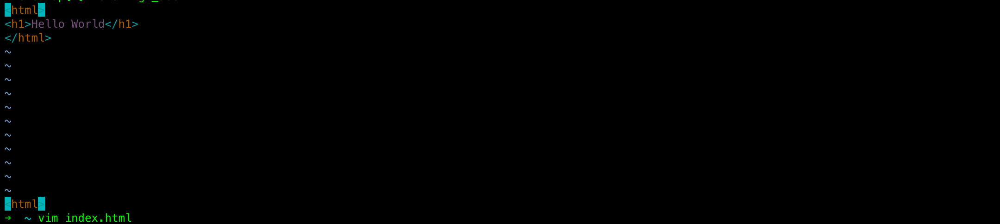
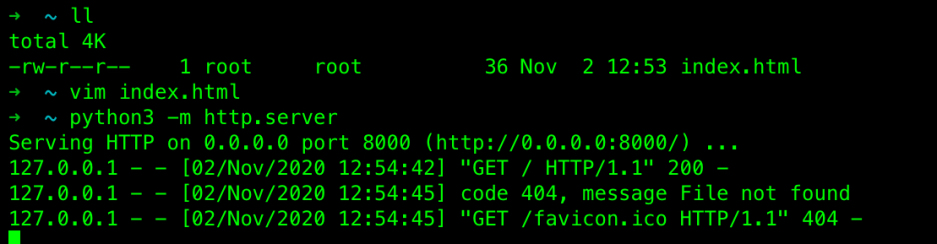
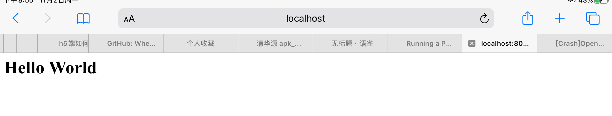

我在家里的时候，大部分时间用iPad远程连接到服务端做开发。虽然也是蛮方便的，但是每年都需要买个云服务器，也是一笔花费，最近看到一个App, 可以在手机上直接运行一个Linux环境，试了一下，果然还不错。下面记录一下安装过程。


# step1: 下载iSh




# step2: 安装apk


这个软件下载之后打开，就直接进到shell界面，虽然它是一个基于alpine的环境，但是没有apk， 我们需要手工安装这个包管理工具。


```bash
wget -qO- http://dl-cdn.alpinelinux.org/alpine/v3.12/main/x86/apk-tools-static-2.10.5-r1.apk | tar -xz sbin/apk.static && ./sbin/apk.static add apk-tools && rm sbin/apk.static && rmdir sbin 2> /dev/null
```


温馨提示：在iSh的右下角，有个按钮是粘贴按钮。




# step3: apk update

虽然安装了apk,  但是不更新的话，可能很多安装包都没有，所以最好先更新。

在更新之前。最好执行下面的命令，把apk的源换成清华的，这样之后的安装软件会比较快点。

```bash
sed -i 's/dl-cdn.alpinelinux.org/mirrors.tuna.tsinghua.edu.cn/g' /etc/apk/repositories

apk update
```


# step4: 安装各种开发工具 git zsh tmux vim...

```bash
apk add git zsh tmux vim
```


# step5: 安装oh-my-zsh 这是必不可少的神器

因为从github上克隆oh-my-zsh可能会很慢，所以我用了码云上的一个仓库。 这样速度就会很快了。

```bash
git clone https://gitee.com/nuannuande/oh-my-zsh.git ~/.oh-my-zsh

cp ~/.oh-my-zsh/templates/zshrc.zsh-template ~/.zshrc

chsh -s $(which zsh)
```


# step6: 安装nodejs python golang等。

```bash
apk add nodejs python3
```

下面看到输出了nodejs和python的版本，说明安装成功。另外ish支持换肤的。之前的白色的，下面的是黑色的。




# step7: vim写个hello world吧

vim index.html<br />



# step8: 监听端口可以吗？

写web服务器就不赘述了，直接用python自带的静态文件服务器吧。

```bash
python3 -m http.server
```

这会打开一个静态文件服务器，监听在8000端口。



我们打开自带的safari浏览器看看，能否访问这个页面。


hello world出现。完美！！！




# step9: 后台运行

后台运行的思路是：

1. 使用tmux 创建一个新的sesssion
2. 这这个session中执行下面的命令。下面的命令实际上是获取你的位置信息，当App切到后台时，位置在后台刷新，保证ish能够后台运行。当然这需要给予位置权限。你也可以收工输入 `cat /dev/location` 看看会发生什么。

```bash
cat /dev/location > /dev/null &
```


# FAQ

-  有些人会问，ish不支持多标签页，怎么同时做很多事情呢？ 问这个问题，说明你还没用过tmux这个工具，建议你先学学tmux。


