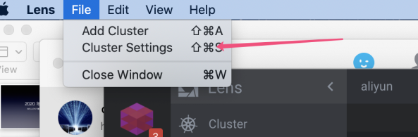
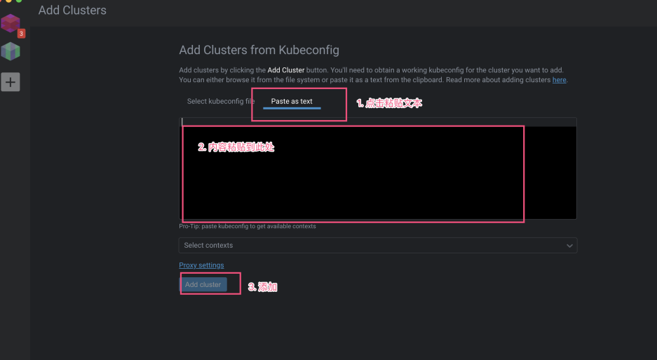
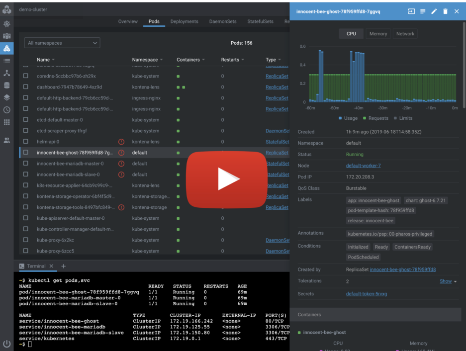

# 下载安装

[Lens-4.0.4.dmg](https://www.yuque.com/attachments/yuque/0/2020/dmg/280451/1608723355915-643e36ab-7e24-4412-a5fc-5be9f03d4cea.dmg?_lake_card=%7B%22uid%22%3A%221608723332085-0%22%2C%22src%22%3A%22https%3A%2F%2Fwww.yuque.com%2Fattachments%2Fyuque%2F0%2F2020%2Fdmg%2F280451%2F1608723355915-643e36ab-7e24-4412-a5fc-5be9f03d4cea.dmg%22%2C%22name%22%3A%22Lens-4.0.4.dmg%22%2C%22size%22%3A128698408%2C%22type%22%3A%22%22%2C%22ext%22%3A%22dmg%22%2C%22progress%22%3A%7B%22percent%22%3A99%7D%2C%22status%22%3A%22done%22%2C%22percent%22%3A0%2C%22id%22%3A%2208dCP%22%2C%22card%22%3A%22file%22%7D)


# 添加集群
在k8s master 节点上使用输入下面的指令，** 将输出内容复制一下**

```bash
kubectl config view --minify --raw
```


# 选择Fiel > Add cluster




# 粘贴




# 集群就显示出来了

