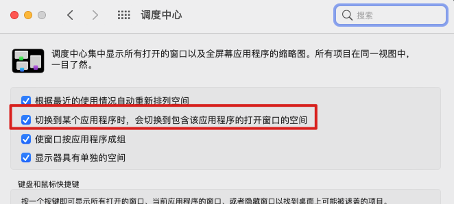

今天发现一个问题，按住command + tab, 已经切换到对应的应用图标上，但是松开按键之后，屏幕并没有切换到新的App屏幕上。特别是那些全屏的应用。

看了很多资料，都是没啥用的，最后发现

- [https://apple.stackexchange.com/questions/112350/cmdtab-does-not-work-on-hidden-or-minimized-windows](https://apple.stackexchange.com/questions/112350/cmdtab-does-not-work-on-hidden-or-minimized-windows)

最终发现，需要设置调度中心的 `切换到某个应用时，会切换到包含该应用程序的打开的窗口空间`， 这个必需要勾选。

