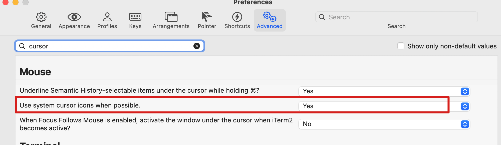

终端用着用着，光标消失了。

iterm2 仓库issues给出提示，要在设置》高级里面，Use system cursor icons when possile 为 yes.



然而上面的设置并没有用。

然后看了superuser上的question, 给出提示, 直接在终端输入 `reset` , 光标就会出现。解决了问题。

```bash
reset
```


# 参考

- [https://gitlab.com/gnachman/iterm2/-/issues/6623](https://gitlab.com/gnachman/iterm2/-/issues/6623)
- [https://superuser.com/questions/177377/os-x-terminal-cursor-problem](https://superuser.com/questions/177377/os-x-terminal-cursor-problem)

