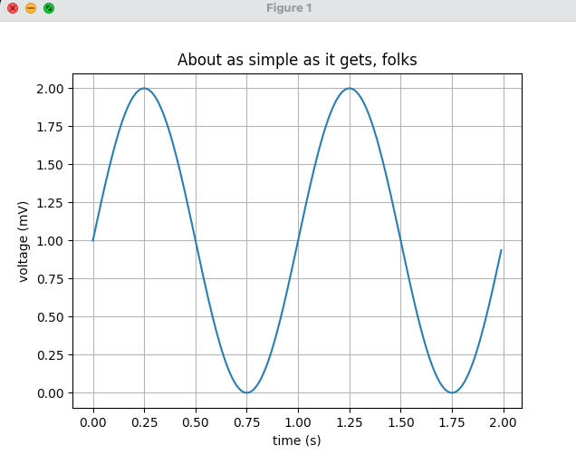

```bash
python3 wave.py
Traceback (most recent call last):
  File "wave.py", line 3, in <module>
    import matplotlib.pyplot as plt
ModuleNotFoundError: No module named 'matplotlib'
```

这种问题一般有两个原因

1. 这个第三方的包本地的确没有安装，解决方式就是安装这个包
2. 这个包安装了，但是因为环境配置或者其他问题，导致找不到正确的路径


# 问题1: 本地有没有安装过matplotlib?

下面的命令的输出说明已经安装了matplotlib, 并且目录是

- /usr/local/lib/python3.9/site-packages
```bash
pip3 show matplotlib
Name: matplotlib
Version: 3.4.1
Summary: Python plotting package
Home-page: https://matplotlib.org
Author: John D. Hunter, Michael Droettboom
Author-email: matplotlib-users@python.org
License: PSF
Location: /usr/local/lib/python3.9/site-packages
Requires: pillow, python-dateutil, pyparsing, numpy, kiwisolver, cycler
Required-by:
```


# 问题2: python3运行的那个版本的python？

由于历史原因，python的版本非常多，电脑上可能安装了多个python的版本。

下面的命令说明，python3实际执行的的是python 3.8.2，搜索的路径也是3.8的。但是pip3安装的第三方包，是在python3.9的目录下。

```bash
➜  bin python3
Python 3.8.2 (default, Dec 21 2020, 15:06:04)
[Clang 12.0.0 (clang-1200.0.32.29)] on darwin
Type "help", "copyright", "credits" or "license" for more information.
>>> import sys
>>> print(sys.path)
['', '/Library/Developer/CommandLineTools/Library/Frameworks/Python3.framework/Versions/3.8/lib/python38.zip', '/Library/Developer/CommandLineTools/Library/Frameworks/Python3.framework/Versions/3.8/lib/python3.8', '/Library/Developer/CommandLineTools/Library/Frameworks/Python3.framework/Versions/3.8/lib/python3.8/lib-dynload', '/Library/Developer/CommandLineTools/Library/Frameworks/Python3.framework/Versions/3.8/lib/python3.8/site-packages']
➜  pip3 -V
pip 21.0.1 from /usr/local/lib/python3.9/site-packages/pip (python 3.9)
```


# 问题3: python3.9在哪？
通过上面的命令，就说了我的电脑上有python3.9， 那么实际要克制行文件在哪里呢？

一般我是用brew安装软件的，brew list

```bash
brew list
- python@3.9

brew info python@3.9

Python has been installed as
  /usr/local/bin/python3

Unversioned symlinks `python`, `python-config`, `pip` etc. pointing to
`python3`, `python3-config`, `pip3` etc., respectively, have been installed into
  /usr/local/opt/python@3.9/libexec/bin
```
上面的输出中，有两个路径

- /usr/local/bin/python3  试了下这个路径没有文件
- /usr/local/opt/python@3.9/libexec/bin 这个文件存在

```bash
➜  bin /usr/local/opt/python@3.9/libexec/bin/python -V
Python 3.9.2
```
将python3 设置为一个别名
```bash
alias python3='/usr/local/opt/python@3.9/libexec/bin/python'
```

source ~/.zshrc

python3 wave.py,

问题解决。


