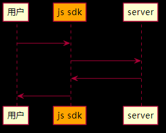

关于js sdk的设计，这篇文档基本上详细介绍了很多的点，值得深入阅读一遍。[https://github.com/hueitan/javascript-sdk-design](https://github.com/hueitan/javascript-sdk-design)

然而最近在重构某个js sdk时，也发现了一些问题，这个问题并不存在于上述文章中的。

js sdk在收到服务端的响应时，直接将server端返回的错误码给到用户。

这里会有一个问题，这个响应码，实际上是js sdk和server之间的消息交流。并不是js sdk和用户之间的消息交流。

如果我们将server端的响应直接返回给用户，则js sdk可以理解为是一个透明代理。用户将会和server端产生强耦合。如果server端有不兼容的变化，将会直接影响到用户的使用。

所以较好的做法是js sdk将这个错误封装为另一个种表现形式，和server端分离出来。

