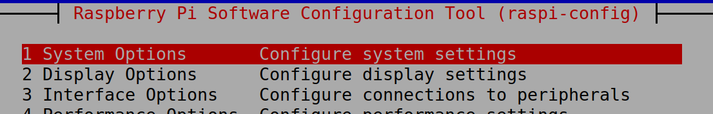
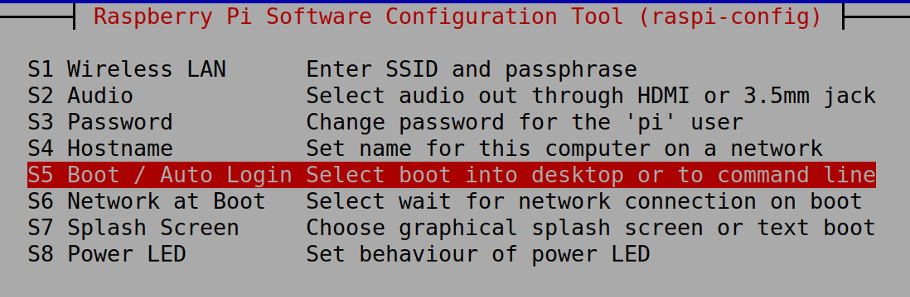
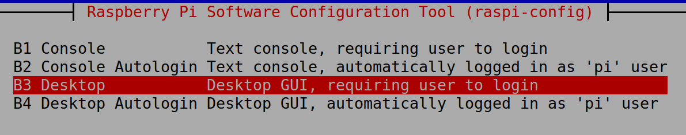
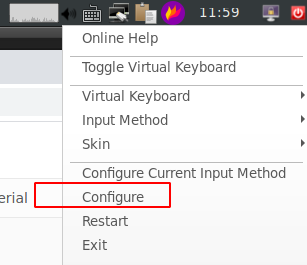
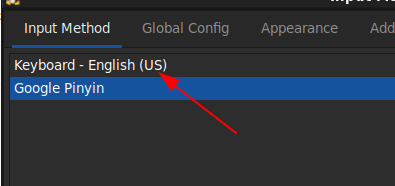
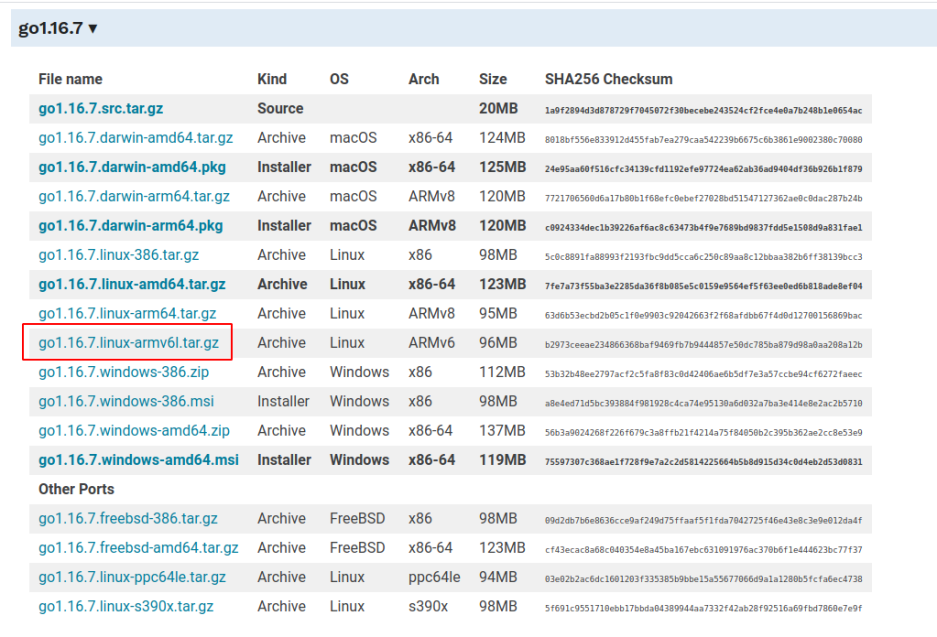

# 选择那个版本的系统？

不要过高的估算树莓派的性能，最好不要选择那些具有漂亮界面的ubuntu或者manjaro, 因为当你使用这些带桌面的系统时，很大概率界面能让你卡的想把树莓派砸了。

所以优先选择不带图形界面的lite版本的系统，如果确实需要的话，可以再安装lxde


# 网线插了，还是无法联网
插了网线，网口上的绿灯也是在闪烁，但是eth0就是无法联网成功。真是气人。

解决方案： 编辑 /etc/network/interfaces, 将里面的内容改写成下面的，然后重启树莓派。

这个配置文件的涵义是：在启动时就使用eth0有线网卡，并且使用dhcp给这个网卡自动配置IP

```
auto eth0
iface eth0 inet dhcp
iface etho inet6 dhcp
source-directory /etc/network/interfaces.d
```


# 无桌面版本，如何手工安装桌面

首先安装lxde
```
sudo apt update
sudo apt install lxde -y
```

然后通过raspi-config, 配置默认从桌面启动

```
sudo rasip-config
```

选择系统配置, 按回车键进入<br />


选择Boot/Auto login， 按回车进入



选择Desktop, 回车确认。保存之后，退出重启。<br />




# 键盘无法输入|
| 在linux中是管道的意思，然而我的键盘却无法输入。最终发现是键盘布局的原因。

在图标上右键，选择配置<br />



注意这里是US, 这是正常的。如果是UK，就是英式布局，是有问题的，需要把UK的删除，重新增加一个US的。<br />




# 如何安装最新版本的neovim?

树莓派使用apt安装的neovim， 版本太老了。很多插件使用上都会体验不好。所以建议安装最新版的neovim。

```
sudo apt install snapd
sudo snap install --classic nvim

注意： nvim的默认安装的路径是/snap/bin, 所以你需要把这个路径设置到PATH里，才能使用nvim.
```


# 如何安装最新的golang？

打开这个页面 [https://golang.google.cn/dl/](https://golang.google.cn/dl/)

因为树莓是armhf架构的，所以这这么多版本里，只有armv6l这个版本是能够在树莓派上运行的。

压缩包下载之后解压，里面的go/bin目录中就有go的可执行文件，只要将这个目录暴露到PTAH中，就能使用golang了。<br />




# 如何安装最新版本的node.js

```
curl -L https://gitee.com/wangduanduan/install-node/raw/master/bin/n -o n
bash n lts
```


# 如何安装谷歌浏览器？

```
sudo apt full-upgrade
sudo apt install chromium-browser -y
```


# 使用清华apt源

- [https://mirrors.tuna.tsinghua.edu.cn/help/raspbian/](https://mirrors.tuna.tsinghua.edu.cn/help/raspbian/)
```
# 编辑 `/etc/apt/sources.list` 文件，删除原文件所有内容，用以下内容取代：
deb http://mirrors.tuna.tsinghua.edu.cn/raspbian/raspbian/ buster main non-free contrib rpi
deb-src http://mirrors.tuna.tsinghua.edu.cn/raspbian/raspbian/ buster main non-free contrib rpi

# 编辑 `/etc/apt/sources.list.d/raspi.list` 文件，删除原文件所有内容，用以下内容取代：
deb http://mirrors.tuna.tsinghua.edu.cn/raspberrypi/ buster main ui
```


# 如何安装截图工具？

```
sudo apt-get install -y flameshot
```


# 使用树莓派在浏览器上看视频怎么样？

非常卡


