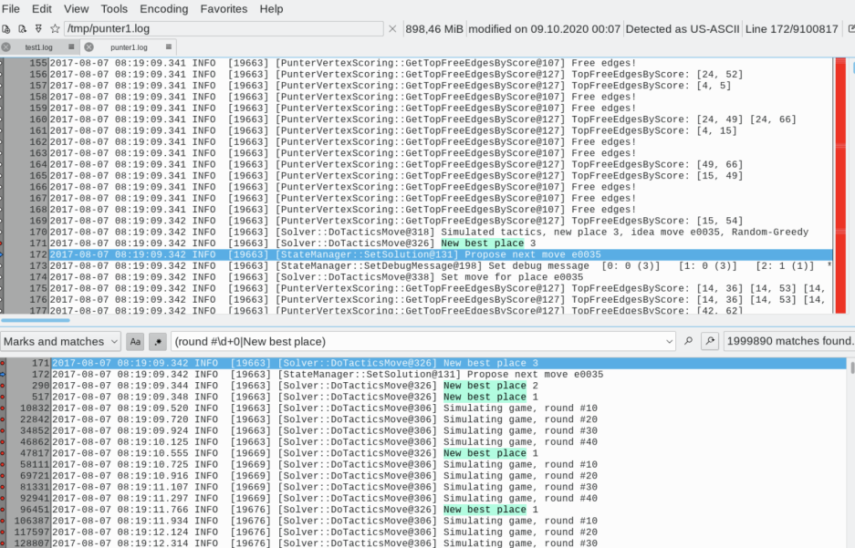
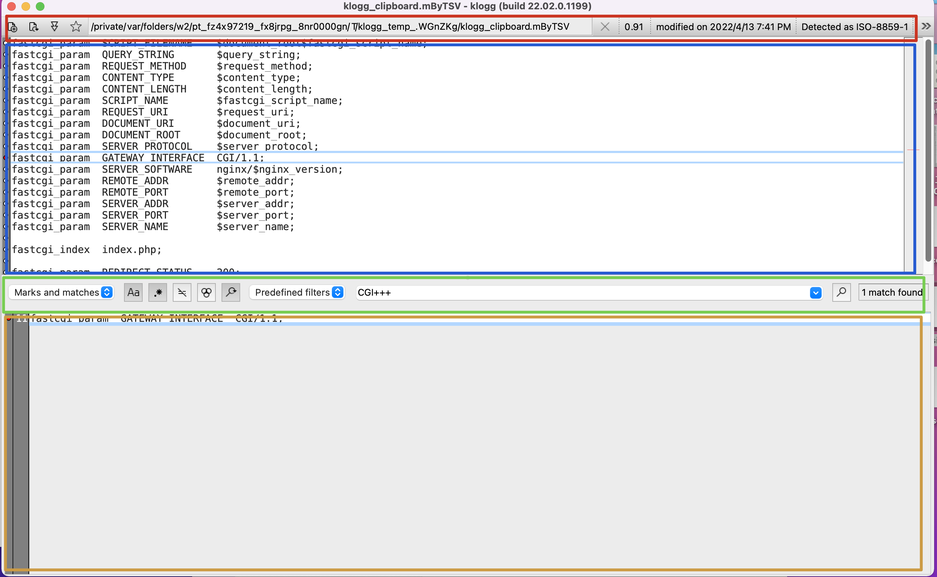
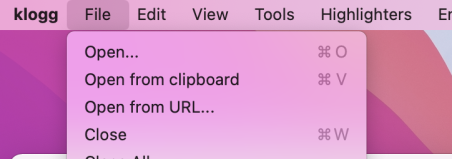

# 项目信息

github地址 [https://github.com/variar/klogg](https://github.com/variar/klogg)

# 1. 安装
klogg是个跨平台软件，windows, mac, linux都可以安装。具体安装方式参考github项目地址

# 2. 界面布局

1. 文件信息栏
2. 日志栏
3. 过滤器设置栏
4. 过滤后的日志显示栏

# 3. 文件加载
klogg支持多种方式加载日志文件

1. 将日志文件拖动到klogg中
2. 直接将常见的压缩包文件拖动到klogg中，klogger将会自动将其解压后展示
3. 支持从http url地址下载日志，然后查看
4. 支持从剪贴板复制日志，然后展示

# 4. 过滤表达式

因为klogg支持正则过滤，所以他的功能就非常强悍了。

逻辑表达式

| 表达式 | 例子 | 备注 |
| --- | --- | --- |
| 与  and  | "open" and "close" | 包含open，并且包含close |
| 或 or  | "open" or "close" | 包含open, 或者 close |
| 非 not | not("open") | 不包含open |

与或非同时支持复杂的运算，例如包含open 但是不包含close: `"open" and not("close")`

# 5. 快捷方式
klogg的快捷方式很多参考了vim, vim使用者非常高兴。

| 键 | 动作 |
| --- | --- |
| arrows | 上下或者左右移动 |
| [number] j/k | 支持用j/k上下移动 |
| h/l | 支持用h/l左右移动 |
| ^ or $ | 滚动到某行的开始或者结尾 |
| [number] g | 跳到对应的行 |
|  | entered |
| G | 跳到第一行 |
| Shift+G | 跳到最后一行 |
| Alt+G | 显示跳到某一行的对话框 |
| ' or " | 在当前屏幕快速搜索 |
|  | (forward and backward) |
| n or N | 向前或者向后跳 |
| * or . | search for the next occurrence of the currently selected text |
| / or , | search for the previous occurrence of the currently selected text |
| f | 流的方式，类似 tail -f |
|  |   |
| m | 标记某一行，标记后的行会自动加入过滤结果中 |
| [ or ] | 跳转到上一个或者下一标记点 |
| + or - | 调整过滤窗口的尺寸 |
| v | 循环切换各种显示模式 - Matches: 只显式匹配的内容 - Marks: 只显式标记的内容 - Marks and Matchs：显示匹配和标记的内容  |
|  | (Marks and Matches -> Marks -> Matches) |
| F5 | 重新加载文件 |
| Ctrl+S | Set focus to search string edit box |
| Ctrl+Shift+O | 打开对话框去选择其他文件 |

# 参考

- [https://github.com/variar/klogg/blob/master/DOCUMENTATION.md](https://github.com/variar/klogg/blob/master/DOCUMENTATION.md)

