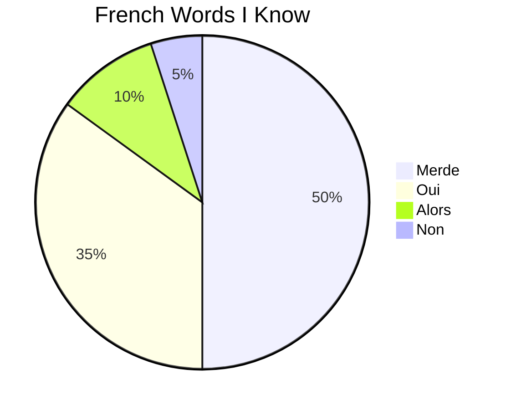
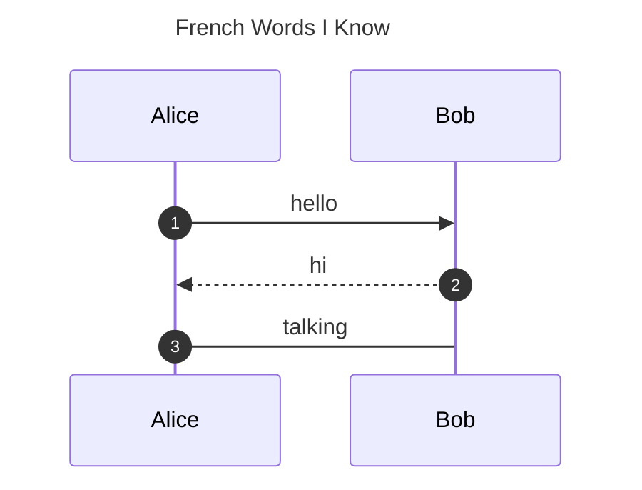

# step1

在themes/YourTheme/layouts/partials/footer.html 的最后追加如下内容

```html
{{if .Store.Get "hasMermaid" }}
  <script type="module">
    import mermaid from 'https://cdn.jsdelivr.net/npm/mermaid/dist/mermaid.esm.min.mjs';
    mermaid.initialize({ startOnLoad: true });
  </script>
{{end }}
```

# step2:

在layouts/_default/_markup/render-codeblock-mermaid.html

```html
<pre class="mermaid">
    {{- .Inner | htmlEscape | safeHTML }}
</pre>
{{ .Page.Store.Set "hasMermaid" true }}
```

# 在blog中增加如下代码




