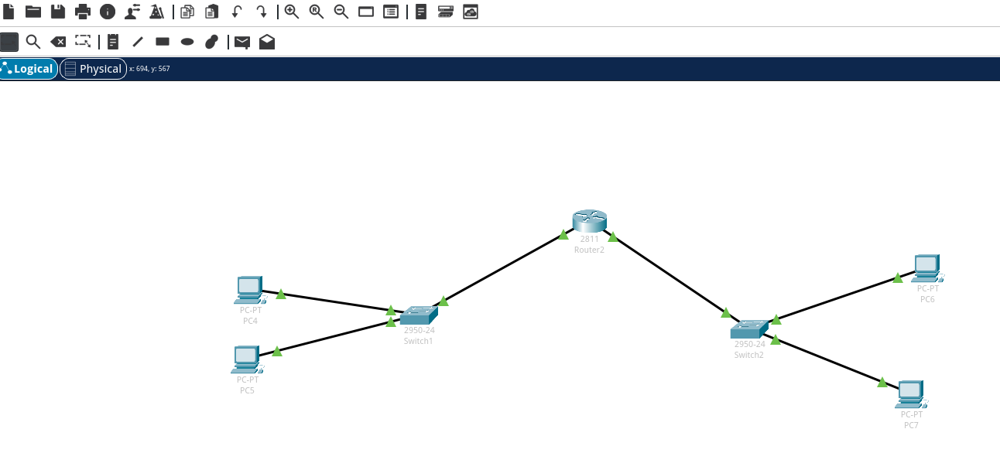

```
# 将会下载packettracer到当前目录下
yay -G packettracer
cd packettracer

# Download PacketTracer_731_amd64.deb to this folder
makepkg

sudo pacman -U packettracer-7.3.1-2-x86_64.pkg.tar.xz
```

注意，如果下载的packetraacer包不是PacketTracer_731_amd64.deb， 则需要修改PKGBUILD文件中的, souce对应的文件名。 例如我下载的packettracer是Cisco_Packet_Tracer_811_Ubuntu_64bit_cf200f5851.deb

```
source=('local://Cisco_Packet_Tracer_811_Ubuntu_64bit_cf200f5851.deb'                                                                                                       
    'packettracer.sh')
```

注意：最新版的packertracer打开后，必须登陆账号才能使用，有点坑。 花费点时间注册了账号后，才能用。



# 参考

- [https://forum.manjaro.org/t/how-to-get-cisco-packet-tracer-on-manjaro/25506/5](https://forum.manjaro.org/t/how-to-get-cisco-packet-tracer-on-manjaro/25506/5)

