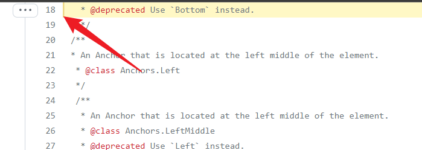
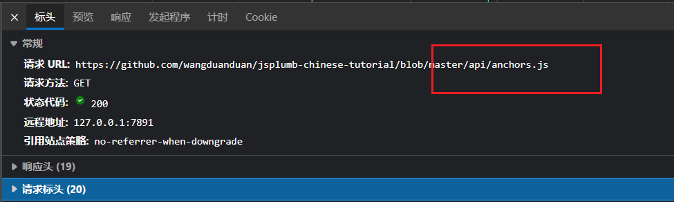

# HTTP URL的格式复习
<scheme>://<user>:<password>@<host>:<port>/<path>;<params>?<query>#frag

- scheme 协议，             常见的有http, https, file, ftp等
- <user>:<password> 用户名和密码
- host  主机或者IP
- port  端口号
- path  路径
- params  参数 用的比较少
- query     查询参数
- frag         片段，资源的一部分，浏览器不会把这部分发给服务端

# 关于frag片段

浏览器加载一个网页，网页可能有很多章节的内容，frag片段可以告诉浏览器，应该将某个特定的点显示在浏览器中。

例如 [https://github.com/wangduanduan/jsplumb-chinese-tutorial/blob/master/api/anchors.js#L18](https://github.com/wangduanduan/jsplumb-chinese-tutorial/blob/master/api/anchors.js#L18)

这里的#L8就是一个frag片段， 当浏览器打开这个页面的时，就会跳到对应的行



在网络面板，也可以看到，实际上浏览器发出的请求，也没有带有frag参数



# Vue
在Vue中，默认的路由就是这种frag片段。 这种路由只对浏览器有效，并不会发送到服务端。

所以在一个单页应用中，服务端是无法根据URL知道用户访问的是什么页面的。

**所以实际上nginx无法根据frag片段进行拦截。**


# nginx路径拦截

```

location [modifier] [URI] {
  ...
  ...
}

```

- modifier
   - = 完全匹配
   - ^~ 正则匹配，并且必须是以特定的URL开头
   - ~ 正则匹配，且大小写敏感
   - ~* 正则匹配，大小写不敏感

- nginx路径匹配规则
   1. 首先使完全匹配，一旦匹配，则匹配结束，进行后续数据处理
   2. 完全匹配无法找到，则进行最长URL匹配，类似 ^~
   3. 最长匹配找不到，则按照 ~或者~*的方式匹配
   4. 最后按照 / 的默认匹配

