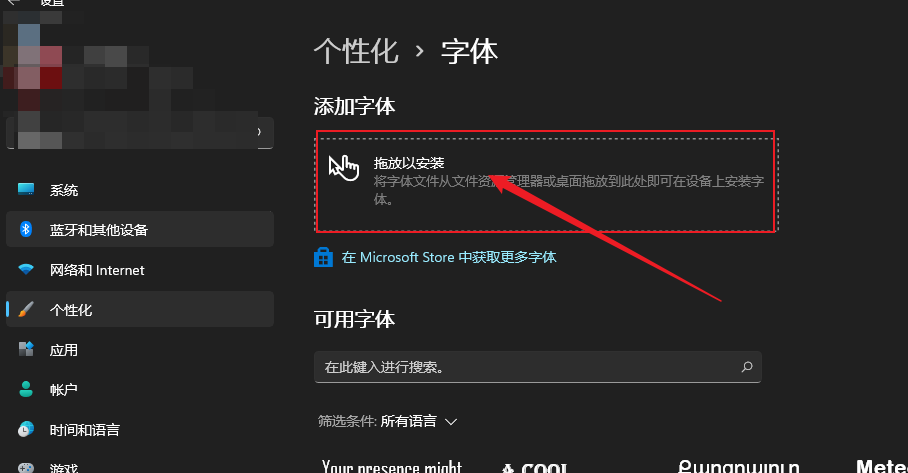
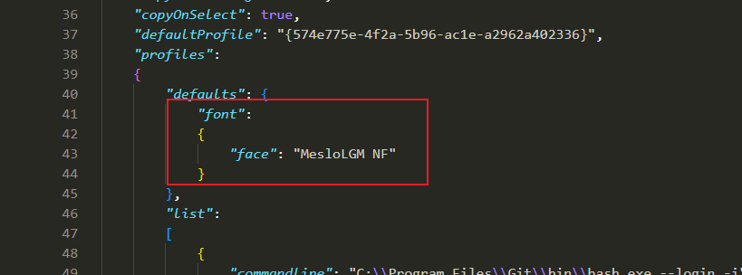
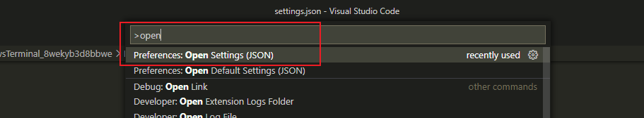
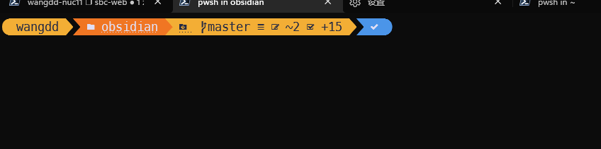
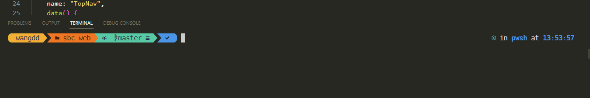

# 0. 前提条件
- 系统是windows11
- 已经安装过powershell 7
- 安装过vscode编辑器
- 默认情况下，所有命令均在powershell下执行的

# 1. 安装 oh my posh

## 1.2 方式1： 通过代理安装
假如你有socks代理，那么可以用winget安装

打开你的power shell 执行类似下面的命令，来配置代理
```
$env:all_proxy="socks5://127.0.0.1:1081"
```
如果没有socks代理，最好不要用winget安装，因为速度太慢。<br />然后执行：

```
winget install JanDeDobbeleer.OhMyPosh -s winget
```


## 1.2 方式2： 下载exe，手工安装
再oh-my-posh的release界面 [https://github.com/JanDeDobbeleer/oh-my-posh/releases](https://github.com/JanDeDobbeleer/oh-my-posh/releases)

可以看到很多版本的文件，windows选择install-amd64.exe,  下载完了之后手工点击执行来安装。

[https://github.com/JanDeDobbeleer/oh-my-posh/releases/download/v8.13.1/install-amd64.exe](https://github.com/JanDeDobbeleer/oh-my-posh/releases/download/v8.13.1/install-amd64.exe)


# 2. 配置 oh-my-posh

在powershell中执行下面的命令，vscode回打开对应的文件。
```
code $PROFILE
```

在文件中粘贴如下的内容：

```
oh-my-posh init pwsh | Invoke-Expression
```

保存文件，然后再次打开windows termial, 输入下面的命令来reload profile

```
. $PROFILE
```

然后你可以看到终端出现了提示符，有可能有点卡，第一次是有点慢的。但是很多符号可能是乱码，因为是没有配置相关的字体。


# 3. 字体配置

## 3.1 安装字体


1. 下载文件 [https://github.com/ryanoasis/nerd-fonts/releases/download/v2.1.0/Meslo.zip](https://github.com/ryanoasis/nerd-fonts/releases/download/v2.1.0/Meslo.zip)
2. 解压文件
3. 打开设置，在个性化》字体中，将之前下载好的所有字体，拖动到下面的红框中，字体就会自动安装




## 3.2 windows termial字体配置

用vscode打开对windows termial的配置json文件，在profiles.default.font中配置如下字体

```
"font":
{
      "face": "MesloLGM NF"
}
```


配置之后，需要重启windows termial


## 3.3 vscode termial 配置
在vscode中输入 Open Sett, 就可以打开设置的json文件。


在配置中设置如下的内容

```
  "terminal.integrated.fontFamily": "MesloLGM NF",
```


# 4. 效果展示

## 4.1 windows terminal



## 4.2 vscode terminal


# 5. 体验

- 优点
   - oh-my-posh 总体还不错，能够方便的展示git相关的信息
- 缺点
   - 性能拉跨，每次终端可能需要0.5s到2s之间的延迟卡顿，相比于linux上的shell要慢不少


# 6. 参考文献

- [https://ohmyposh.dev/docs/installation/prompt](https://ohmyposh.dev/docs/installation/prompt)

