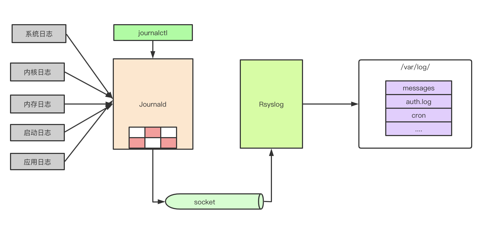

# 1. 序言
日志文件包含系统的运行信息，包括内核、服务、应用程序等的日志。日志在分析系统故障、排查应用问题等方面，有着至关重要的作用。

# 2. 哪些进程负责管理日志？
默认情况下，系统上有两个守护进程服务管理日志。journald和rsyslogd。

journald是systemd的一个组件，journald的负责收集日志，日志可以来自

- Syslog日志
- 内核日志
- 初始化内存日志
- 启动日志
- 所有服务写到标准输出和标准错误的日志

journal收集并整理收到的日志，使其易于被使用。

有以下几点需要注意

1. 默认情况下，journal的日志是不会持久化的。
2. journal的日志是二进制的格式，并不能使用文本查看工具，例如cat, 或者vim去分析。journal的日志需要用journalctl命令去读取。

journald会把日志写到一个socket中，rsyslog可以通过这个socket来获取日志，然后去写文件。



# 3. 日志文件文件位置

- 日志文件位置 /var/log/ 目录

# 4. 日志配置文件位置

- /etc/rsyslog.conf  rsyslogd配置文件
- /etc/logrotate.conf  日志回滚的相关配置
- /etc/systemd/journald.conf  journald的配置文件


# 5. rsyslog.conf

## 5.1. 模块加载

- 注意 imjournal就是用来负责访问journal中的日志
- imuxsock 提供本地日志输入支持，例如使用logger命令输入日志
```bash
$ModLoad imuxsock # provides support for local system logging (e.g. via logger command)
$ModLoad imjournal # provides access to the systemd journal
```

## 5.2. 过滤

### 5.2.1. 优先级过滤
**模式：FACILITY.****PRIORITY**

- 设备(FACILITY): kern (0), user (1), mail (2), daemon (3), auth (4), syslog (5), lpr (6), news (7), cron (8), authpriv (9), ftp (10), and local0 through local7 (16 - 23).
- 日志等级：debug (7), info (6), notice (5), warning (4), err (3), crit (2), alert (1), and emerg (0).
- 正则
   - = 指定某个级别
   - ! 排除某个级别
   - * 匹配所有级别

Example: 
```bash
kern.*  #选择所有的内核信息
mail.crit #选择所有优先级高于等于crit
cron.!info # 选择cron日志不是info级别的日志
```

### 5.2.2. 属性过滤
模式：**:PROPERTY, [!]COMPARE_OPERATION, "STRING"**
**

- 比较操作符（COMPARE_OPERATION）
   - contains 包含
   - isequal 相等
   - starswitch 以xxx开头
   - regex 正则匹配

**
举个比较常见的例子.

如果日志中包含 wdd 这个字符串，就把日志写到/var/log/wdd.log 这个文件里。

首先编辑一下/etc/rsyslog.conf 文件

> 注意
> :msg 表示消息的内容
> 详情可以参考 man rsyslog.conf 关于Available Properties的部分内容

```bash
:msg,contains,"wdd"                                     /var/log/wdd.log
```
保存退出，然后执行下面的命令：
```bash
touch /var/log/wdd.log # 创建文件
systemctl restart rsyslog # 重启服务
logger hello wdd

➜  log tail /var/log/wdd.log
May 23 19:26:52 VM_0_8_centos root: hello wdd
```

### 5.2.3. Action

将rsyslog写日志文件：

```bash
# 方式1：过滤器 日志路径
cron.* /var/log/cron.log

# 方式2：过滤器	-日志路径。注意多了个-
# 默认rsyslog是同步写日志，加个-表示异步写日志。在写日志比较多时候，异步的写可以提高性能
mail.* -/var/log/cron.log

# 方式3：通过网络发送日志
# @[(zNUMBER)]HOST:[PORT]  zNUMBER是压缩等级
mail.* @192.168.2.3:8000 #通过UDP发送日志
cron.* @@192.168.2.3:8000 #通过TCP发送日志， 注意多了一个@
*.* @(2)192.168.2.3:8000 #通过UDP发送日志，日志会被压缩后发送，压缩等级是2。日志如果少于60字节，将不会压缩
```

### 5.2.4. 丢弃日志
```bash
cron.* stop
*.*   ~      # rsyslog8 支持用~丢弃日志
```
详情可以：man rsyslog.conf

### 5.2.5. 日志回滚

man lograte 里面有很多日志
```bash
/var/log/wdd.log {
        noolddir
        size 10M
        rotate 10
        sharedscripts
        postrotate
        /bin/kill -HUP `cat /var/run/syslogd.pid 2> /dev/null` 2> /dev/null || true
        /bin/kill -HUP `cat /var/run/rsyslogd.pid 2> /dev/null` 2> /dev/null || true
        endscript
}
```

# 6. 速度限制
## 6.1. journald的速度限制

- RateLimitInterval 限速周期,默认30s
- RateLimitBurst 限速值, 默认限速值1000

针对单个service, 在一个限速周期内，如果消息量超过限速值，则丢弃本周期内的所有消息。

/etc/systemd/journal.conf
```bash
#RateLimitInterval=30s
#RateLimitBurst=1000
```
如果想关闭速度限制，就将RateLimitInterval设置为0

>       RateLimitInterval=, RateLimitBurst=
>           Configures the rate limiting that is applied to all messages generated on the system. If, in the time interval defined by
>           RateLimitInterval=, more messages than specified in RateLimitBurst= are logged by a service, all further messages within the interval
>           are dropped until the interval is over. A message about the number of dropped messages is generated. This rate limiting is applied
>           per-service, so that two services which log do not interfere with each other's limits. Defaults to 1000 messages in 30s. The time
>           specification for RateLimitInterval= may be specified in the following units: "s", "min", "h", "ms", "us". To turn off any kind of rate

>           limiting, set either value to 0.


## 6.2. rsyslog的速度限制
/etc/rsyslog.conf
```bash
$SystemLogRateLimitInterval 2 # 单位是s
$SystemLogRateLimitBurst 50
```
如果要关闭速度限制，就将SystemLogRateLimitInterval设置为0

# 7. journal 日志清理
	
>        --vacuum-size=, --vacuum-time=
>           Removes archived journal files until the disk space they use falls below the specified size (specified with the usual "K", "M", "G", "T"

>           suffixes), or all journal files contain no data older than the specified timespan (specified with the usual "s", "min", "h", "days",

>           "months", "weeks", "years" suffixes). Note that running --vacuum-size= has only indirect effect on the output shown by --disk-usage as

>           the latter includes active journal files, while the former only operates on archived journal files.  --vacuum-size= and --vacuum-time=

>           may be combined in a single invocation to enforce both a size and time limit on the archived journal files.


发现 /var/log/journal的目录居然有4G。

所以需要清理。

## 7.1. 手动清理
```bash
journalctl --vacuum-time=2d # 保留最近两天
journalctl --vacuum-size=500M # 保留最近500MB
```

按天执行一次试试：
```bash
journalctl --vacuum-time=2d
Vacuuming done, freed 3.9G of archived journals on disk.
```

## 7.2. 修改配置

为了避免以后还需要手动清理，可以修改/etc/systemd/journal.conf文件

例如将最大使用改为200M
```bash
SystemMaxUse=200M
```

重启journald: 

```bash
systemctl restart systemd-journald
```

# 8. linux 日志文件简介

inux的日志位于/var/log目录下。

日志主要分为4类

- 1 应用日志
- 2 事件日志
- 3 服务日志
- 4 系统日志

日志内容

- /var/log/messages 普通应用级别活动
- /var/log/auth.log 用户验证相关事件
- /var/log/secure 系统授权
- /var/log/boot.log 系统启动日志
- /var/log/dmesg.log 硬件设备相关
- /var/log/kern.log 内核日志
- /var/log/faillog 失败的登录尝试日志
- /var/log/cron crontab计划任务日志
- /var/log/yum.log 包安装日志
- /var/log/maillog /var/log/mail.log 邮件服务相关日志
- /var/log/httpd/ Apache web服务器日志
- /var/log/mysql.log /var/log/mysqld.log mysql相关日志