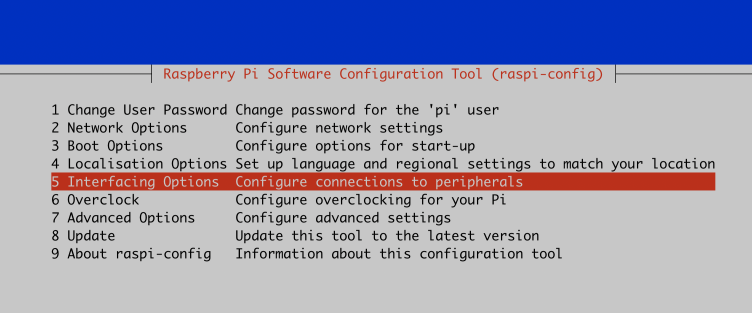
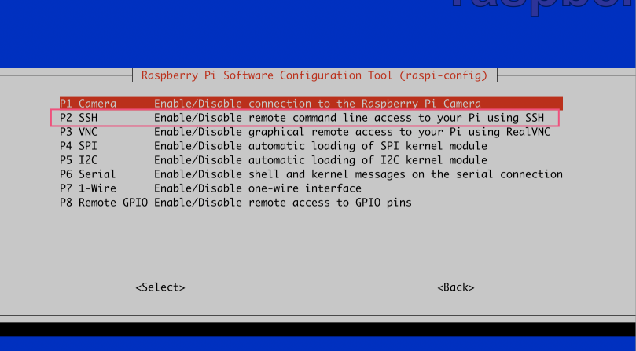
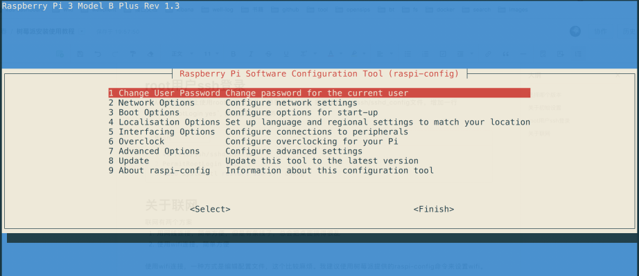
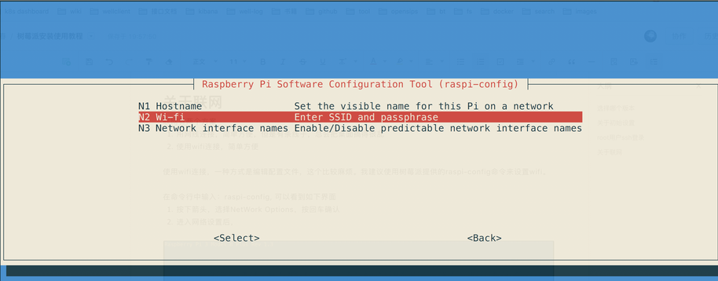

我已经装过几次树莓派的系统了，记录一些使用心得。

# 1. 选择哪个版本
最好用无[桌面版](https://downloads.raspberrypi.org/raspbian_lite_latest)，无桌面版更加稳定。我之前用过几次桌面版，桌面版存在以下问题。

1. 使用偶尔感觉会卡
2. 经常使用一天之后，第二天要重启系统。

# 2. 关于初始设置

1. 默认的用户是 pi，默认的密码是raspberry
2. 登录成功之后，sudo passwd pi 来修改pi用户的密码
3. 登录之后，sudo passwd root 来设置root的用户密码

# 3. 开启ssh 远程登录服务

```bash
raspi-config
```





# 4. root用户ssh登录
默认树莓派是禁止使用root远程登录的，想要开启的话，需要编辑/etc/ssh/sshd_config文件，增加一行`PermitRootLogin yes`, 然后重启ssh服务

```bash
vi /etc/ssh/sshd_config
PermitRootLogin yes
sudo systemctl restart ssh //  chong
```

# 5. 关于联网
联网有两个方案

1. 用网线连接，简单方便，但是有条线子，总会把桌面搞得很乱
2. 使用wifi连接，简单方便

使用wifi连接，一种方式是编辑配置文件，这个比较麻烦。我建议使用树莓派提供的raspi-config命令来设置wifi。

在命令行中输入：raspi-config, 可以看到如下界面

1. 按下箭头，选择NetWork Options，按回车确认
2. 进入网络设置后，按下箭头，选择N2 Wi-fi
3. 然后就很简单了，输入wifi名称和wifi密码，最好你的wifi名称是英文的，出现中文会很尴尬的。






# 6. 如何找到树莓派的IP地址

某些情况下，树莓派在断电重启之后会获得新的IP地址。在没有显示器的情况下，如果找到树莓派的IP呢？

树莓派的MAC地址是：b8:27:eb:6c 开头

所以你只需要输入: arp -a   就会打印网络中的主机以及MAC地址，找以b8:e7:eb:6c开头的，很可能就是树莓派。

# 7. 设置清华镜像源
[https://mirrors.tuna.tsinghua.edu.cn/help/raspbian/](https://mirrors.tuna.tsinghua.edu.cn/help/raspbian/)
