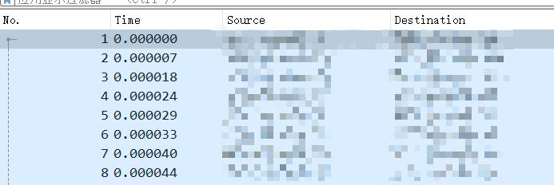
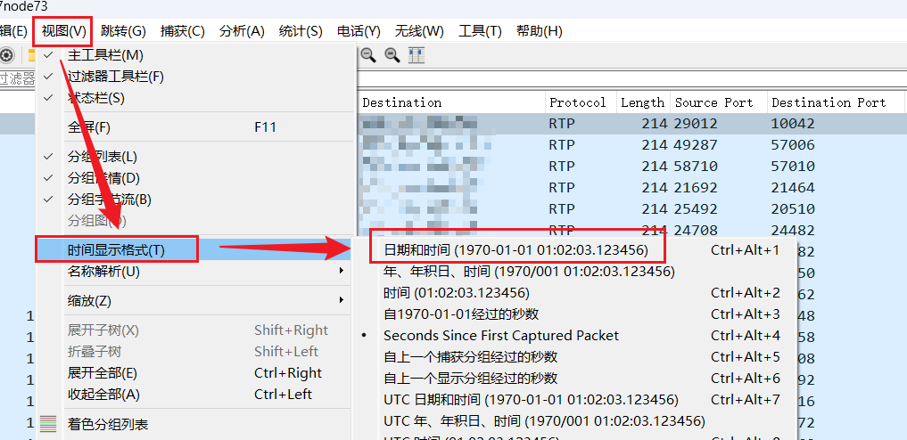
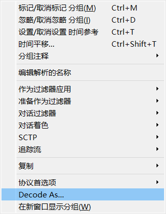
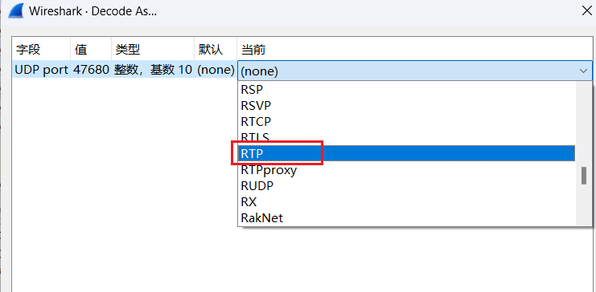
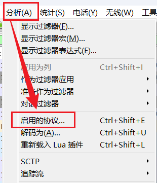
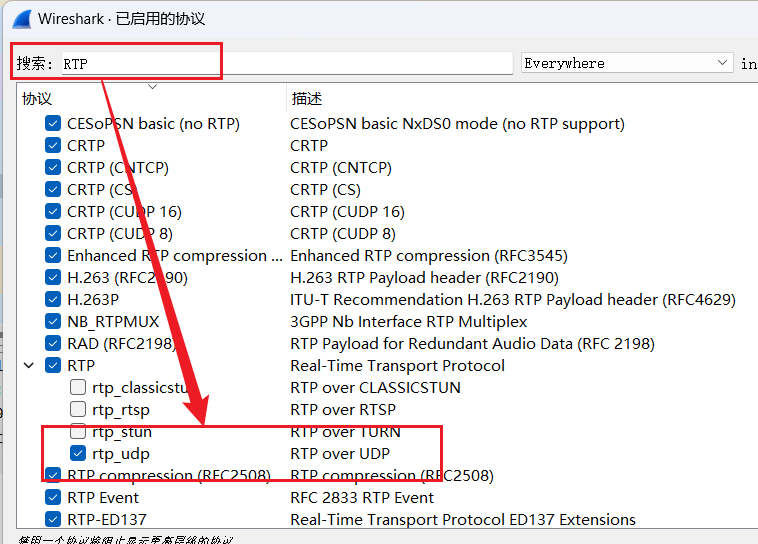

# 0. 前提条件
- wireshark 4.0.2

# 1. 时间显示

wireshark的默认时间显示是抓包的相对时间， 如果我们时间按照年月日时分秒显示，就需要进行如下设置:

视图->时间显示格式->选择具体的时间格式

# 2. UDP解码为RTP

## 方案1

在一个包UDP包上点击右键，出现如下弹框，选择**Decode As**

再当前值上选择RTP

## 方案2

方案1有一个缺点，只能过滤单一端口的UDP包，将其解码为RTP。

假如有很多的UDP包，并且端口都不一样，如果想把这些包都解码为RTP,  则需要如下设置。

选择分析->启用的协议

在搜索框中输入RTP, 然后启用RTP的**rtp_udp**

