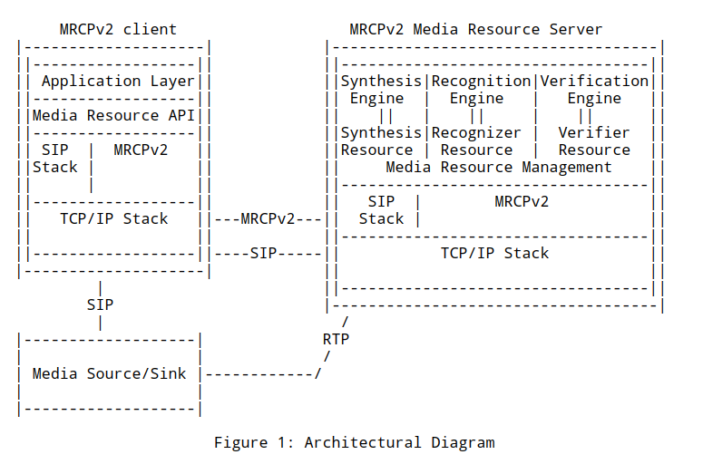

# 简介

-   MRCPv2 是`Media Resource Control Protocol Version 2`的缩写
-   MRCP 允许客户端去操作服务端的媒体资源处理
-   MRCP 的常见功能如下
    -   文本转语音
    -   语音识别
    -   说话人识别
    -   语音认证
    -   等等
-   MRCP 并不是一个独立的协议，而是依赖于其他的协议，如 SIP/SDP
-   MRCPv2 RFC 发表于 2012 年
-   MRCPv2 主要由思科,Nuance,Speechworks 开发
-   MRCPv2 是基于 MRCPv1 开发的
-   MRCPv2 不兼容 MRCPv1
-   MRCPv2 在传输层使用 TCP 或者 TLS

# 定义

-   媒体资源： An entity on the speech processing server that can be controlled through MRCPv2.
-   MRCP 服务器： Aggregate of one or more "Media Resource" entities on a server, exposed through MRCPv2. Often, 'server' in this document refers to an MRCP server.
-   MRCP 客户端: An entity controlling one or more Media Resources through MRCPv2 ("Client" for short).
-   DTMF: Dual-Tone Multi-Frequency; a method of transmitting key presses in-band, either as actual tones (Q.23 [Q.23]) or as named tone events (RFC 4733 [RFC4733]).
-   Endpointing: The process of automatically detecting the beginning and end of speech in an audio stream. This is critical both for speech recognition and for automated recording as one would find in voice mail systems.
-   Hotword Mode: A mode of speech recognition where a stream of utterances is evaluated for match against a small set of command words. This is generally employed either to trigger some action or to control the subsequent grammar to be used for further recognition.

# 架构

- 客户端使用SIP/SDP建立MRCP控制通道
- SIP使用SDP的offer/answer模型来描述MRCP通道的参数
- 服务端在answer SDP中提供唯一的通道ID和服务端TCP端口号
- 客户端可以开启一个新的TCP链接，多个MRCP通道也可以共享一个TCP链接



# 管理资源控制通道

- This "m=" line MUST have a media type field of "application"
- transport type field of either "TCP/MRCPv2" or "TCP/TLS/MRCPv2"
- The port number field of the "m=" line MUST contain the "discard" port of the transport protocol (port 9 for TCP) in the SDP offer from the client
- MUST contain the TCP listen port on the server in the SDP answer
- MRCPv2 servers MUST NOT assume any relationship between resources using the same port other than the sharing of the communication channel.
- To remain backwards compatible with conventional SDP usage, the format field of the "m=" line MUST have the arbitrarily selected value of "1".
- The a=connection attribute MUST have a value of "new" on the very first control "m=" line offer from the client to an MRCPv2 server
-  Subsequent control "m=" line offers from the client to the MRCP server MAY contain "new" or "existing", depending on whether the client wants to set up a new connection or share an existing connection
- When the client wants to deallocate the resource from this session, it issues a new SDP offer, according to RFC 3264 [RFC3264], where the control "m=" line port MUST be set to 0
- When the client wants to tear down the whole session and all its resources, it MUST issue a SIP BYE request to close the SIP session.
   This will deallocate all the control channels and resources allocated under the session.

#  MRCPv2 Session Termination

If an MRCP client notices that the underlying connection has been
   closed for one of its MRCP channels, and it has not previously
   initiated a re-INVITE to close that channel, it MUST send a BYE to
   close down the SIP dialog and all other MRCP channels.  If an MRCP
   server notices that the underlying connection has been closed for one
   of its MRCP channels, and it has not previously received and accepted
   a re-INVITE closing that channel, then it MUST send a BYE to close
   down the SIP dialog and all other MRCP channels.

# MRCP request

```
request-line   =    mrcp-version SP message-length SP method-name
                       SP request-id CRLF
```
- request-id     =    1*10DIGIT


# MRCP response

```
response-line  =    mrcp-version SP message-length SP request-id
                       SP status-code SP request-state CRLF
```
- status-code     =    3DIGIT
- request-state    =  "COMPLETE"
                    /  "IN-PROGRESS"
                    /  "PENDING"
# event

```
event-line       =  mrcp-version SP message-length SP event-name
                       SP request-id SP request-state CRLF
```

- event-name       =  synthesizer-event
                    /  recognizer-event
                    /  recorder-event
                    /  verifier-event

# 参考

-   https://www.rfc-editor.org/rfc/rfc6787
